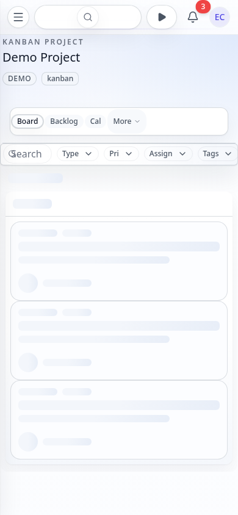

# Board Page - Current State

> **Route**: `/:slug/projects/:key/board`
> **Status**: REVIEWED, trustworthy baseline
> **Last Updated**: 2026-03-26

> **Spec Contract**: This file is intentionally hyper-comprehensive. ASCII diagrams, explicit structure walkthroughs, and high-detail notes are deliberate and should not be reduced to a short summary.

---

## Screenshot Matrix

| Viewport | State | Preview |
|----------|-------|---------|
| Desktop | Dark |  |
| Desktop | Light |  |
| Tablet | Light |  |
| Mobile | Light |  |
| Mobile | Loading |  |
| Desktop | Create Issue Modal |  |

---

## Current UI

- The board uses the slimmer shared project shell instead of the older heavy page chrome.
- Filled-state screenshots now show real seeded issues instead of broken empty baselines.
- Mobile now uses a single-column workflow selector instead of squeezing the desktop multi-column rail into phone width.
- The create-issue modal captures reliably again across the full screenshot matrix.
- The shared project shell is lighter now: the bespoke header card is gone, the project identity lives in the shared `PageHeader`, and desktop tabs use a slimmer section strip instead of a second pill panel.
- The shared project shell and mobile tab row are tighter than the last round, so the board starts sooner and reads less like stacked chrome.
- The extra mobile board-actions card is gone; export/sprint controls now sit as a lighter utility row above filters instead of a full-width chrome block.
- Mobile filter controls now use the quieter shared filter button/input chrome instead of a heavier custom pill treatment.
- Mobile utility actions now sit in a compact in-flow toolbar row beneath filters, so they stay reachable without overlapping the workflow selector.
- Mobile lanes now focus one workflow state at a time, with a segmented selector above the board so narrow screens keep card content readable.
- Mobile export and sprint controls share that same compact toolbar row as selection instead of floating over the selector or living in a detached actions card.
- The export action still uses compact mobile treatment, but it now stays in the shared toolbar row instead of a separate strip.
- The board baseline is now operationally trustworthy, so the remaining issues are visual rather than harness-related.
- The loading state now has a reviewed desktop/tablet/mobile matrix and no longer reuses the old desktop-shaped multi-column haze on phone widths.
- The screenshot matrix also includes create-issue validation/success/draft-restore, filter-active, swimlane, import/export, collapsed-column, loading, and WIP warning states in the spec folder beyond the single modal preview shown above.

---

## Files

| File | Purpose |
|------|---------|
| `src/routes/_auth/_app/$orgSlug/projects/$key/route.tsx` | Shared project shell |
| `src/routes/_auth/_app/$orgSlug/projects/$key/board.tsx` | Board page chrome |
| `src/components/App/AppHeader.tsx` | Global app header |
| `src/components/GlobalSearch.tsx` | Search and commands modal + trigger |
| `src/components/KeyboardShortcutsHelp.tsx` | Shortcuts modal |
| `src/components/AdvancedSearchModal.tsx` | Advanced search modal |
| `src/components/FilterBar.tsx` | Filters |
| `src/components/Kanban/BoardToolbar.tsx` | Board toolbar |
| `src/components/KanbanBoard.tsx` | Board columns |
| `src/components/Kanban/KanbanColumn.tsx` | Column shell |
| `src/components/IssueCard.tsx` | Issue cards |
| `e2e/screenshot-pages.ts` | Screenshot readiness for board/backlog/modal capture |
| `e2e/pages/projects.page.ts` | Shared create-issue modal readiness contract |

---

## Problems

| # | Problem | Area | Severity |
|---|---------|------|----------|
| 1 | Card hierarchy inside the first lane could still feel a little stronger in light mode | `src/components/Kanban/KanbanColumn.tsx`, `src/components/IssueDetail/IssueCard.tsx` | LOW |

---

## Summary

The board screenshot baseline is trustworthy again. The next pass can stay focused on card hierarchy
and lane-level polish, not clipped mobile rails, loading-shell regressions, harness repair, or selector-overlapping mobile toolbar cleanup.
