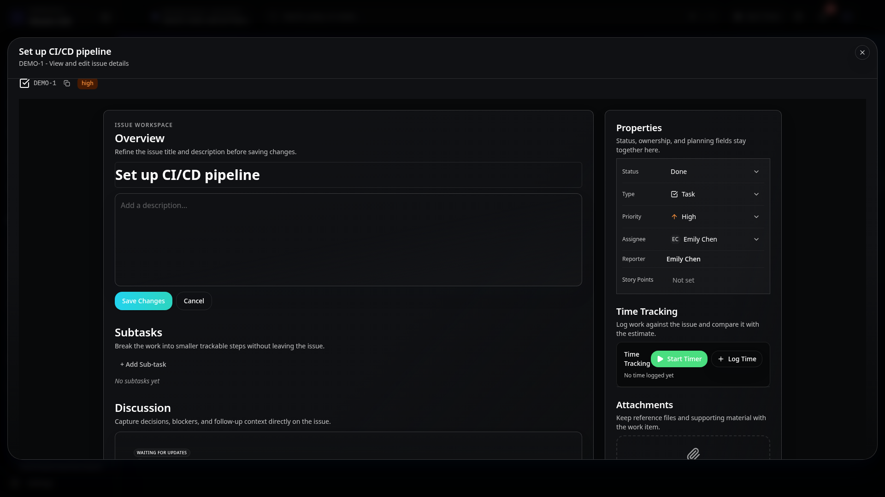
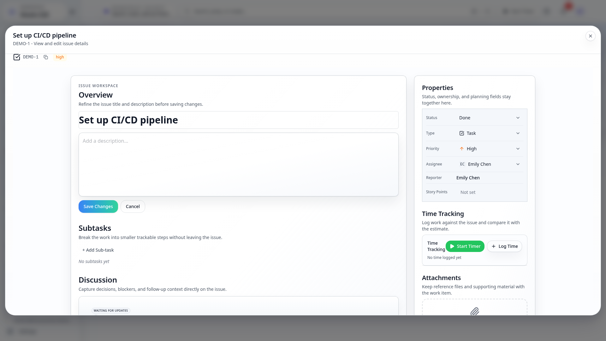
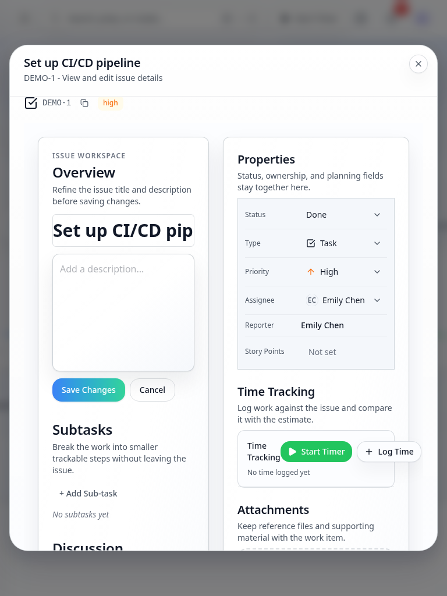
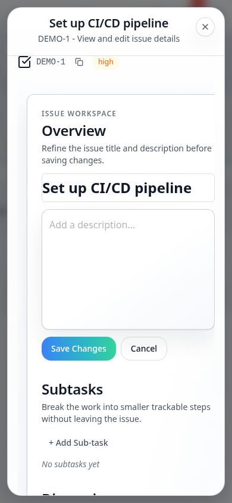

# Issue Detail Page - Current State

> **Route**: `/:slug/issues/:key`
> **Status**: REVIEWED, with secondary section polish still open
> **Last Updated**: 2026-03-21

> **Spec Contract**: This file is intentionally hyper-comprehensive. ASCII diagrams, explicit structure walkthroughs, and high-detail notes are deliberate and should not be reduced to a short summary.

---

## Screenshot Matrix

| Viewport | Base Route | Detail Modal | Detail Modal + Inline Editing |
|----------|------------|--------------|-------------------------------|
| Desktop Dark |  |  |  |
| Desktop Light |  |  |  |
| Tablet Light |  |  |  |
| Mobile Light |  |  |  |

---

## Current Read

- The route once again resolves real seeded issues directly by org-scoped key.
- The page uses a more explicit section anatomy for description, metadata, comments, watchers, and
  subtasks instead of loose panel stacking.
- Modal and inline-edit states are reviewed as first-class captures, not incidental overlays.

---

## Remaining Gaps

| Problem | Area | Severity |
|---------|------|----------|
| Sidebar fields are more consistent now, but the field stack can still feel dense in lighter themes | sidebar anatomy | LOW |
| Comments, watchers, and metadata sections are coherent, but still not as visually calm as the cleanest page shells elsewhere | secondary sections | LOW |

---

## Source Files

- `src/routes/_auth/_app/$orgSlug/issues/$key.tsx`
- `src/components/IssueDetail/IssueDetailLayout.tsx`
- `src/components/IssueDetail/IssueDetailContent.tsx`
- `src/components/IssueDetail/IssueDetailSidebar.tsx`
- `src/components/IssueDetail/IssueDetailSection.tsx`
- `convex/issues/queries.ts`
- `e2e/screenshot-pages.ts`

---

## Summary

Issue detail is current and route-real again. Remaining work is local section polish, not route
correctness or screenshot trust.
