# Documents Page - Current State

> **Route**: `/:slug/documents`
> **Status**: REVIEWED, with follow-up polish only
> **Last Updated**: 2026-03-25

> **Spec Contract**: This file is intentionally hyper-comprehensive. ASCII diagrams, explicit structure walkthroughs, and high-detail notes are deliberate and should not be reduced to a short summary.

---

## Purpose

The documents route is no longer just a tree browser. It is now a real documents workspace:

- create a blank document quickly
- search recent docs by title or owner
- understand library scale at a glance
- jump into templates when the goal is repeatable structure
- keep the full hierarchical library visible in a side rail

---

## Screenshot Matrix

### Canonical workspace

| Viewport | Theme | Preview |
|----------|-------|---------|
| Desktop | Dark | 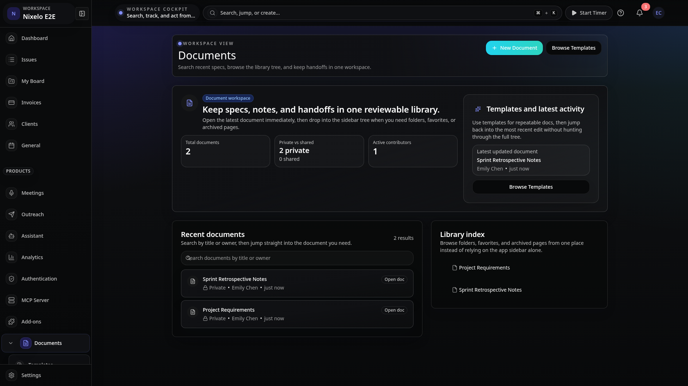 |
| Desktop | Light | 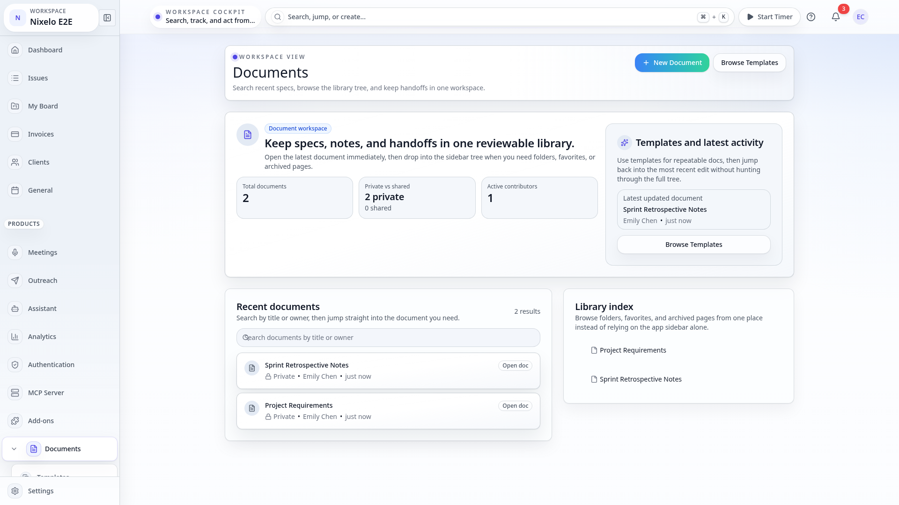 |
| Tablet | Light | 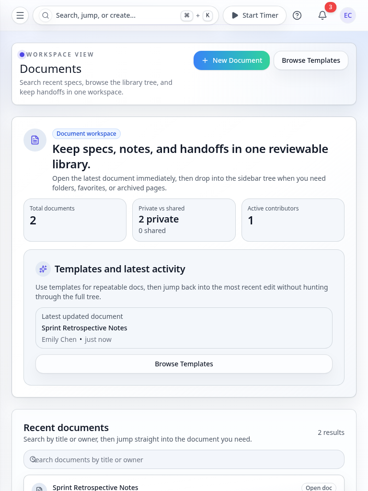 |
| Mobile | Light | 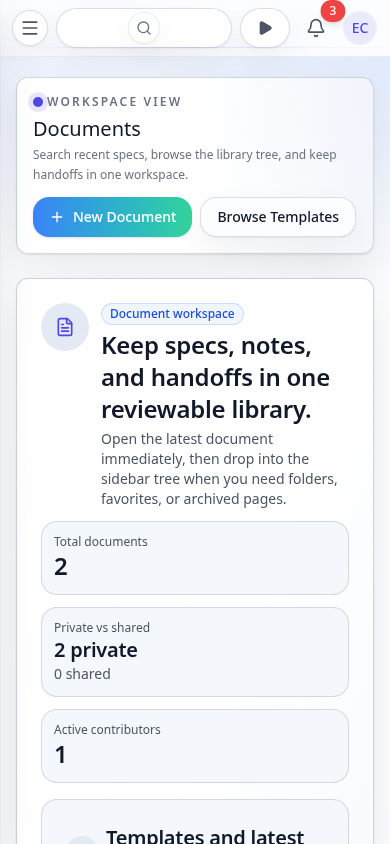 |

### Templates route

| Viewport | Theme | Preview |
|----------|-------|---------|
| Desktop | Dark | 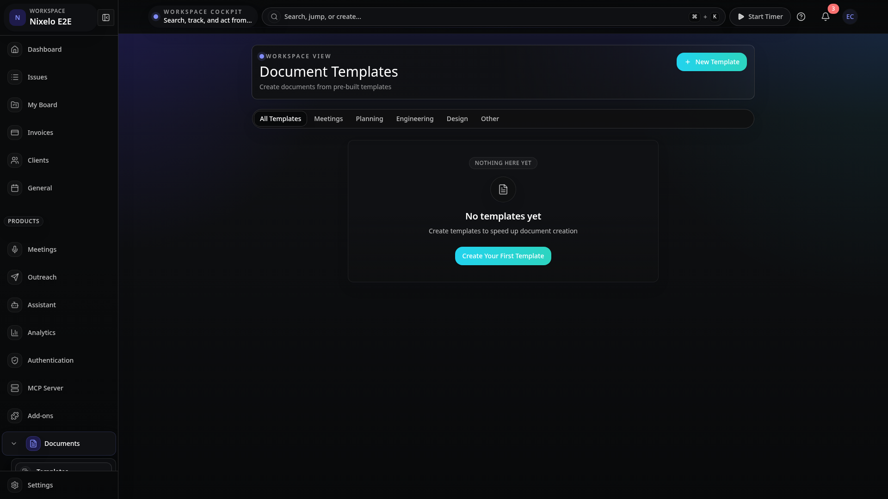 |
| Desktop | Light | 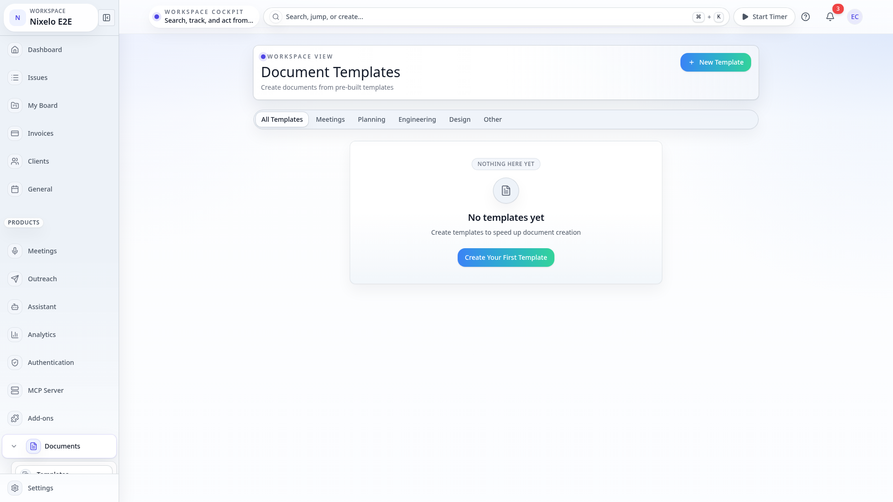 |
| Tablet | Light | 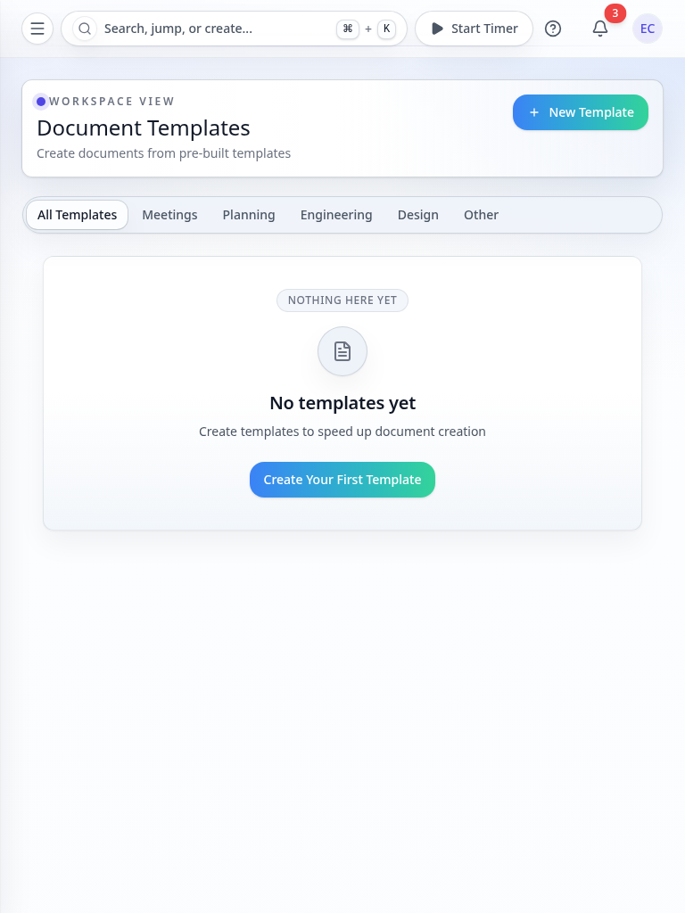 |
| Mobile | Light | 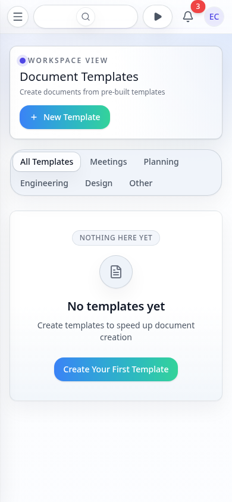 |

### Filtered search

| Viewport | Theme | Preview |
|----------|-------|---------|
| Desktop | Dark | 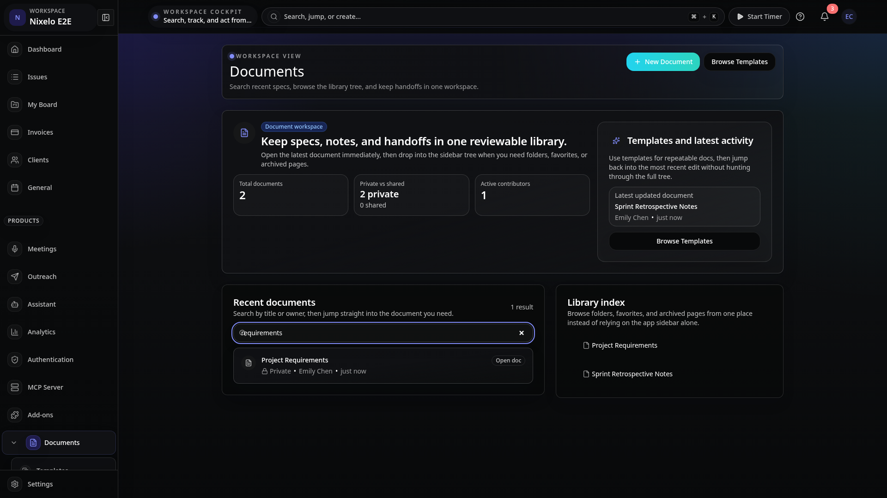 |
| Desktop | Light | 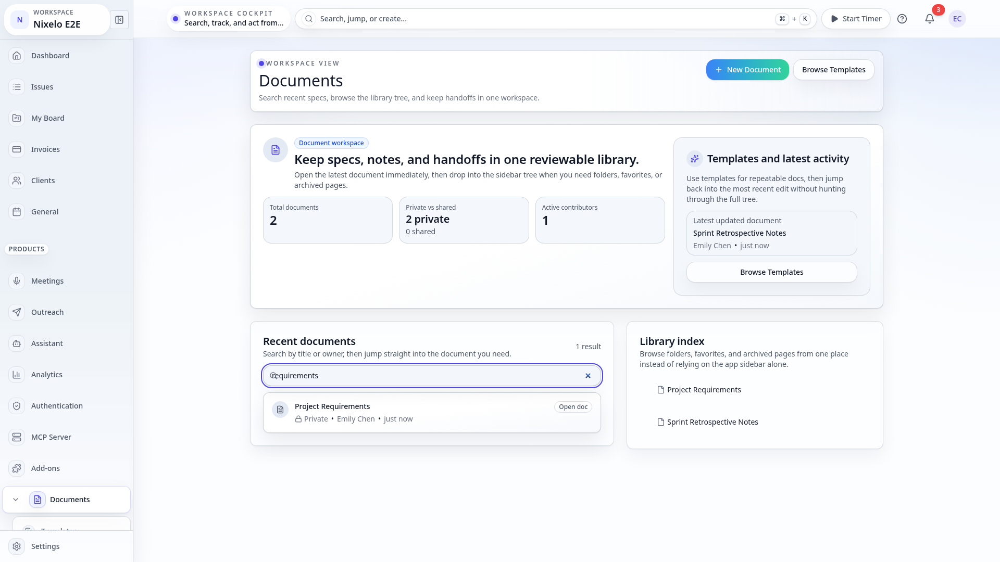 |
| Tablet | Light | 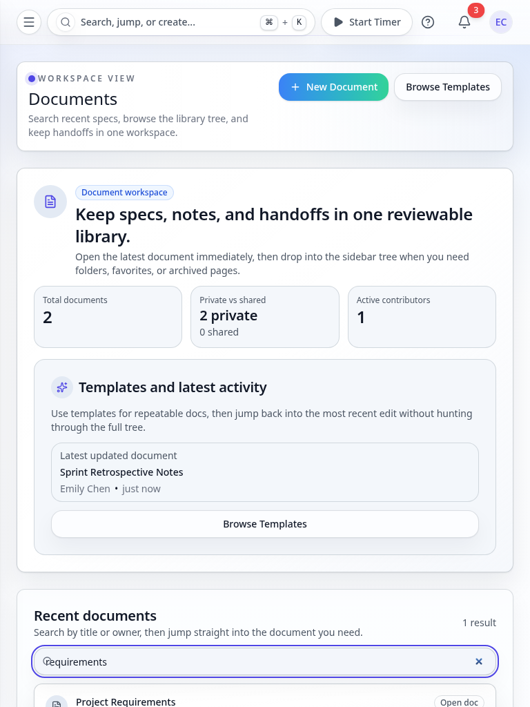 |
| Mobile | Light | 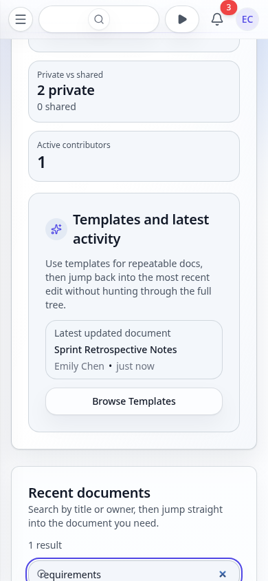 |

### Search empty state

| Viewport | Theme | Preview |
|----------|-------|---------|
| Desktop | Dark | 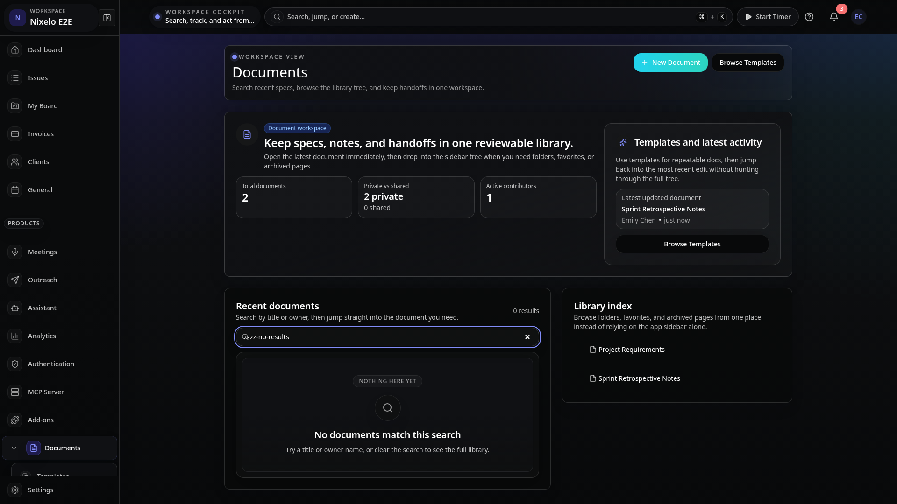 |
| Desktop | Light | 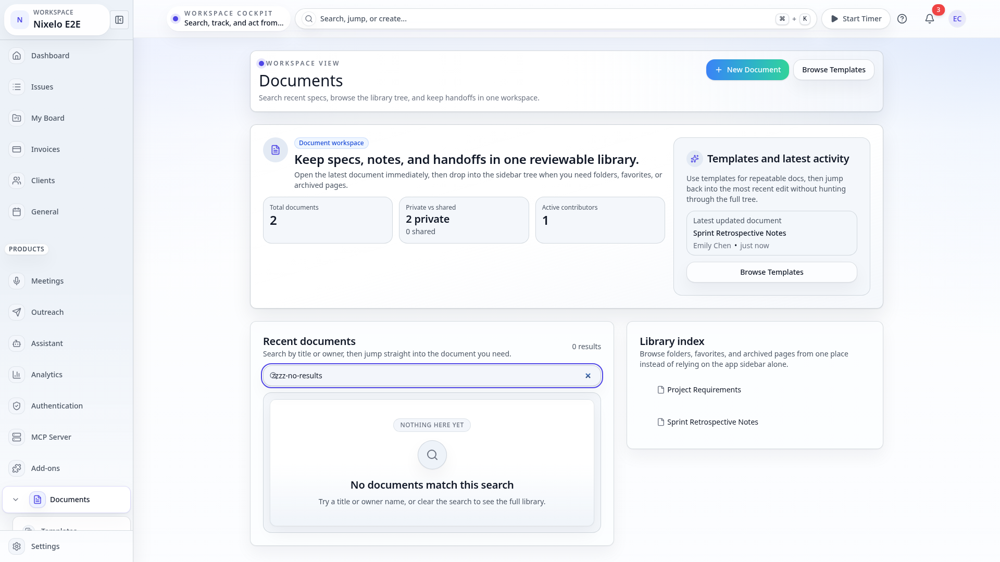 |
| Tablet | Light | 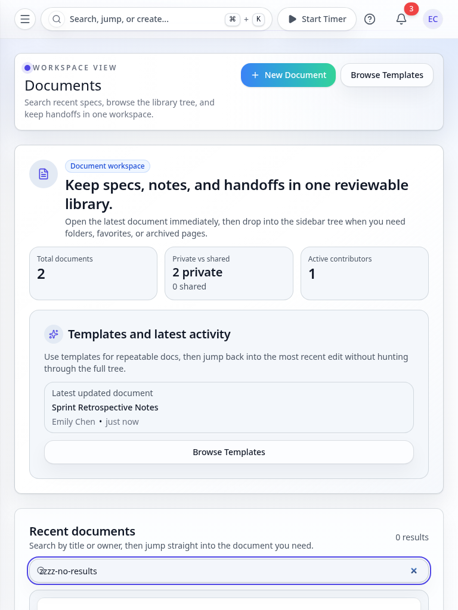 |
| Mobile | Light | 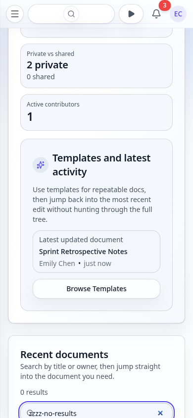 |

---

## Route Anatomy

```text
┌──────────────────────────────────────────────────────────────────────────────────────────────┐
│ PageHeader                                                                                  │
│ Documents                                                                 [New] [Templates] │
│ Search recent specs, browse the library tree, and keep handoffs in one workspace            │
├──────────────────────────────────────────────────────────────────────────────────────────────┤
│ Summary / entry band                                                                        │
│                                                                                             │
│  left: workspace intro + counts                                                             │
│  right: templates + latest activity card                                                    │
├──────────────────────────────────────────────────────────────────────────────────────────────┤
│ Main workspace grid                                                                         │
│                                                                                             │
│  left / primary: recent documents                                                           │
│    - search field                                                                           │
│    - filtered results                                                                       │
│    - metadata rows                                                                          │
│                                                                                             │
│  right / secondary: library                                                                 │
│    - shared `DocumentTree`                                                                  │
│    - nested folders                                                                         │
│    - create child document                                                                  │
└──────────────────────────────────────────────────────────────────────────────────────────────┘
```

---

## Current Composition

### 1. Page header

- Title: `Documents`
- Description makes the route's job explicit: search recent specs, browse the tree, and keep
  handoffs in one workspace.
- Primary actions:
  - `New Document`
  - `Browse Templates`

### 2. Workspace summary band

- Left side uses a shared surface to explain the route and show document-library counts:
  - total documents
  - private vs shared
  - active contributors
- Right side is a narrower `Templates and latest activity` card.
- This gives the route an immediate "workspace overview" read instead of dropping the user into
  a tree with no context.

### 3. Recent documents surface

- Search box filters by document title or creator.
- Result count is explicit.
- Document rows are the fast path into current work rather than a deep-library exploration tool.

### 4. Library side rail

- Uses the shared `DocumentTree`.
- Supports nested structure, document selection, and child-document creation.
- Functions as the longer-lived library view while recent documents handles the immediate workflow.

### 5. Empty state

- Uses shared `EmptyState`.
- Keeps the route actionable with:
  - create blank document
  - browse templates

---

## State Coverage

### Canonical route states covered by the current implementation

- Filled workspace with overview, recent docs, and tree
- Templates route gallery
- Search-filtered recent-doc list
- Search empty state
- Empty library state
- Blank-document creation success path
- Blank-document creation failure path

The screenshot spec now covers the workspace, templates route, filtered search, and no-results
search state. Route tests still cover the create success/failure paths directly.

---

## Current Strengths

| Area | Current Read |
|------|--------------|
| Route purpose | Clear. The page now reads as a documents workspace rather than a generic file tree. |
| Actionability | Strong. Blank document creation and templates are obvious on first scan. |
| Shared-shell discipline | Good. The route uses shared page/header/layout primitives instead of one-off chrome. |
| Review depth | Improved. Search and templates are now in the reviewed screenshot matrix instead of living only in route tests. |
| Responsive behavior | Tablet/mobile continue to preserve the primary/secondary distinction without inventing extra route-only UI. |

---

## Current Problems

| # | Problem | Area | Severity |
|---|---------|------|----------|
| 1 | The summary band is useful, but in light mode the top workspace card can still feel a touch broader and flatter than the denser recent-doc list beneath it | route composition | LOW |
| 2 | The library side rail is operationally correct, but the visual difference between "recent docs" and "library" could be stronger in first-glance screenshots | hierarchy | LOW |
| 3 | The true empty workspace is still validated by route behavior/tests more than by a checked-in reviewed screenshot, so empty-state polish can still hide between spec refreshes | review depth | LOW |

---

## Source Files

| File | Purpose |
|------|---------|
| `src/routes/_auth/_app/$orgSlug/documents/index.tsx` | Documents workspace route |
| `src/components/Documents/DocumentTree.tsx` | Hierarchical library tree |
| `src/routes/_auth/_app/$orgSlug/documents/$id.tsx` | Downstream document detail route |
| `src/routes/_auth/_app/$orgSlug/documents/templates.tsx` | Templates route entry point |
| `e2e/screenshot-lib/interactive-captures.ts` | Search-state screenshot capture |
| `e2e/screenshot-pages.ts` | Canonical route screenshot capture |

---

## Review Guidance

- Keep this route as a workspace, not a tree page with extra cards glued on.
- If more screenshot states are added, the next worthwhile captures are:
  - true empty state
  - template empty state or template create/edit flows
  - document creation success/error overlays if that workflow becomes visually richer
- Do not collapse recent-doc search and library tree into the same surface; they solve different
  navigation problems.

---

## Summary

The documents page is current and materially better than the old tree-only route. The screenshot
spec now covers the meaningful filled route variants instead of only the canonical workspace. The
remaining work is minor polish plus a future reviewed empty-state pass if the route changes again.
