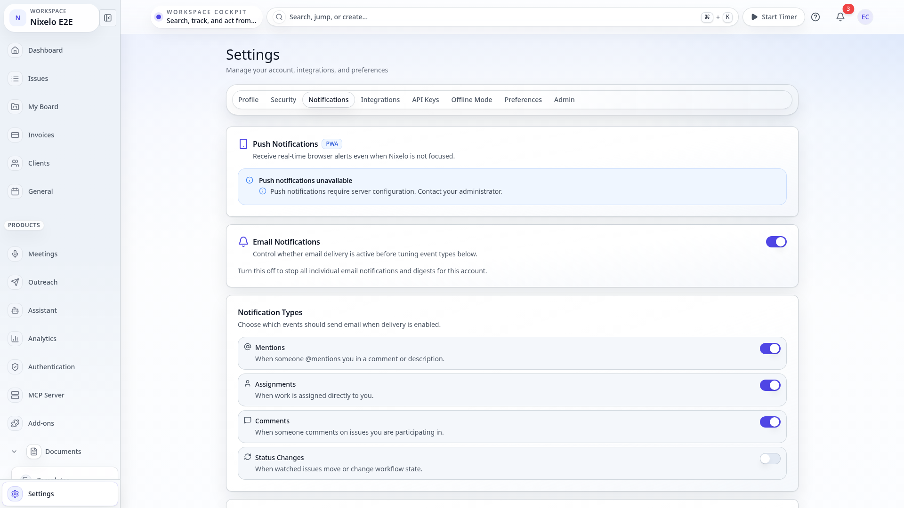
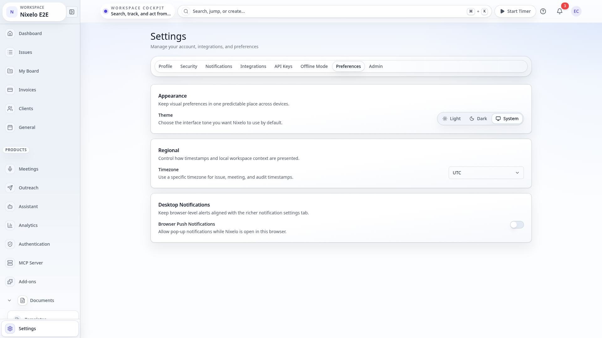
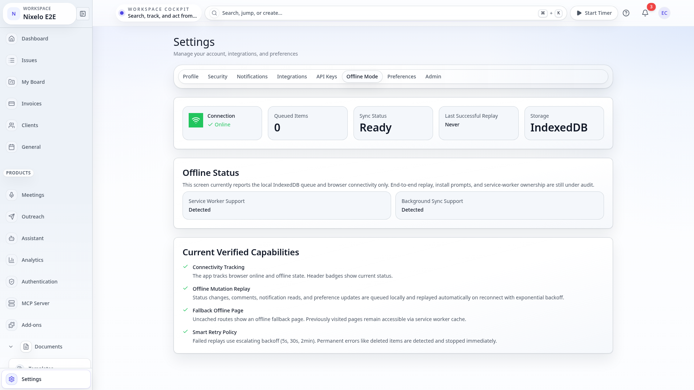

# Settings Page - Current State

> **Route**: `/:slug/settings/profile`
> **Status**: 🟢 Settings tabs now share a consistent shell, including admin
> **Last Updated**: 2026-03-21

---

## Screenshots

| Viewport | State | Preview |
|----------|-------|---------|
| Desktop | Dark |  |
| Desktop | Light |  |
| Tablet | Light |  |
| Mobile | Light |  |
| Desktop | Integrations Tab |  |
| Desktop | Admin Tab |  |
| Desktop | Notifications Tab |  |
| Desktop | Security Tab |  |
| Desktop | API Keys Tab |  |
| Desktop | Preferences Tab |  |
| Desktop | Offline Tab |  |
| Desktop | Project Settings |  |

---

## Current UI

- The route now owns settings tab state through the `tab` search param instead of copying it into local component state.
- Visible tabs come from the canonical `SETTINGS_TABS` model in `settingsTabs.ts`, which removes the old duplicated tab definitions.
- The top-level page remains a header plus horizontal tabs, with the profile tab showing the heaviest composition.
- The profile tab now behaves like one responsive workspace surface instead of a desktop-first card stack squeezed into smaller screens.
- Project settings screenshots in the same spec folder now reflect the slimmer shared project shell.

---

## Recent Improvements

- `src/components/Settings.tsx` was refactored to use one typed tab model for visibility, routing, and rendering.
- `src/routes/_auth/_app/$orgSlug/settings/profile.tsx` now validates and canonicalizes the route search state.
- `src/components/Settings/ProfileContent.tsx` was simplified so the profile tab is less ad hoc than before.
- Shared tab primitives now support the denser settings layout.
- Desktop light mode is less over-shelled now that the profile surface uses lighter shared card depth and a smaller outer shell.
- Tablet and mobile now keep the settings tabs readable by using shorter labels until larger viewports.
- The profile header is now mobile-first: the avatar actions stay attached to the avatar, the name/actions collapse cleanly, and the account metadata no longer feels like a second competing card stack.
- Account metadata now uses compact inset rows, so the profile surface reads as one system from mobile through desktop.
- Preferences and offline now share the same settings-section anatomy instead of reading like unrelated internal tools.
- Notifications now uses the same section anatomy for push, email, digest, and quiet-hours states instead of a bespoke internal card stack.
- Integrations now uses one shared settings anatomy across GitHub, Slack, Google Calendar, and Pumble instead of four unrelated card/header treatments.
- The lighter admin sections now use the same settings/admin anatomy instead of mixing bespoke card headers, bordered dividers, and one-off help blocks.
- Security, API Keys, and DevTools now use the same settings-section anatomy, so the remaining low-level settings utilities no longer read like orphaned internal tools.
- Screenshot coverage now includes first-class Preferences and Offline tab captures so these lighter settings states stop drifting outside review.
- Screenshot coverage now includes the normal notifications tab in addition to the blocked-permission edge case.
- Screenshot coverage now includes the integrations tab so the remaining multi-state settings shell no longer hides outside the spec.
- Screenshot coverage now includes the admin tab, so the remaining settings review is no longer hiding behind the role-gated surface.
- Screenshot coverage now includes the security and API keys tabs, so the settings suite no longer has uncaptured high-traffic residue outside review.

---

## Remaining Gaps

| Problem | Area | Severity |
|---------|------|----------|
| The role-gated DevTools tab is intentionally excluded from seeded screenshots because screenshot accounts suppress developer-only surfaces; it still relies on test coverage instead of visual review | devtools screenshot coverage | LOW |

---

## Source Files

- `src/routes/_auth/_app/$orgSlug/settings/profile.tsx`
- `src/components/Settings.tsx`
- `src/components/Settings/settingsTabs.ts`
- `src/components/Settings/ProfileContent.tsx`
- `src/components/Settings/AdminTab.tsx`
- `src/components/Settings/TwoFactorSettings.tsx`
- `src/components/Settings/ApiKeysManager.tsx`
- `src/components/Settings/DevToolsTab.tsx`
- `src/components/Settings/NotificationsTab.tsx`
- `src/components/Settings/SettingsSection.tsx`
- `src/components/Admin/OrganizationSettings.tsx`
- `src/components/Admin/OAuthHealthDashboard.tsx`
- `src/components/Admin/OAuthFeatureFlagSettings.tsx`
- `src/components/Admin/IpRestrictionsSettings.tsx`
- `src/components/ui/Tabs.tsx`
