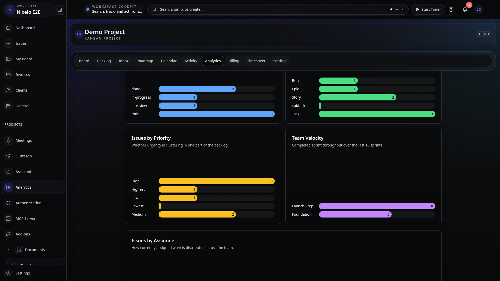

# Analytics Page - Current State

> **Route**: `/:slug/projects/:key/analytics` and `/:slug/analytics`
> **Status**: 🟡 NEEDS POLISH
> **Last Updated**: Run `pnpm screenshots` to regenerate

---

## Screenshots

| Viewport | Preview |
|----------|---------|
| Desktop |  |

---

## Structure

Analytics dashboard with metric cards and charts:

```
+-------------------------------------------------------------------------------------------+
| [=] Nixelo E2E                      [Commands Cmd+K] [?] [> Timer] [Search Cmd+K] [N] [AV]|
+-------------------------------------------------------------------------------------------+
|                                                                                           |
|  Analytics Dashboard                                                                      |
|  Project insights, team velocity, and progress metrics                                    |
|                                                                                           |
|  +----------------+ +----------------+ +----------------+ +----------------+               |
|  |  Total Issues  | |  Unassigned    | |  Avg Velocity  | | Completed      |               |
|  |  [icon]        | |  [icon]        | |  [icon]        | | Sprints [icon] |               |
|  |                | |                | |                | |                |               |
|  |      42        | |       8        | |     12.5       | |      6         |               |
|  |                | |                | | points/sprint  | |                |               |
|  +----------------+ +----------------+ +----------------+ +----------------+               |
|                                                                                           |
|  +------------------------------------+ +------------------------------------+             |
|  | Issues by Status                   | | Issues by Type                     |             |
|  +------------------------------------+ +------------------------------------+             |
|  |                                    | |                                    |             |
|  | Backlog    ████████████████  24    | | Task   ████████████████████  28    |             |
|  | In Progress █████████  12          | | Bug    ████████████  16            |             |
|  | Review     ████  4                 | | Story  ██████  8                   |             |
|  | Done       ██  2                   | | Epic   ██  4                       |             |
|  |                                    | |                                    |             |
|  +------------------------------------+ +------------------------------------+             |
|                                                                                           |
|  +------------------------------------+ +------------------------------------+             |
|  | Issues by Priority                 | | Team Velocity (Last 10 Sprints)    |             |
|  +------------------------------------+ +------------------------------------+             |
|  |                                    | |                                    |             |
|  | Highest    ████████  10            | | Sprint 1  ████████  8              |             |
|  | High       ██████████████  18      | | Sprint 2  ████████████  12         |             |
|  | Medium     ████████████  14        | | Sprint 3  ██████████  10           |             |
|  | Low        ████  4                 | | Sprint 4  ██████████████  14       |             |
|  | Lowest     ██  2                   | | Sprint 5  ████████████  12         |             |
|  |                                    | |                                    |             |
|  +------------------------------------+ +------------------------------------+             |
|                                                                                           |
|  +--------------------------------------------------------------------------+             |
|  | Issues by Assignee                                                        |             |
|  +--------------------------------------------------------------------------+             |
|  | Alice    ████████████████████  20                                         |             |
|  | Bob      ████████████████  16                                             |             |
|  | Charlie  ████████████  12                                                 |             |
|  | Diana    ████████  8                                                      |             |
|  +--------------------------------------------------------------------------+             |
|                                                                                           |
|  +--------------------------------------------------------------------------+             |
|  | Recent Activity                                                           |             |
|  +--------------------------------------------------------------------------+             |
|  | [AV] John moved PROJ-123 to Done                           2 hours ago    |             |
|  | [AV] Sarah created PROJ-124                                3 hours ago    |             |
|  | [AV] Mike commented on PROJ-100                            5 hours ago    |             |
|  +--------------------------------------------------------------------------+             |
|                                                                                           |
+-------------------------------------------------------------------------------------------+
```

---

## Current Elements

### Header
- **Title**: "Analytics Dashboard"
- **Description**: "Project insights, team velocity, and progress metrics"

### Metric Cards (4-column grid)
- **Total Issues**: Count with TrendingUp icon
- **Unassigned**: Count with MapPin icon, warning ring if > 0
- **Avg Velocity**: Points/sprint with Zap icon
- **Completed Sprints**: Count with CheckCircle icon

### Charts (2-column grid)
- **Issues by Status**: Horizontal bar chart, blue bars
- **Issues by Type**: Horizontal bar chart, green bars
- **Issues by Priority**: Horizontal bar chart, yellow bars
- **Team Velocity**: Horizontal bar chart, accent color

### Assignee Chart
- **Full-width**: Horizontal bar chart, brand color

### Recent Activity
- **Activity list**: Avatar, description, relative time

---

## Files

| File | Purpose | Lines |
|------|---------|-------|
| `src/routes/_auth/_app/$orgSlug/projects/$key/analytics.tsx` | Route definition | ~35 |
| `src/routes/_auth/_app/$orgSlug/analytics.tsx` | Org-level placeholder | ~20 |
| `src/components/AnalyticsDashboard.tsx` | Main dashboard | ~240 |
| `src/components/Analytics/MetricCard.tsx` | Stat card | ~50 |
| `src/components/Analytics/BarChart.tsx` | Horizontal bar chart | ~50 |
| `src/components/Analytics/ChartCard.tsx` | Chart wrapper | ~30 |
| `src/components/Analytics/RecentActivity.tsx` | Activity list | ~80 |

---

## Problems

| # | Problem | Location | Severity |
|---|---------|----------|----------|
| 1 | No date range picker | AnalyticsDashboard.tsx | MEDIUM |
| 2 | Charts lack interactivity | BarChart.tsx | MEDIUM |
| 3 | No trend indicators on metrics | MetricCard.tsx | MEDIUM |
| 4 | Missing export functionality | AnalyticsDashboard.tsx | LOW |
| 5 | No chart tooltips | BarChart.tsx | LOW |
| 6 | Org-level analytics placeholder only | analytics.tsx | LOW |
| 7 | No comparison period | AnalyticsDashboard.tsx | LOW |
| 8 | Activity list needs pagination | RecentActivity.tsx | LOW |
| 9 | Bar chart animation basic | BarChart.tsx | LOW |
| 10 | No pie/donut chart options | N/A | LOW |

---

## Current Chart Colors

| Chart | Color Token |
|-------|-------------|
| Status | `bg-status-info` (blue) |
| Type | `bg-status-success` (green) |
| Priority | `bg-status-warning` (yellow) |
| Velocity | `bg-accent` (accent) |
| Assignee | `bg-brand` (brand) |

---

## Summary

Analytics dashboard is functional with basic charts:
- Metric cards display key stats
- Horizontal bar charts for all breakdowns
- Recent activity list working
- Skeleton loading states
- Needs date range picker for filtering
- Charts lack tooltips and hover states
- No trend indicators (up/down arrows)
- No data export functionality
- Org-level analytics not implemented
