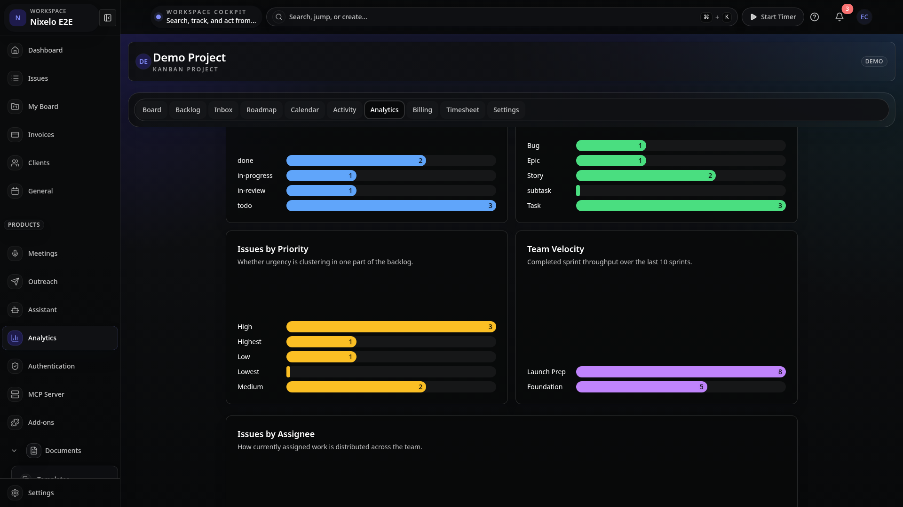
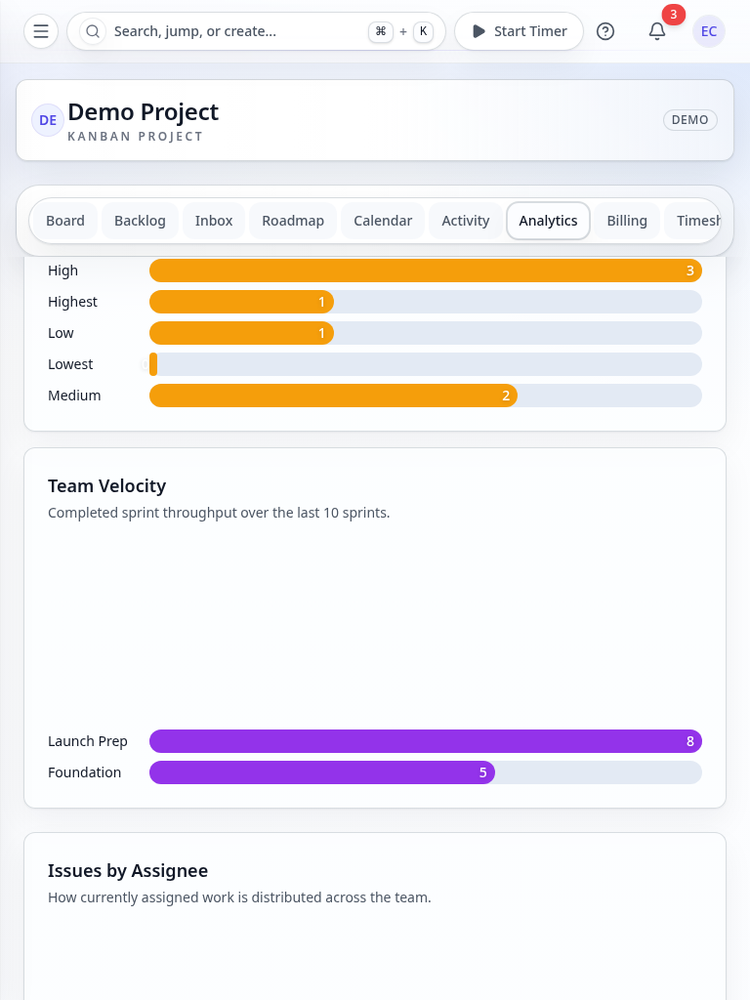
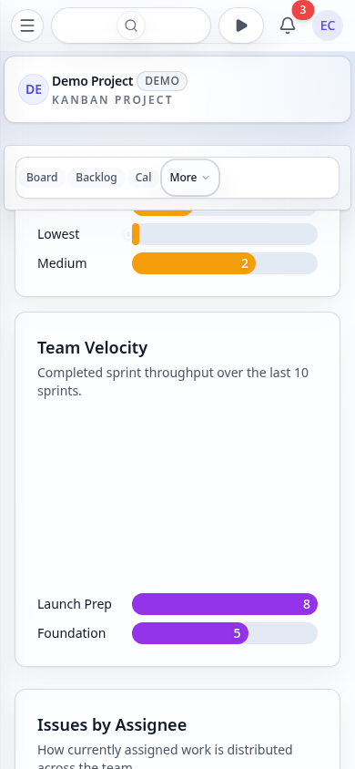

# Analytics Page - Current State

> **Route**: `/:slug/projects/:key/analytics`
> **Status**: 🟢 REVIEWED
> **Last Updated**: 2026-03-21

---

## Screenshots

| Viewport | Theme | Preview |
|----------|-------|---------|
| Desktop | Dark |  |
| Desktop | Light |  |
| Tablet | Light |  |
| Mobile | Light |  |

---

## Current UI

- The project analytics route now reads like a real project workspace instead of a generic chart page.
- The header is project-specific and frames the route around delivery, workload, and ownership signals for the active project key.
- A top snapshot band summarizes flow, assignment coverage, and sprint signal before the metric cards and chart grid.
- Every major analytics block now uses the shared analytics shell or an explicit shared empty state instead of silently disappearing when data is missing.

---

## Current Structure

- **Project header**
  - Project-specific title and description
- **Snapshot band**
  - Flow snapshot
  - Ownership snapshot
  - Sprint signal snapshot
- **Metrics row**
  - Total issues
  - Unassigned
  - Average velocity
  - Completed sprints
- **Chart grid**
  - Issues by status
  - Issues by type
  - Issues by priority
  - Team velocity
- **Ownership distribution**
  - Issues by assignee
- **Recent activity**
  - Timeline of issue changes with explicit empty state

---

## Recent Improvements

- The project route now passes project name and key into the dashboard so the page is contextual instead of generic.
- Added shared summary tiles via `AnalyticsInsightCard` for the top-of-page workspace snapshot.
- `ChartCard` now supports shared empty-state handling, so empty analytics sections stay visually consistent with populated ones.
- `RecentActivity` now uses the same analytics section anatomy and shows an explicit empty state instead of dropping the entire section.
- The analytics screenshot harness now waits on a broader analytics heading pattern, so project-specific header copy does not break the spec.

---

## Remaining Gaps

| Problem | Area | Severity |
|---------|------|----------|
| No date-range or comparison controls yet | Analytics functionality | MEDIUM |
| Charts are still static bars without tooltips, drill-in, or export affordances | Analytics interaction depth | LOW |
| Organization analytics and project analytics now share shell discipline, but any future analytics surfaces should keep using the shared section/empty-state contract instead of reintroducing custom panels | Shared analytics system | LOW |

---

## Source Files

- `src/routes/_auth/_app/$orgSlug/projects/$key/analytics.tsx`
- `src/components/AnalyticsDashboard.tsx`
- `src/components/Analytics/AnalyticsInsightCard.tsx`
- `src/components/Analytics/ChartCard.tsx`
- `src/components/Analytics/RecentActivity.tsx`
- `e2e/screenshot-pages.ts`
