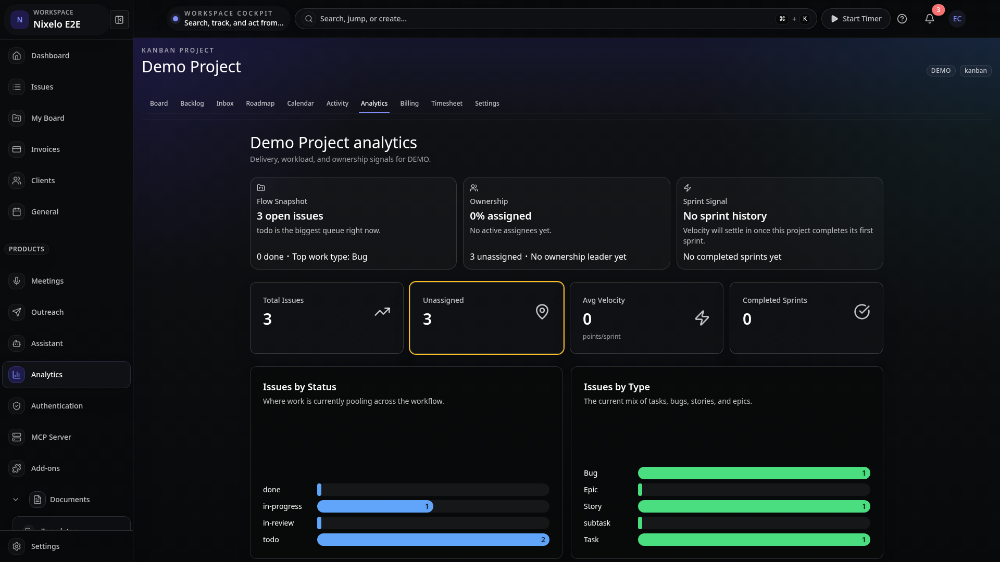
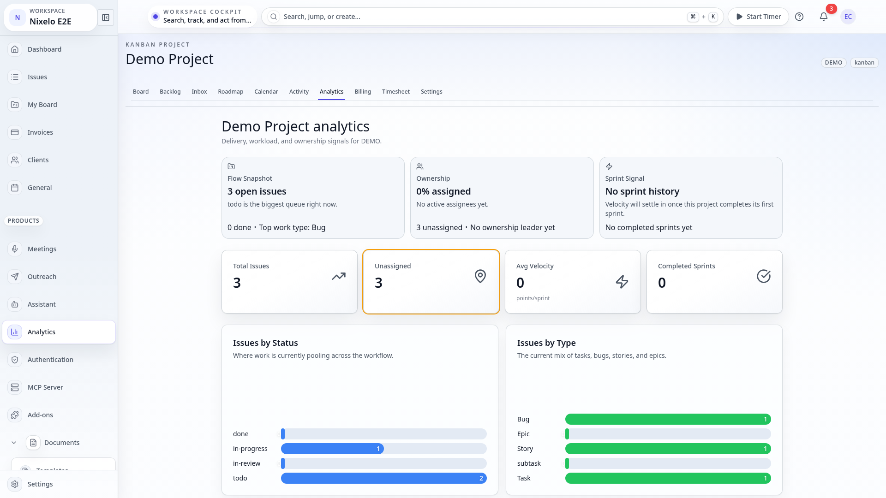
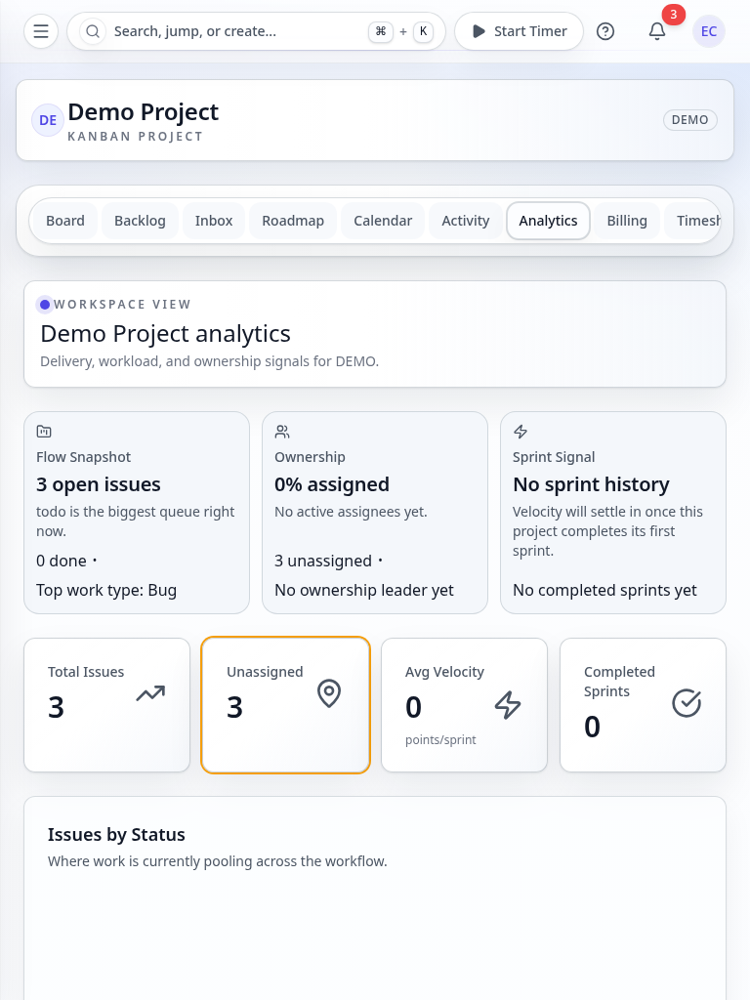
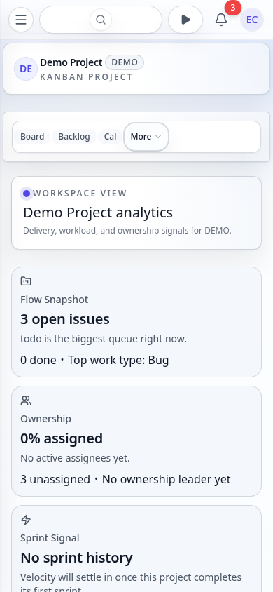
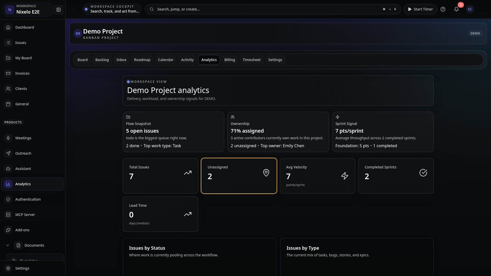
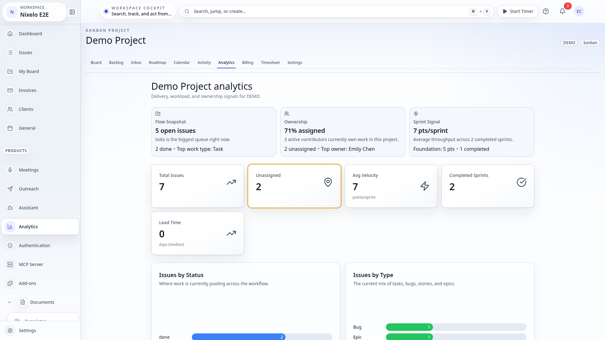
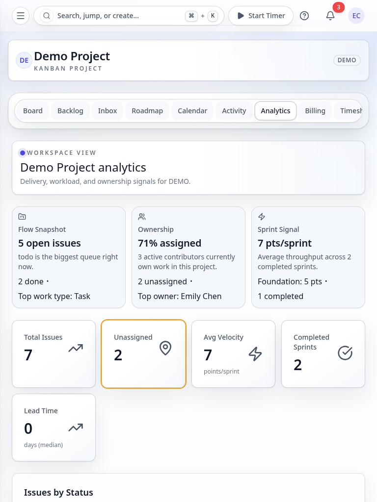
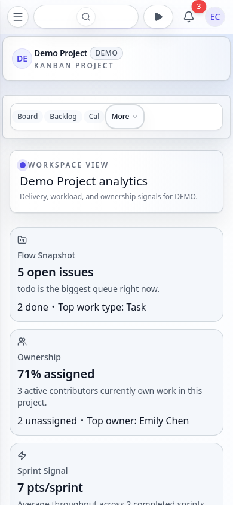

# Analytics Page - Current State

> **Route**: `/:slug/projects/:key/analytics`
> **Status**: REVIEWED, with routine follow-up polish only
> **Last Updated**: 2026-03-26

> **Spec Contract**: This file is intentionally hyper-comprehensive. ASCII diagrams, explicit structure walkthroughs, and high-detail notes are deliberate and should not be reduced to a short summary.

---

## Scope

This page spec covers the **project analytics** route. Organization analytics now has its own
separate screenshot route and should be reviewed through the org analytics spec folder, not folded
into this one.

The project analytics route is supposed to do three things:

1. summarize current delivery flow
2. expose ownership and sprint signal without leaving the project shell
3. keep charts and recent activity inside one contextual project workspace

---

## Screenshot Matrix

| State | Desktop Dark | Desktop Light | Tablet Light | Mobile Light |
|-------|--------------|---------------|--------------|--------------|
| Canonical route |  |  |  |  |
| Sparse-data route |  |  |  |  |
| No recent activity |  |  |  |  |

Org analytics is reviewed separately. This spec now covers the canonical project analytics route
plus the two previously-missing low-history variants.

---

## Route Anatomy

```text
┌──────────────────────────────────────────────────────────────────────────────────────────────┐
│ Shared project shell                                                                        │
│ compact project header + section nav                                                        │
├──────────────────────────────────────────────────────────────────────────────────────────────┤
│ Project analytics route                                                                     │
│                                                                                             │
│  PageHeader                                                                                 │
│  "{projectName} analytics"                                                                  │
│  Delivery, workload, and ownership signals for {projectKey}                                 │
│                                                                                             │
│  Insight band                                                                               │
│  [Flow Snapshot] [Ownership] [Sprint Signal]                                                │
│                                                                                             │
│  Metric band                                                                                │
│  [Total Issues] [Unassigned] [Avg Velocity] [Completed Sprints]                             │
│                                                                                             │
│  Chart grid                                                                                 │
│  [Issues by Status] [Issues by Type]                                                        │
│  [Issues by Priority] [Team Velocity]                                                       │
│                                                                                             │
│  Lower row                                                                                  │
│  [Issues by Assignee] [Recent Activity]                                                     │
└──────────────────────────────────────────────────────────────────────────────────────────────┘
```

---

## Current Composition

### 1. Contextual project framing

- The route receives real `projectId`, `projectName`, and `projectKey` context from the project
  route instead of pretending analytics is route-agnostic.
- The header copy names the actual project and keeps the page inside the shared project shell.

### 2. Insight band

- `AnalyticsInsightCard` provides the top interpretation layer:
  - `Flow Snapshot`
  - `Ownership`
  - `Sprint Signal`
- This is the "what should I conclude from the charts?" layer that the older generic dashboard
  lacked.

### 3. Metrics band

- Standard stat cards still exist, but they are now secondary to the contextual insight band.
- The route is no longer "four metrics, then charts"; it is "context first, metrics second."

### 4. Breakdown charts

- Status
- Type
- Priority
- Velocity
- Assignee

Each chart now has explicit empty-state handling instead of silently disappearing when data is
thin.

### 5. Recent activity

- The route keeps recent project activity inside the same analytics shell rather than bolting on a
  generic feed card.

---

## State Coverage

### Route states currently covered

- Filled project analytics route across desktop/tablet/mobile
- Sparse-data project with minimal assignee and sprint-history signal
- No-activity project with the dashboard intact but the recent-activity panel empty
- Loading skeleton state in code
- Explicit empty-state paths inside charts and recent activity

### Route states still not called out by dedicated screenshots

- project shell navigation interactions beyond the analytics route itself

---

## Current Strengths

| Area | Current Read |
|------|--------------|
| Project context | Strong. The route now feels tied to the active project instead of being a generic analytics demo. |
| Section rhythm | Good. Insight cards, metrics, charts, and activity now read as one workspace. |
| Empty-state honesty | Better than the earlier route because missing data produces explicit sections instead of silently dropped panels. |
| Screenshot trust | High. The reviewed matrix now covers canonical, sparse-data, and no-activity variants across the full viewport set, and the canonical captures now start at the actual route header instead of a mid-page chart scroll position. |

---

## Current Problems

| # | Problem | Area | Severity |
|---|---------|------|----------|
| ~~1~~ | ~~Sparse-data and low-history states not captured (need seed data variation in E2E tooling)~~ **Fixed** — screenshot capture now seeds and reviews sparse-data plus no-activity analytics variants across desktop/tablet/mobile | ~~screenshot coverage~~ | ~~LOW~~ |
| 2 | Desktop light mode is valid, but the chart grid still reads a bit flatter than the top insight band | surface hierarchy | LOW |
| 3 | The route is contextual now, but there is still no explicit date-range or comparison control when the user wants analysis beyond the default view | product depth | LOW |

---

## Source Files

| File | Purpose |
|------|---------|
| `src/routes/_auth/_app/$orgSlug/projects/$key/analytics.tsx` | Project analytics route and project context wiring |
| `src/components/AnalyticsDashboard.tsx` | Main project analytics composition |
| `src/components/Analytics/AnalyticsInsightCard.tsx` | Top-level insight band |
| `src/components/Analytics/ChartCard.tsx` | Shared chart section shell |
| `src/components/Analytics/MetricCard.tsx` | Metric cards |
| `src/components/Analytics/RecentActivity.tsx` | Activity section |
| `convex/e2e.ts` | Deterministic analytics screenshot-state seeding |
| `e2e/utils/test-user-service.ts` | Analytics screenshot-state API client |
| `e2e/screenshot-lib/filled-states.ts` | Canonical, sparse-data, and no-activity captures |
| `e2e/screenshot-pages.ts` | Project analytics screenshot registration |

---

## Review Guidance

- Keep project analytics contextual. Do not regress it into a generic stats wall.
- If screenshot coverage grows again, prioritize new states only when they expose materially
  different route behavior instead of duplicating the current low-history matrix.
- Org analytics belongs in the org analytics spec, not blended back into this page doc.

---

## Summary

Project analytics is current and materially better than the old generic dashboard version. The
remaining work is about product-depth controls and light hierarchy polish, not missing screenshot
states or route identity.
