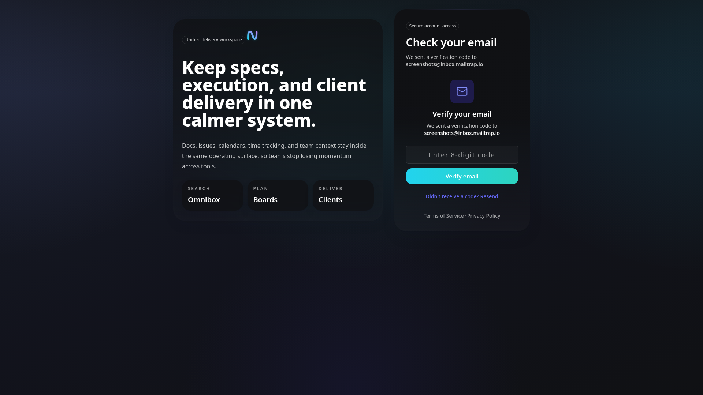
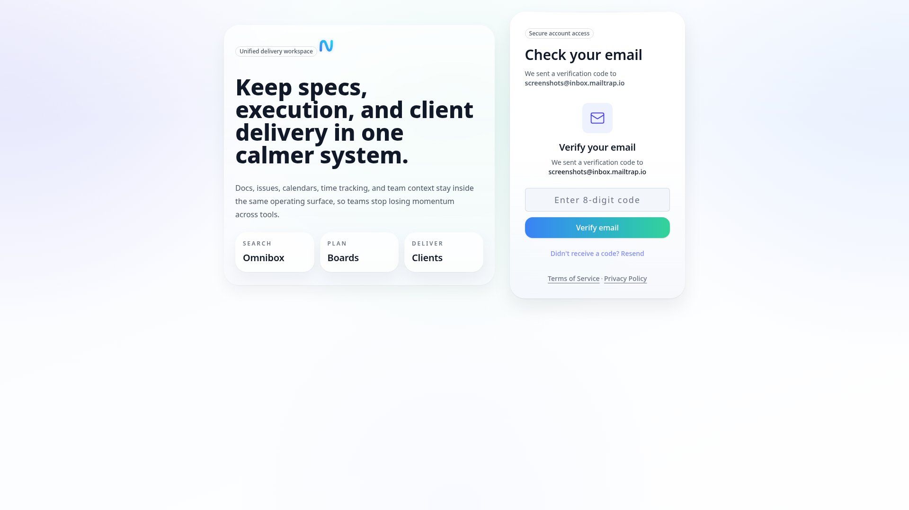
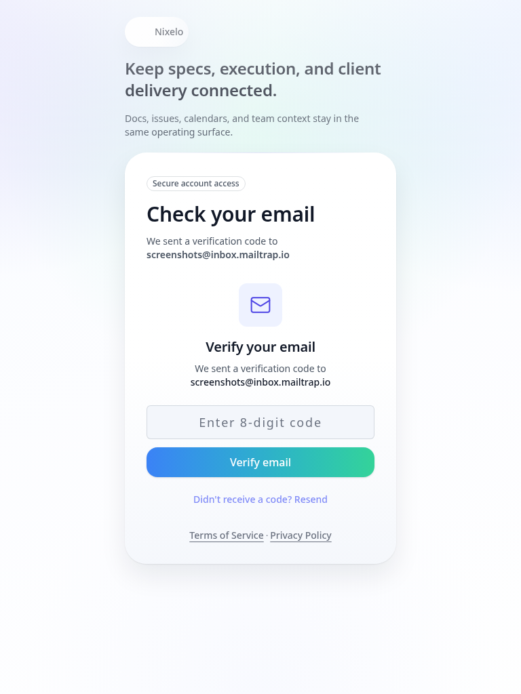

# Verify Email Page - Current State

> **Route**: `/verify-email`
> **Status**: REVIEWED, implemented, and part of the auth screenshot suite
> **Last Updated**: 2026-03-21

> **Spec Contract**: This file is intentionally hyper-comprehensive. ASCII diagrams, explicit structure walkthroughs, and high-detail notes are deliberate and should not be reduced to a short summary.

---

## Screenshot Matrix

| Viewport | Theme | Preview |
|----------|-------|---------|
| Desktop | Dark |  |
| Desktop | Light |  |
| Tablet | Light |  |
| Mobile | Light |  |

---

## Current Read

- This route now exists and is part of the real auth flow.
- It uses the shared auth shell rather than a bespoke verification card.
- When an `email` search param is present, the page shows the code-verification form.
- When no email is present, it falls back to a lighter explanatory state instead of failing or
  redirecting into nowhere.
- The route is wrapped in `AuthRedirect`, so successful verification continues into the app flow.

---

## Route Anatomy

```text
┌──────────────────────────────────────────────────────────────────────────────┐
│ Shared auth shell                                                           │
│                                                                              │
│  title: Check your email                                                     │
│  subtitle: sent code to {email} or fallback guidance                         │
│                                                                              │
│  EmailVerificationForm                                                       │
│  - code entry                                                                │
│  - resend hook                                                               │
│  - verified redirect                                                         │
└──────────────────────────────────────────────────────────────────────────────┘
```

---

## Remaining Gaps

| Problem | Area | Severity |
|---------|------|----------|
| The route is current, but it still only has canonical screenshots; error, resend, and no-email fallback states are not separately reviewed | screenshot depth | LOW |

---

## Source Files

- `src/routes/verify-email.tsx`
- `src/components/Auth/AuthPageLayout.tsx`
- `src/components/Auth/EmailVerificationForm.tsx`

---

## Summary

This page is no longer missing. It is a real part of the auth flow and should be treated as such in
future auth reviews.
