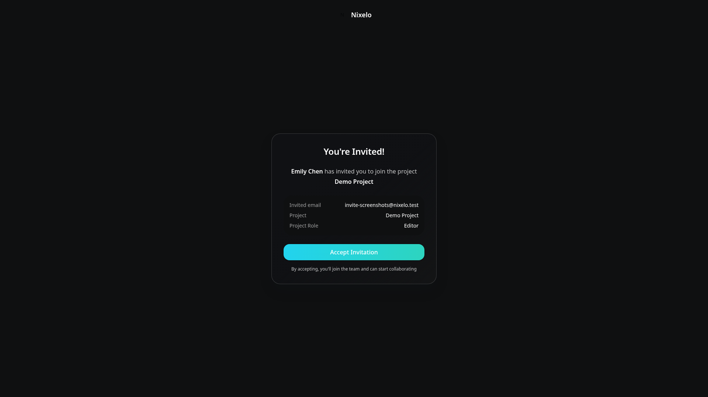
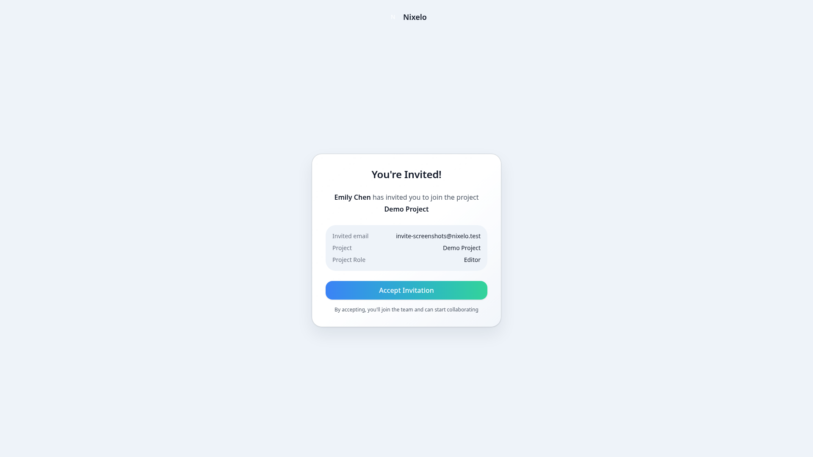
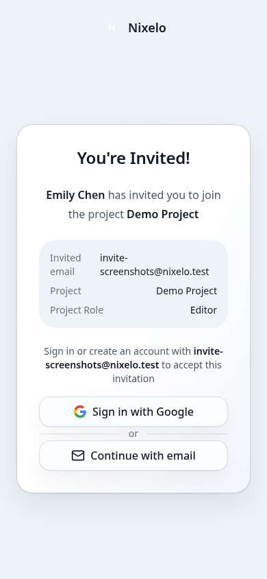

# Invite Page - Current State

> **Route**: `/invite/:token`
> **Status**: 🟡 FUNCTIONAL but NEEDS POLISH
> **Last Updated**: 2026-02-13

---

## Screenshots

| Viewport | Theme | Preview |
|----------|-------|---------|
| Desktop | Dark |  |
| Desktop | Light |  |
| Mobile | Light |  |

---

## Structure

### Loading State
```
┌─────────────────────────────────────────────────────────────────────────────┐
│                                                                             │
│     bg: bg-ui-bg-secondary                                                  │
│                                                                             │
│                         [Spinner]                                           │
│                    Loading invitation...                                    │
│                                                                             │
└─────────────────────────────────────────────────────────────────────────────┘
```

### Error States (Invalid/Expired/Revoked)
```
┌─────────────────────────────────────────────────────────────────────────────┐
│                                                                             │
│     bg: bg-ui-bg-secondary                                                  │
│                                                                             │
│                    ┌─────────────────────────────┐                          │
│                    │                             │ ← max-w-md (448px)       │
│                    │    ⚠️  (48px icon)          │   NO CARD NEEDED         │
│                    │                             │                          │
│                    │    Invalid Invitation       │ ← h3                     │
│                    │                             │                          │
│                    │    This invitation link     │ ← p, secondary           │
│                    │    is invalid...            │                          │
│                    │                             │                          │
│                    │    [ Go to Home ]           │ ← primary button         │
│                    │                             │                          │
│                    └─────────────────────────────┘                          │
│                                                                             │
└─────────────────────────────────────────────────────────────────────────────┘
```

### Valid Invite (Pending)
```
┌─────────────────────────────────────────────────────────────────────────────┐
│                                                                             │
│     bg: bg-ui-bg-secondary                                                  │
│                                                                             │
│  ┌─────────────────────────────────────────────────────────────────────┐   │
│  │ [N] Nixelo                                                   ← header   │
│  └─────────────────────────────────────────────────────────────────────┘   │
│                                                                             │
│         ┌───────────────────────────────────────────────┐                   │
│         │                                               │ ← bg-ui-bg        │
│         │         You're Invited!                       │   rounded-2xl     │
│         │                                               │   shadow-lg       │
│         │   {inviterName} has invited you to join       │   p-8            │
│         │   the project {projectName}                   │                   │
│         │                                               │   SLOP: Card?    │
│         │   ┌─────────────────────────────────────────┐ │                   │
│         │   │ Invited email    user@example.com       │ │ ← bg-ui-bg-secondary │
│         │   │ Project          Project Name           │ │   rounded-lg     │
│         │   │ Project Role     editor                 │ │   p-4            │
│         │   └─────────────────────────────────────────┘ │                   │
│         │                                               │                   │
│         │   [Authenticated]                             │                   │
│         │   ┌─────────────────────────────────────────┐ │                   │
│         │   │       Accept Invitation                 │ │ ← primary, lg    │
│         │   └─────────────────────────────────────────┘ │                   │
│         │   By accepting, you'll join the team...       │ ← xs, tertiary    │
│         │                                               │                   │
│         │   [Unauthenticated]                           │                   │
│         │   Sign in or create account with {email}      │                   │
│         │   <SignInForm />                              │ ← embedded form   │
│         │                                               │                   │
│         └───────────────────────────────────────────────┘                   │
│                                                                             │
└─────────────────────────────────────────────────────────────────────────────┘
```

---

## Files

| File | Purpose | Lines |
|------|---------|-------|
| `src/routes/invite.$token.tsx` | Route + all UI logic | 285 |
| `convex/invites.ts` | Backend invite logic | ~200 |

---

## Problems

| # | Problem | Location | Severity |
|---|---------|----------|----------|
| 1 | Card wrapper (`shadow-lg rounded-2xl`) | invite.$token.tsx:184 | MEDIUM |
| 2 | Header with logo feels disconnected | invite.$token.tsx:169-178 | LOW |
| 3 | "You're Invited!" heading is template-speak | invite.$token.tsx:187 | LOW |
| 4 | Details box could be cleaner | invite.$token.tsx:203-229 | LOW |
| 5 | Error state icons in separate colored circles | multiple | LOW |
| 6 | Verbose "By accepting..." disclaimer | invite.$token.tsx:260 | LOW |

---

## Current States

| State | Trigger | UI |
|-------|---------|-----|
| Loading | `invite === undefined` | Spinner + "Loading invitation..." |
| Invalid | `invite === null` | AlertCircle icon + error message |
| Expired | `invite.isExpired` | Clock icon + expiry message |
| Already Accepted | `invite.status === "accepted"` | CheckCircle + success message |
| Revoked | `invite.status === "revoked"` | AlertCircle + revoked message |
| Pending (Auth) | `invite.status === "pending"` + authenticated | Accept button |
| Pending (Unauth) | `invite.status === "pending"` + unauthenticated | SignInForm embedded |

---

## Summary

The invite page is **functional** but has typical slop patterns:
- Card wrapper with shadow
- Exclamation-mark heading ("You're Invited!")
- Verbose disclaimers
- Error states with icon circles

Overall it works correctly. The authentication flow (showing SignInForm for unauthenticated users) is well-implemented. Just needs visual cleanup to match the refined auth pages.
