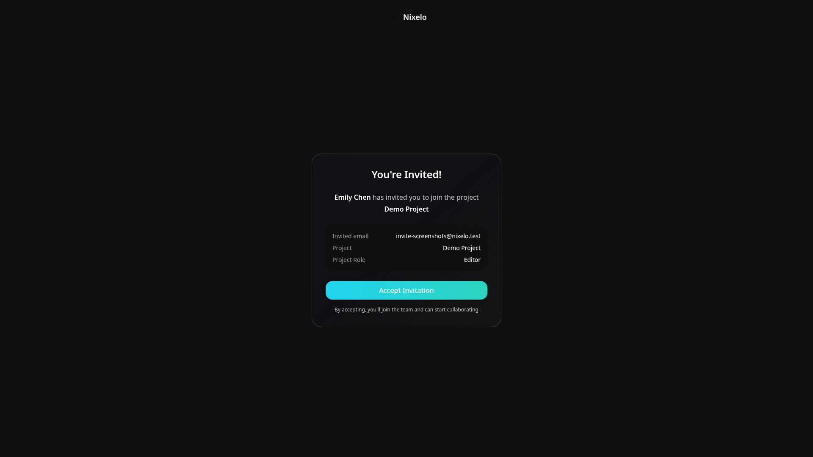
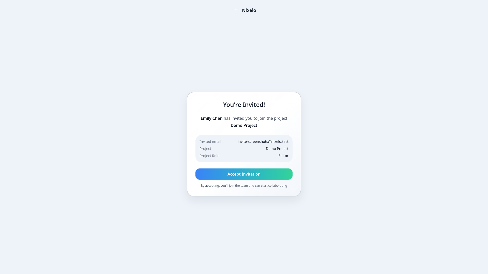
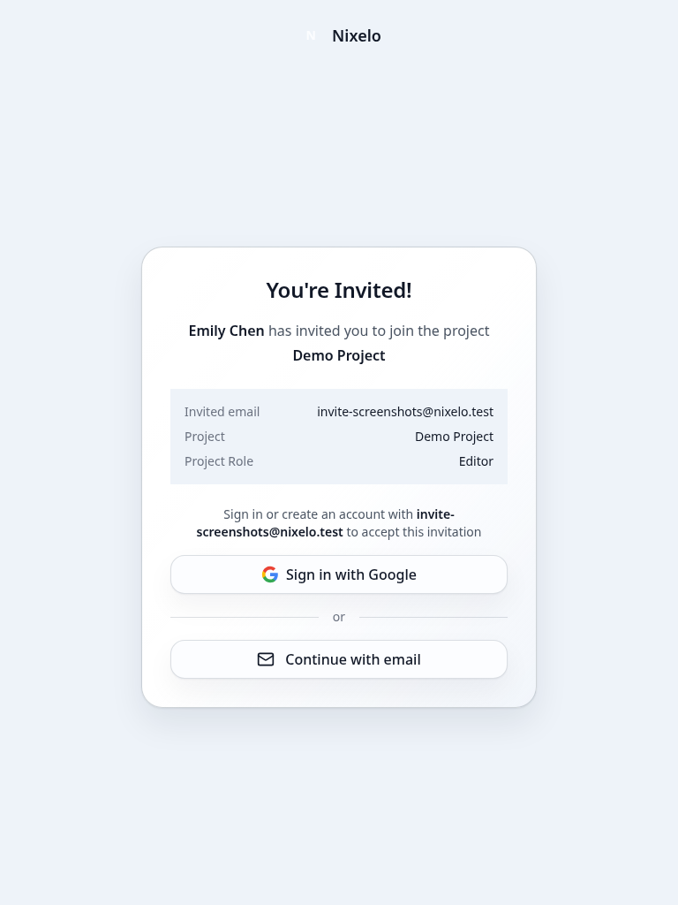
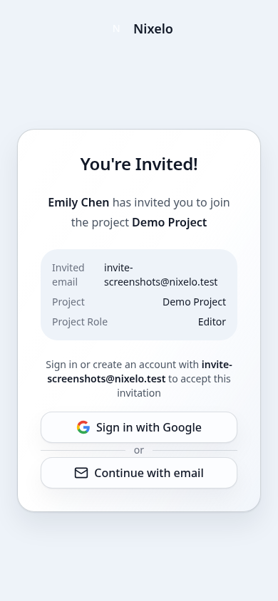

# Invite Page - Current State

> **Route**: `/join/:token`
> **Status**: IMPLEMENTED and reviewed across pending plus terminal invite states
> **Last Updated**: 2026-03-26
> **Spec Contract**: This file is intentionally hyper-comprehensive. ASCII diagrams, explicit structure walkthroughs, and high-detail notes are deliberate and should not be reduced to a short summary.

---

## Screenshot Matrix

| State | Desktop Dark | Desktop Light | Tablet Light | Mobile Light |
|-------|--------------|---------------|--------------|--------------|
| Pending invite |  |  |  |  |
| Invalid invite |  |  |  |  |
| Expired invite |  |  |  |  |
| Revoked invite |  |  |  |  |
| Accepted invite |  |  |  |  |

---

## Current Read

- The join route handles:
  - loading
  - invalid token
  - expired invite
  - revoked invite
  - already accepted invite
  - valid pending invite for authenticated and unauthenticated users
- Authenticated users can accept directly.
- Unauthenticated users are dropped into the shared sign-in flow in-place.
- All primary terminal branches now render inside the same branded invite shell as the pending path.
- The reviewed screenshot matrix now covers the important terminal states instead of only the happy-path invite.

---

## Route Anatomy

```text
┌──────────────────────────────────────────────────────────────────────────────┐
│ Standalone public route                                                      │
│                                                                              │
│  header: compact Nixelo brand row                                            │
│                                                                              │
│  main invite card                                                            │
│  - inviter identity                                                          │
│  - project / org invite details                                              │
│  - authenticated accept path OR embedded sign-in path                        │
│                                                                              │
│  alternate state screens                                                     │
│  - invalid / expired / revoked / accepted                                    │
└──────────────────────────────────────────────────────────────────────────────┘
```

---

## Remaining Gaps

No significant route-specific visual gaps remain on the current branch. Future work belongs to the broader public-route consistency pass rather than an invite-only defect.

---

## Source Files

- `src/routes/join.$token.tsx`
- `src/components/Auth/SignInForm.tsx`
- `convex/invites.ts`

---

## Summary

Invite is implemented, visually coherent, and now reviewable across the main pending and terminal
states. Remaining work is broader public-route consistency, not missing invite behavior or screenshot
coverage.
