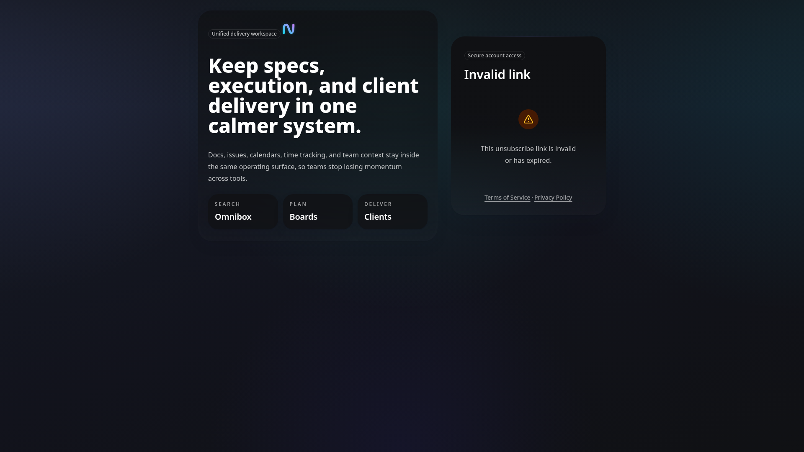
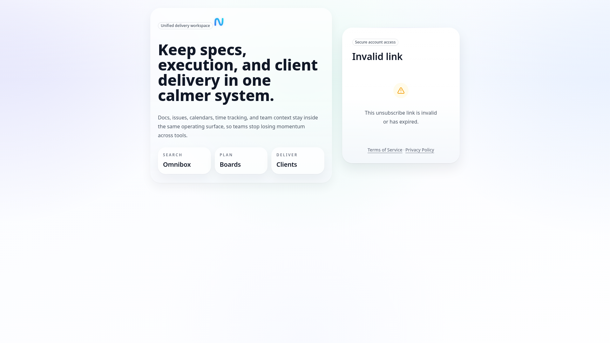
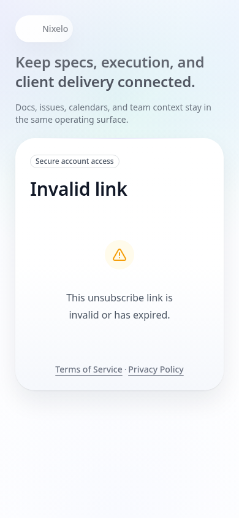

# Unsubscribe Page - Current State

> **Route**: `/unsubscribe/:token`
> **Status**: 🟡 FUNCTIONAL but NEEDS POLISH
> **Last Updated**: 2026-02-13

---

## Screenshots

| Viewport | Theme | Preview |
|----------|-------|---------|
| Desktop | Dark |  |
| Desktop | Light |  |
| Mobile | Light |  |

---

## Structure

```
┌─────────────────────────────────────────────────────────────────────────────┐
│                                                                             │
│     bg: bg-ui-bg-secondary                                                  │
│                                                                             │
│         ┌───────────────────────────────────────────────┐                   │
│         │                                               │ ← max-w-md        │
│         │     bg-ui-bg rounded-lg shadow-lg p-8         │   SLOP: Card     │
│         │                                               │                   │
│         │   [Loading State]                             │                   │
│         │   ┌─────────────────────────┐                 │                   │
│         │   │ [Spinner lg]            │                 │                   │
│         │   └─────────────────────────┘                 │                   │
│         │   Processing...                               │ ← h4              │
│         │   Unsubscribing you from email notifications  │ ← secondary       │
│         │                                               │                   │
│         │   [Success State]                             │                   │
│         │   ┌─────────────────────────┐                 │                   │
│         │   │ ✓ (checkmark in circle) │                 │ ← 48px, green bg  │
│         │   └─────────────────────────┘                 │                   │
│         │   Successfully Unsubscribed                   │ ← h4              │
│         │   You have been unsubscribed from all...      │ ← secondary       │
│         │   You can update your notification            │ ← muted           │
│         │   preferences anytime by logging into...      │                   │
│         │                                               │                   │
│         │   [Invalid State]                             │                   │
│         │   ┌─────────────────────────┐                 │                   │
│         │   │ ⚠ (warning in circle)   │                 │ ← 48px, yellow bg │
│         │   └─────────────────────────┘                 │                   │
│         │   Invalid or Expired Link                     │ ← h4              │
│         │   This unsubscribe link is invalid or has...  │ ← secondary       │
│         │                                               │                   │
│         │   [Error State]                               │                   │
│         │   ┌─────────────────────────┐                 │                   │
│         │   │ ✕ (X in circle)         │                 │ ← 48px, red bg    │
│         │   └─────────────────────────┘                 │                   │
│         │   Something Went Wrong                        │ ← h4              │
│         │   We couldn't process your unsubscribe...     │ ← secondary       │
│         │   {errorMessage}                              │ ← error box       │
│         │                                               │                   │
│         └───────────────────────────────────────────────┘                   │
│                                                                             │
└─────────────────────────────────────────────────────────────────────────────┘
```

---

## Files

| File | Purpose | Lines |
|------|---------|-------|
| `src/routes/unsubscribe.$token.tsx` | Route definition | ~20 |
| `src/components/UnsubscribePage.tsx` | All UI logic | 175 |
| `convex/unsubscribe.ts` | Backend logic | ~100 |

---

## Problems

| # | Problem | Location | Severity |
|---|---------|----------|----------|
| 1 | Card wrapper (`shadow-lg rounded-lg p-8`) | UnsubscribePage.tsx:54 | MEDIUM |
| 2 | `bg-ui-bg-secondary` background | UnsubscribePage.tsx:53 | LOW |
| 3 | Icon in colored circle (48px) | multiple | LOW |
| 4 | Inline SVG instead of Icon component | UnsubscribePage.tsx:79,107,140 | LOW |
| 5 | Verbose success message | UnsubscribePage.tsx:91-96 | LOW |
| 6 | No "Go to Home" button | N/A | LOW |

---

## Current States

| State | Trigger | UI |
|-------|---------|-----|
| Loading | `getUserFromToken === undefined` or processing | Spinner + "Processing..." |
| Success | `unsubscribe()` succeeds | Green checkmark + success message |
| Invalid | `getUserFromToken === null` | Yellow warning + invalid message |
| Error | `unsubscribe()` throws | Red X + error message + error details |

---

## Summary

The unsubscribe page is **functional** with proper state handling (auto-unsubscribe on valid token). However, it has typical slop:
- Card wrapper with shadow
- Large icons in colored circles
- Inline SVGs instead of Icon component
- Verbose explanatory text
- No way to navigate away after completion

The auto-unsubscribe behavior (one-click) is correct and user-friendly.
