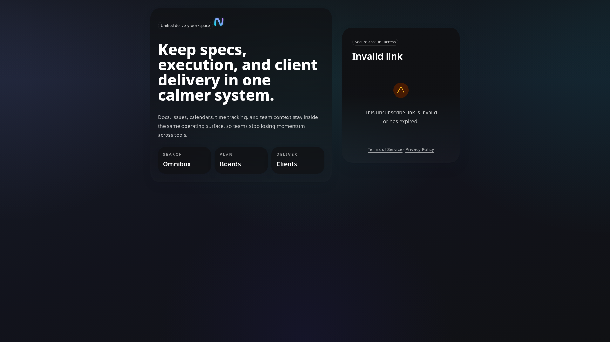
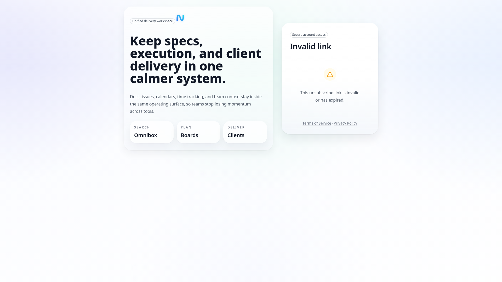
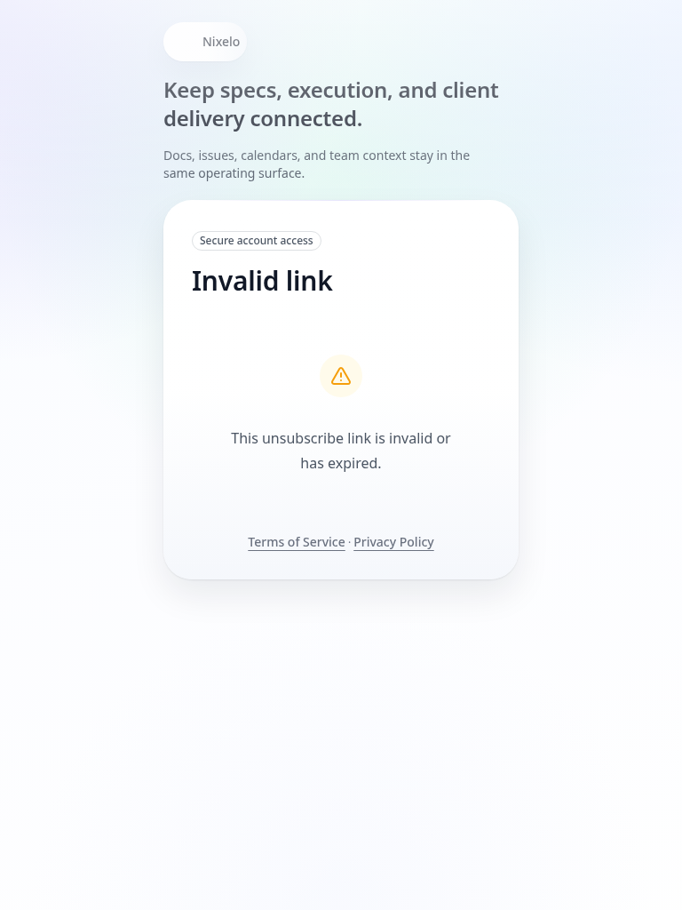
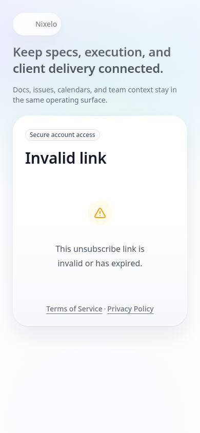

# Unsubscribe Page - Current State

> **Route**: `/unsubscribe?token=...`
> **Status**: IMPLEMENTED and coherent
> **Last Updated**: 2026-03-21

> **Spec Contract**: This file is intentionally hyper-comprehensive. ASCII diagrams, explicit structure walkthroughs, and high-detail notes are deliberate and should not be reduced to a short summary.

---

## Screenshot Matrix

| Viewport | Theme | Preview |
|----------|-------|---------|
| Desktop | Dark |  |
| Desktop | Light |  |
| Tablet | Light |  |
| Mobile | Light |  |

---

## Current Read

- This route now lives at `/unsubscribe` with a `token` search param instead of a path token.
- It uses the shared auth shell and a lighter ghost-card treatment.
- Public unsubscribe still happens automatically once the token resolves.
- The route handles:
  - loading
  - success
  - invalid token
  - error

---

## Route Anatomy

```text
┌──────────────────────────────────────────────────────────────────────────────┐
│ Shared auth shell                                                           │
│                                                                              │
│  title changes by state                                                     │
│  - Unsubscribing...                                                         │
│  - Unsubscribed                                                             │
│  - Invalid link                                                             │
│  - Something went wrong                                                     │
│                                                                              │
│  shared ghost card                                                          │
│  icon circle + short explanatory copy                                       │
└──────────────────────────────────────────────────────────────────────────────┘
```

---

## Remaining Gaps

| Problem | Area | Severity |
|---------|------|----------|
| The route is much cleaner than the older slop-heavy version, but it still only has canonical screenshots rather than separate success/invalid/error captures | screenshot depth | LOW |

---

## Source Files

- `src/routes/unsubscribe.tsx`
- `src/components/UnsubscribePage.tsx`
- `convex/unsubscribe.ts`

---

## Summary

Unsubscribe is implemented, cleaner than before, and no longer accurately described by the older
"shadow-lg card slop" spec. Remaining work is just deeper reviewed state coverage.
