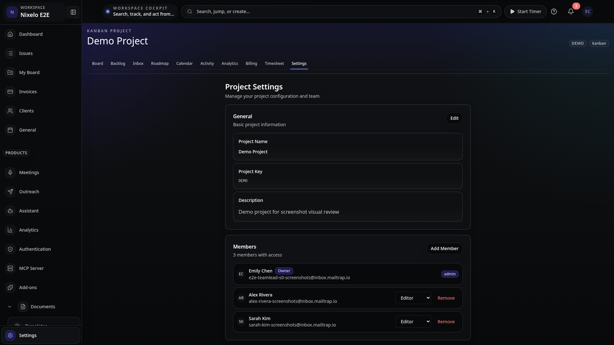
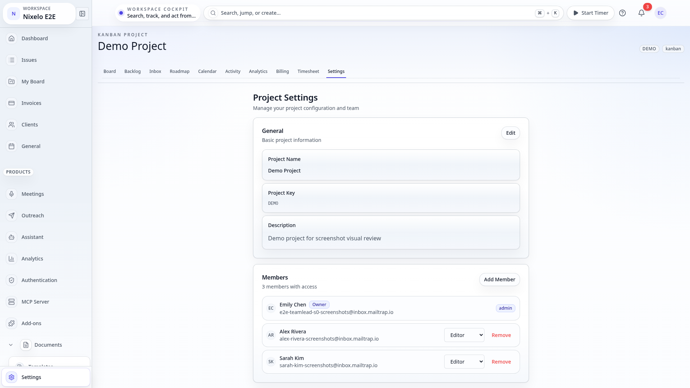

# Members Management - Current State

> **Route**: Part of `/:slug/projects/:key/settings`
> **Status**: 🟡 EMBEDDED - NOT STANDALONE
> **Last Updated**: 2026-02-13

---

## Screenshots

| Viewport | Theme | Preview |
|----------|-------|---------|
| Desktop | Dark |  |
| Desktop | Light |  |

---

## Structure

Members management is currently **embedded in ProjectSettings**, not a standalone page.

```
┌─────────────────────────────────────────────────────────────────────────────┐
│                                                                             │
│  Project Settings Page                                                      │
│                                                                             │
│  ┌───────────────────────────────────────────────────────────┐              │
│  │  General Settings Tab                                     │              │
│  │  - Project name, description, etc.                        │              │
│  └───────────────────────────────────────────────────────────┘              │
│                                                                             │
│  ┌───────────────────────────────────────────────────────────┐              │
│  │  Members Card  ←  card-soft p-6                           │              │
│  │                                                           │              │
│  │  ┌─────────────────────────────────────────────────────┐  │              │
│  │  │  Members                              [Add Member]  │  │              │
│  │  │  {count} members with access                        │  │              │
│  │  └─────────────────────────────────────────────────────┘  │              │
│  │                                                           │              │
│  │  [Add Member Form - if showAddForm]                       │              │
│  │  ┌─────────────────────────────────────────────────────┐  │              │
│  │  │  Add New Member                                     │  │              │
│  │  │  Email Address: [_______________]                   │  │              │
│  │  │  Role: [Admin ▼]                                    │  │              │
│  │  │  [Add Member] [Cancel]                              │  │              │
│  │  └─────────────────────────────────────────────────────┘  │              │
│  │                                                           │              │
│  │  ┌─────────────────────────────────────────────────────┐  │              │
│  │  │  [Avatar] John Smith          Owner  admin ▼        │  │              │
│  │  │           john@example.com                          │  │              │
│  │  └─────────────────────────────────────────────────────┘  │              │
│  │                                                           │              │
│  │  ┌─────────────────────────────────────────────────────┐  │              │
│  │  │  [Avatar] Jane Doe            [editor ▼] [Remove]   │  │              │
│  │  │           jane@example.com                          │  │              │
│  │  └─────────────────────────────────────────────────────┘  │              │
│  │                                                           │              │
│  └───────────────────────────────────────────────────────────┘              │
│                                                                             │
└─────────────────────────────────────────────────────────────────────────────┘
```

---

## Files

| File | Purpose | Lines |
|------|---------|-------|
| `src/components/ProjectSettings/MemberManagement.tsx` | Members UI component | 262 |
| `src/routes/_auth/_app/$orgSlug/projects/$key/settings.tsx` | Parent route | 68 |
| `convex/projects.ts` | Member CRUD operations | - |

---

## Current Features

| Feature | Status | Notes |
|---------|--------|-------|
| List members | ✅ | Avatar, name, email, role |
| Add member by email | ✅ | Email input + role select |
| Change member role | ✅ | Dropdown (admin/editor/viewer) |
| Remove member | ✅ | Button + confirm dialog |
| Owner protection | ✅ | Can't change owner role/remove |
| Role badges | ✅ | Brand/secondary/neutral colors |

---

## Problems

| # | Problem | Location | Severity |
|---|---------|----------|----------|
| 1 | Embedded in settings, not standalone | N/A | INFO |
| 2 | Card wrapper (`card-soft p-6`) | MemberManagement.tsx:125 | LOW |
| 3 | Add form has `bg-ui-bg-tertiary` box | MemberManagement.tsx:144 | LOW |
| 4 | Member rows have hover state | MemberManagement.tsx:193 | LOW |
| 5 | Typography variant override | MemberManagement.tsx:129 | LOW |

---

## Summary

The MemberManagement component is **well-implemented** with proper:
- State management (add form toggle, loading states)
- Role protection (can't modify owner)
- Confirm dialog for removal
- Error handling with toasts

Main consideration: Should this be a standalone page (`/:slug/members`) or remain embedded in project settings? Current location makes sense for project-scoped members, but organization-level members might need a separate page.

**Current implementation is good** - just minor polish needed:
- Remove card wrapper if moved to standalone page
- Consider extracting to org-level route for team management
