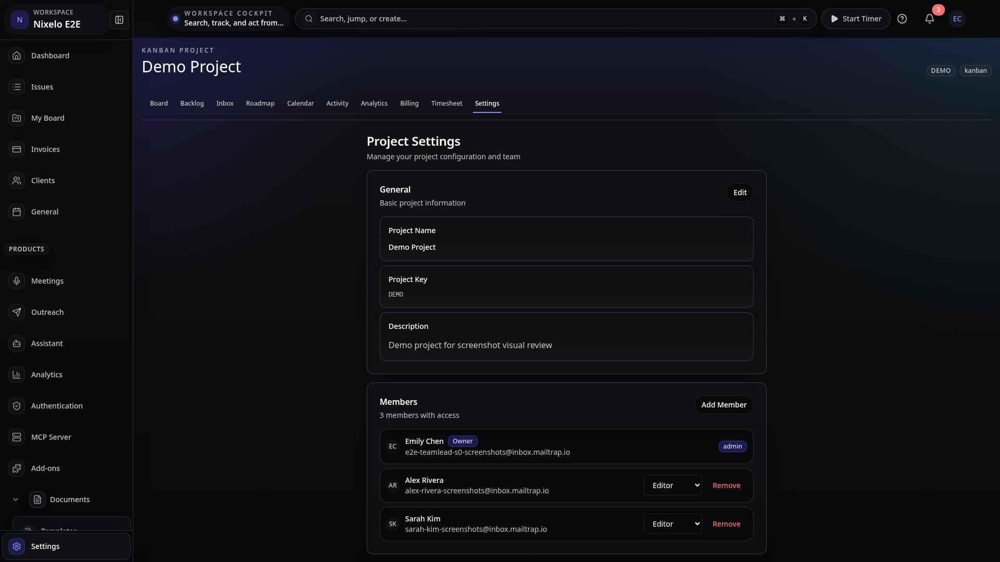
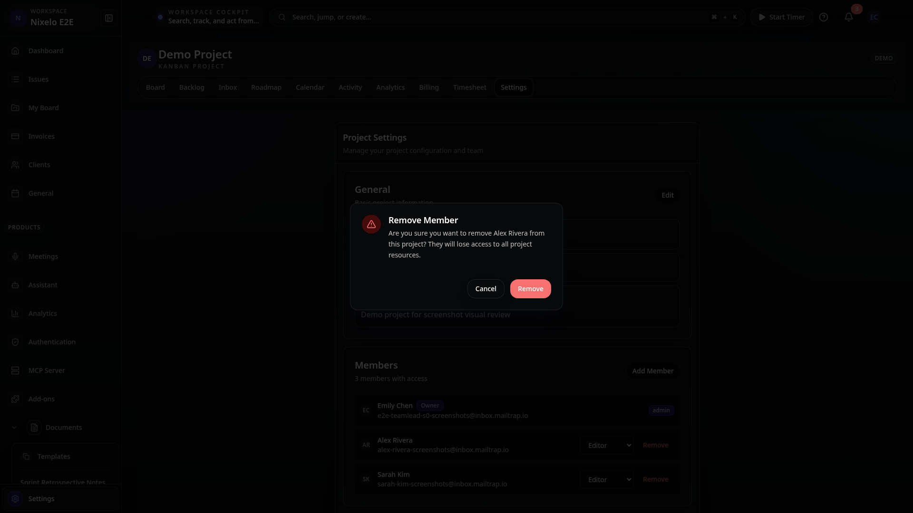
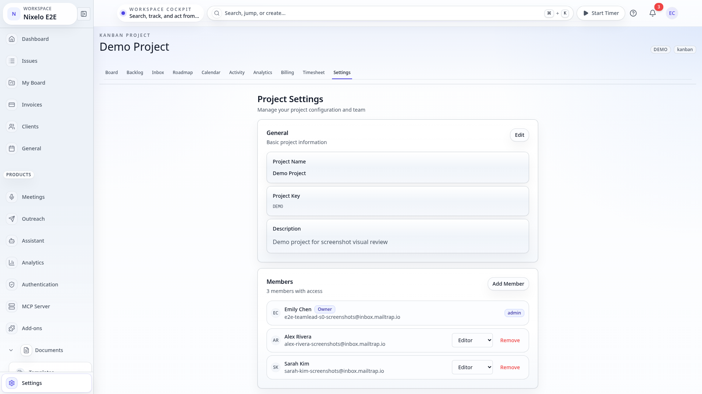
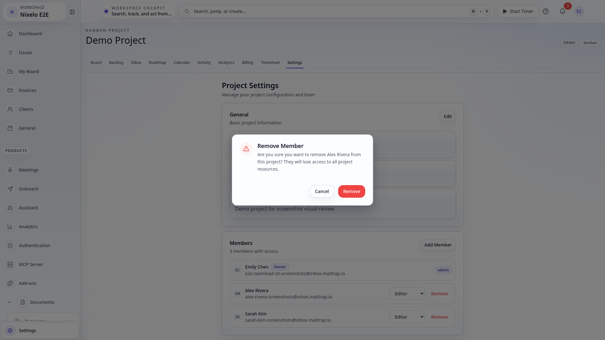
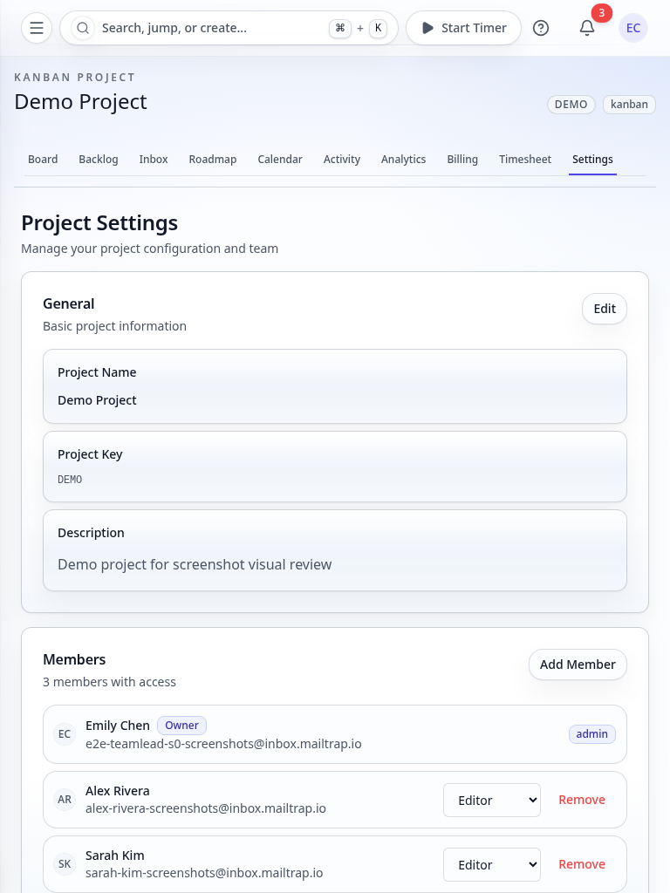
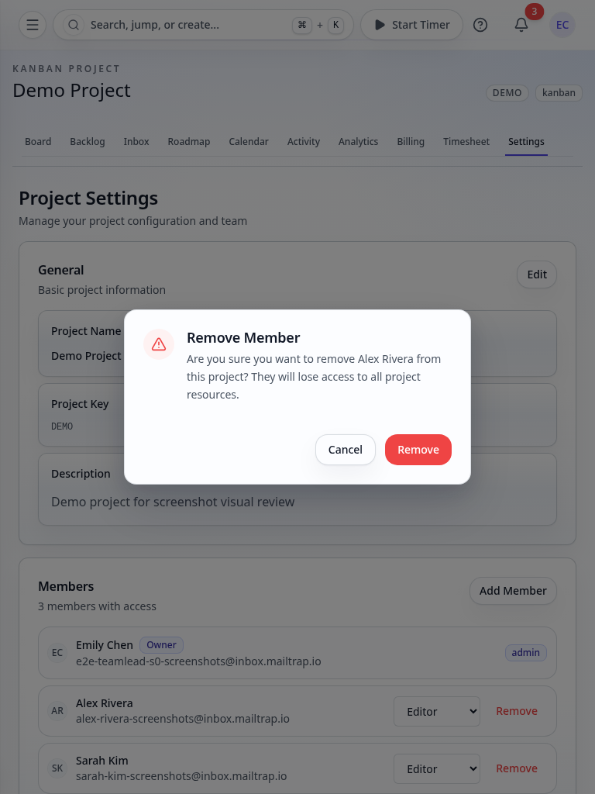
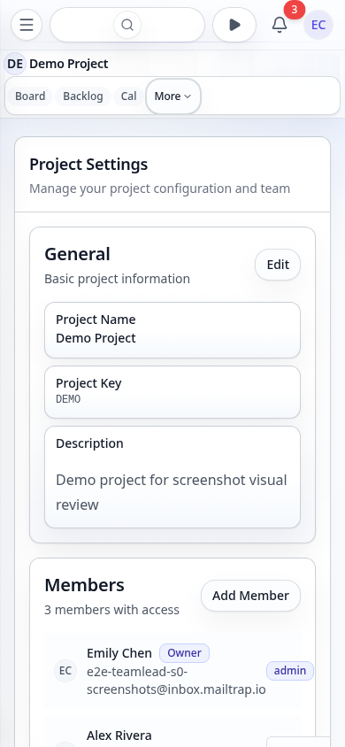
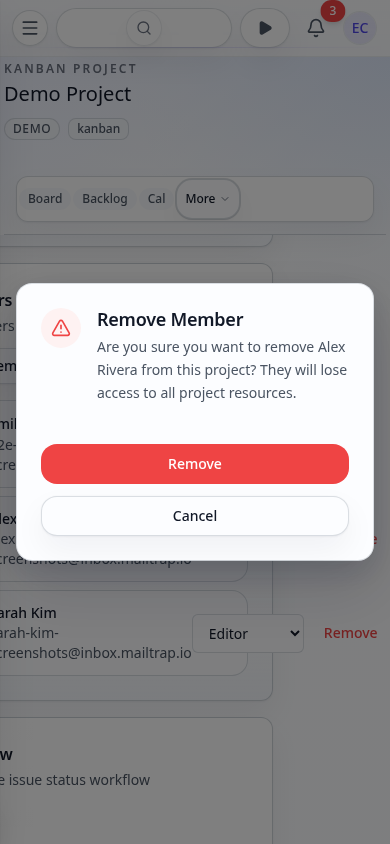

# Members Management - Current State

> **Route**: embedded inside `/:slug/projects/:key/settings`
> **Status**: IMPLEMENTED as a project-settings sub-surface
> **Last Updated**: 2026-03-26

> **Spec Contract**: This file is intentionally hyper-comprehensive. ASCII diagrams, explicit structure walkthroughs, and high-detail notes are deliberate and should not be reduced to a short summary.

---

## Screenshot Matrix

| Viewport | Base State | Confirm Dialog |
|----------|------------|----------------|
| Desktop Dark |  |  |
| Desktop Light |  |  |
| Tablet Light |  |  |
| Mobile Light |  |  |

---

## Current Read

- Members management is intentionally embedded in project settings, not a standalone route.
- The surface supports:
  - member list
  - add member by email
  - role changes
  - owner protection
  - removal with confirm dialog
- The base state and confirm dialog are now both part of the reviewed screenshot set across desktop, tablet, and mobile.

---

## Route Anatomy

```text
┌──────────────────────────────────────────────────────────────────────────────┐
│ Project settings route                                                       │
│                                                                              │
│  ProjectSettings                                                             │
│   └─ MemberManagement                                                        │
│      - header + member count                                                 │
│      - add-member form                                                       │
│      - member rows                                                           │
│      - role controls / remove action                                         │
│      - confirm dialog                                                        │
└──────────────────────────────────────────────────────────────────────────────┘
```

---

## Remaining Gaps

| Problem | Area | Severity |
|---------|------|----------|
| The embedded surface is appropriately scoped now, but if member management expands much further it should graduate into a broader team/org management route instead of accumulating more local settings chrome. | future scope | LOW |

---

## Source Files

- `src/components/ProjectSettings/MemberManagement.tsx`
- `src/routes/_auth/_app/$orgSlug/projects/$key/settings.tsx`
- `convex/projects.ts`

---

## Summary

Members management is current as an embedded settings surface with reviewed base and confirm-dialog
states across desktop, tablet, and mobile. The remaining question is future scope, not shell
quality or screenshot depth.
