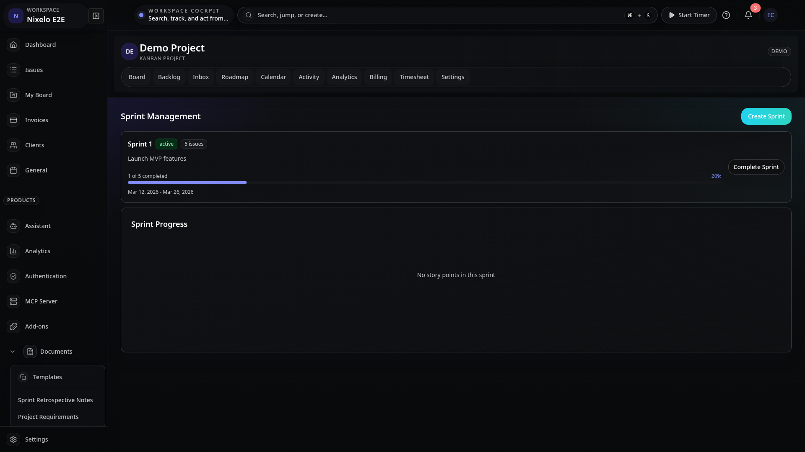
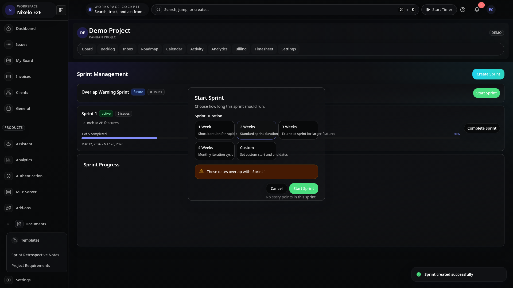
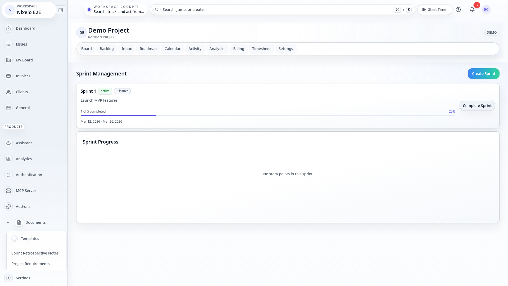
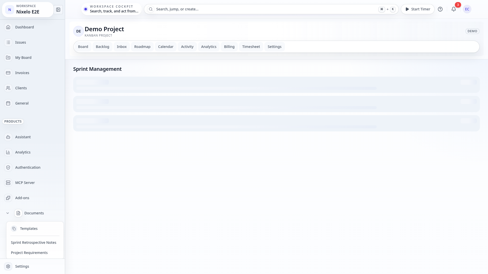
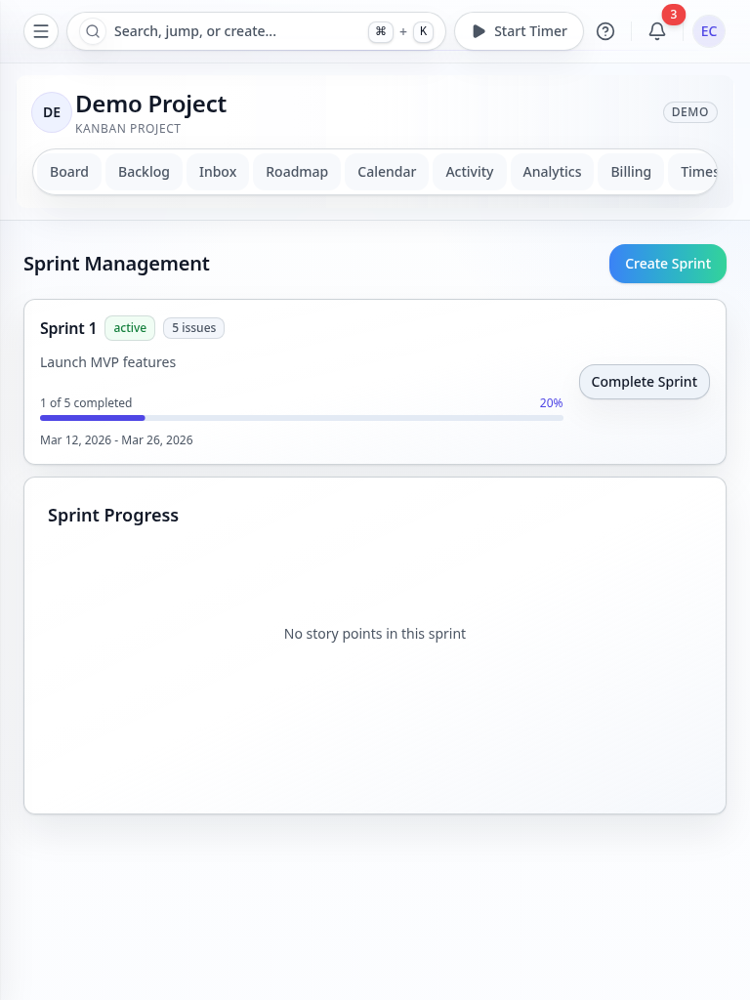
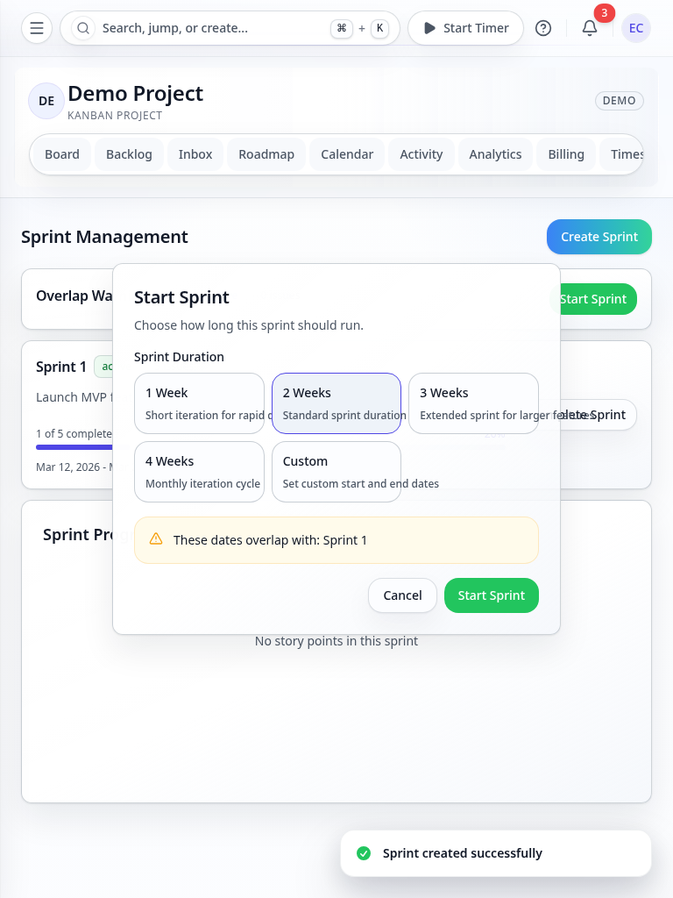
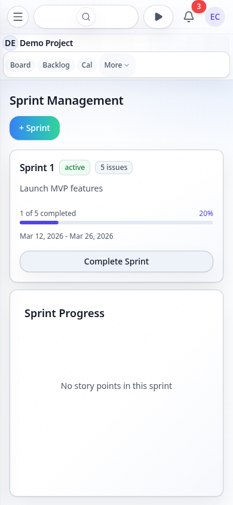

# Sprints Page - Current State

> **Route**: `/:slug/projects/:key/sprints`
> **Status**: REVIEWED baseline with multi-state screenshot coverage
> **Last Updated**: 2026-03-21

> **Spec Contract**: This file is intentionally hyper-comprehensive. ASCII diagrams, explicit structure walkthroughs, and high-detail notes are deliberate and should not be reduced to a short summary.

---

## Screenshot Matrix

| Viewport | Base Route | Burndown | Completion Modal | Date Overlap Warning |
|----------|------------|----------|------------------|----------------------|
| Desktop Dark |  |  |  |  |
| Desktop Light |  |  |  |  |
| Tablet Light |  |  |  |  |
| Mobile Light |  |  |  |  |

---

## Current Read

- The sprints route now participates in the promoted reviewed screenshot baseline.
- It covers more than the happy path:
  - burndown view
  - completion flow
  - overlap warning flow
- The route is still a pragmatic sprint management surface, not an overdesigned planning cockpit.

---

## Route Anatomy

```text
┌──────────────────────────────────────────────────────────────────────────────┐
│ Shared project shell                                                        │
├──────────────────────────────────────────────────────────────────────────────┤
│ Sprint manager                                                              │
│                                                                              │
│  sprint cards                                                                │
│  create sprint                                                               │
│  start sprint                                                                │
│  complete sprint                                                             │
│  optional burndown                                                           │
│  overlap warnings                                                            │
└──────────────────────────────────────────────────────────────────────────────┘
```

---

## Remaining Gaps

| Problem | Area | Severity |
|---------|------|----------|
| Progress semantics are still simpler than a full planning tool and remain partly issue-count focused | product depth | MEDIUM |
| Editing and archive/history flows are still lighter than the main create/start/complete paths | product breadth | LOW |

---

## Source Files

- `src/routes/_auth/_app/$orgSlug/projects/$key/sprints.tsx`
- `src/components/Sprints/SprintManager.tsx`
- `convex/sprints.ts`
- `e2e/screenshot-pages.ts`

---

## Summary

Sprints is no longer just "functional baseline". It has real reviewed state coverage and is current
to the branch. The remaining work is product-depth expansion, not screenshot or route credibility.
