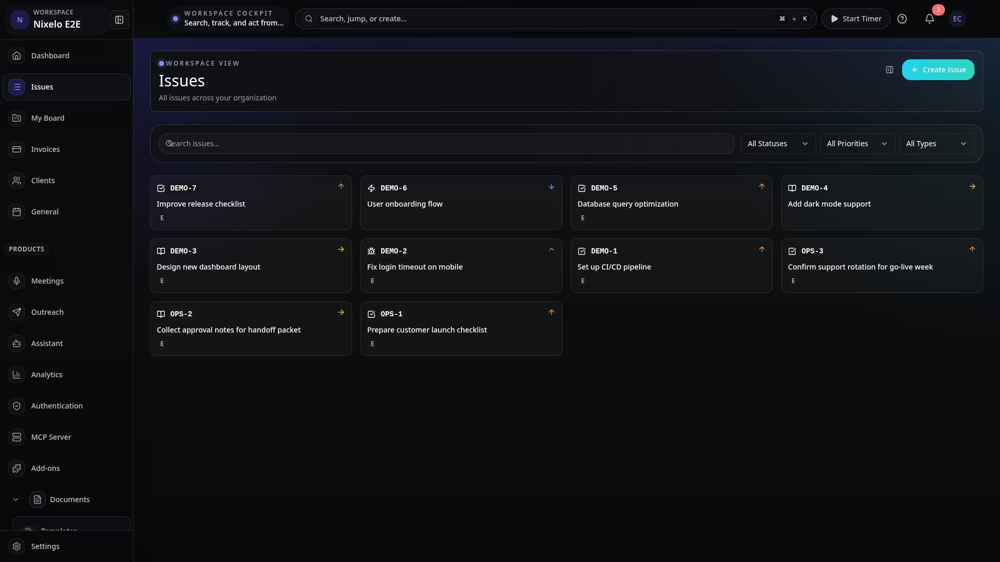
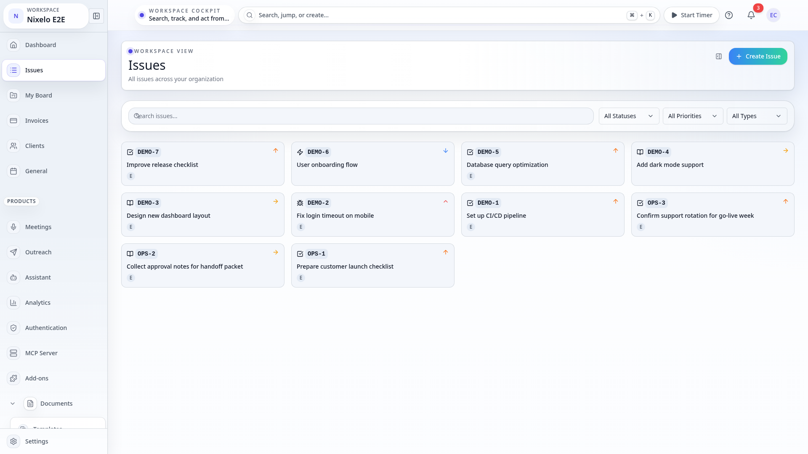
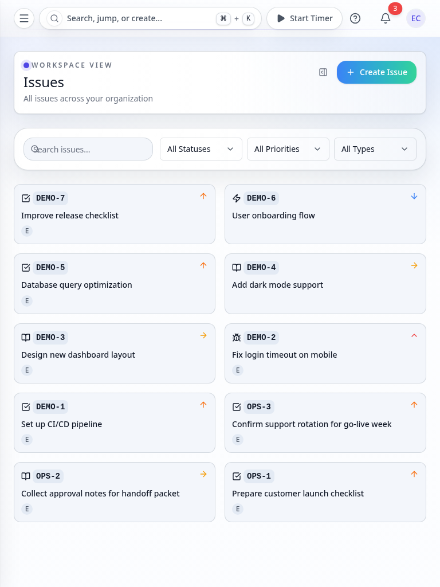
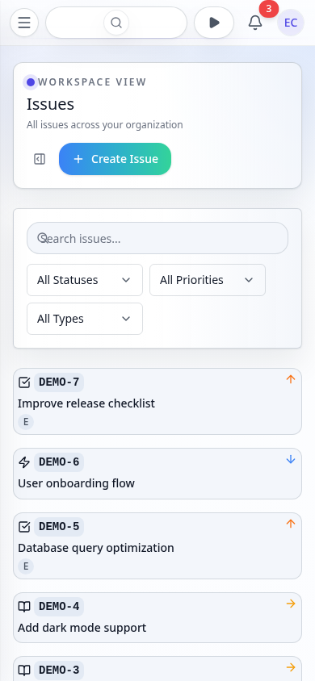

# Issues Page - Current State

> **Route**: `/:slug/issues`
> **Status**: REVIEWED
> **Last Updated**: 2026-03-23

> **Spec Contract**: This file is intentionally hyper-comprehensive. ASCII diagrams, explicit structure walkthroughs, and high-detail notes are deliberate and should not be reduced to a short summary.

---

## Purpose

The issues page is the organization-wide issue browser. It answers:

1. What issues exist across all my projects?
2. Can I quickly find a specific issue by name or key?
3. What's the status distribution across the organization?
4. Can I drill into an issue without leaving the list context?

This is a read-heavy discovery surface, not a project-scoped work board. It shows issues from
every project the user has access to, with simple search and status filtering.

---

## Screenshot Matrix

### Canonical route captures

| Viewport | Theme | Preview |
|----------|-------|---------|
| Desktop | Dark |  |
| Desktop | Light |  |
| Tablet | Light |  |
| Mobile | Light |  |

### Additional state captures

| State | Desktop Dark | Desktop Light | Tablet Light | Mobile Light |
|-------|-------------|---------------|--------------|--------------|
| Side panel open | `desktop-dark-side-panel.png` | `desktop-light-side-panel.png` | `tablet-light-side-panel.png` | `mobile-light-side-panel.png` |

### Missing captures (should be added)

- Empty state (no issues in org)
- Search active with results
- Search active with no results
- Status filter applied
- Create issue modal open
- Loading skeleton state

---

## Route Anatomy

```text
┌──────────────────────────────────────────────────────────────────────────────┐
│ Global app shell                                                             │
│ sidebar + top utility bar                                                    │
├──────────────────────────────────────────────────────────────────────────────┤
│ Issues route                                                                 │
│                                                                              │
│  PageHeader                                                                  │
│  "Issues" + "All issues across your organization"                            │
│                                         [View Mode Toggle] [+ Create Issue]  │
│                                                                              │
│  PageControls                                                                │
│  ┌─────────────────────────────────────────────────┐ ┌──────────────────┐   │
│  │ Search issues...                                │ │ All Statuses     │   │
│  └─────────────────────────────────────────────────┘ └──────────────────┘   │
│                                                                              │
│  PageContent                                                                 │
│  ┌────────────┐ ┌────────────┐ ┌────────────┐ ┌────────────┐               │
│  │ IssueCard  │ │ IssueCard  │ │ IssueCard  │ │ IssueCard  │               │
│  │ PROJ-1     │ │ PROJ-2     │ │ PROJ-3     │ │ PROJ-4     │               │
│  │ Bug title  │ │ Task title │ │ Story ...  │ │ Epic ...   │               │
│  └────────────┘ └────────────┘ └────────────┘ └────────────┘               │
│  ┌────────────┐ ┌────────────┐ ┌────────────┐ ┌────────────┐               │
│  │ ...        │ │ ...        │ │ ...        │ │ ...        │               │
│  └────────────┘ └────────────┘ └────────────┘ └────────────┘               │
│                                                                              │
│                         [ Load More ]                                        │
│                                                                              │
├──────────────────────────────────────────────────────────────────────────────┤
│ (overlay) IssueDetailViewer — sheet from right edge when card clicked        │
│ ┌──────────────────────────────────────────────────────────────────────────┐ │
│ │ IssueDetailContent: header, description editor, comments, sidebar       │ │
│ └──────────────────────────────────────────────────────────────────────────┘ │
├──────────────────────────────────────────────────────────────────────────────┤
│ (overlay) CreateIssueModal — dialog when "+ Create Issue" clicked            │
└──────────────────────────────────────────────────────────────────────────────┘
```

---

## Current Composition

### 1. Route shell

- Route lives under the authenticated app shell (`_auth/_app/$orgSlug`).
- Inherits standard top nav, search, shortcuts, timer, notifications, avatar.
- Uses `PageLayout` then `PageStack` then `PageHeader` + `PageControls` + `PageContent`.
- No route-specific shell overrides or decorative layers.

### 2. Header and controls

- `PageHeader` with title "Issues", description, and two action buttons:
  - `ViewModeToggle` — toggles between card and list views (from Kanban).
  - `Button` "Create Issue" — opens the `CreateIssueModal`.
- `PageControls` row with:
  - Search `Input` (variant="search") — client-side filter by title or key.
  - Status `Select` dropdown — server-side filter by workflow state.
    Status options fetched from `api.projects.getOrganizationWorkflowStates`.

### 3. Issue grid

- `Grid` with responsive columns: 1 (mobile) then 2 (md) then 3 (lg) then 4 (xl).
- Each cell is an `IssueCard` (565 lines) showing:
  - Issue key (e.g., "PROJ-123")
  - Title
  - Priority badge
  - Type badge
  - Assignee avatar
  - Status indicator
- Cards are read-only in this view (`canEdit={false}` — no drag-and-drop).
- Click opens `IssueDetailViewer` side panel.

### 4. Pagination

- Uses `usePaginatedQuery` from Convex with `initialNumItems: 20`.
- "Load More" button appears when `status === "CanLoadMore"`.
- Each load adds 20 more issues.

### 5. Detail side panel

- `IssueDetailViewer` wraps `IssueDetailSheet` — a slide-in panel from the right.
- Contains full issue editing: header, description (Plate editor), comments,
  sidebar with status/priority/assignee/labels/dates/sprint.
- Closing the panel returns focus to the grid.

### 6. Create modal

- `CreateIssueModal` (1207 lines) — full-featured issue creation form.
- Fields: title, description, type, priority, assignee, labels, sprint, dates.
- Project selector (since this is an org-wide view, user must pick a project).

---

## State Coverage

### States the current spec explicitly covers

- Filled grid with seeded issue cards (4 viewports)
- Side panel open with selected issue (4 viewports)
- Empty issues (captured by screenshot harness as `empty-issues`)

### States intentionally not over-specified here

- Search active with matching results
- Search active with zero results
- Status filter applied showing subset
- Create issue modal open
- Loading skeleton during first page load
- "Load More" button visible vs exhausted

Those cases still need to work, but they are not yet in the canonical screenshot matrix.

---

## Current Strengths

| Area | Current Read |
|------|--------------|
| Layout simplicity | Clean grid with no shell overrides. Reads as a standard list page. |
| Responsive behavior | Grid collapses from 4 to 3 to 2 to 1 columns cleanly. |
| Search UX | Instant client-side filtering by title/key. |
| Detail panel | Nondestructive drill-in — list stays visible behind the panel. |
| Page rhythm | Uses shared `PageLayout` / `PageHeader` / `PageControls` discipline. |

---

## Current Problems

| # | Problem | Area | Severity |
|---|---------|------|----------|
| ~~1~~ | ~~Search is client-side only~~ **Fixed** — `searchOrganizationIssues` uses the `search_title` index for full-text search across all org issues, with status/priority/type filter pushdown | ~~search/pagination~~ | ~~MEDIUM~~ |
| ~~2~~ | ~~No advanced filters~~ **Fixed** — added server-side priority and type filters via `listOrganizationIssues` args, plus clear-filters button | ~~controls~~ | ~~MEDIUM~~ |
| 3 | ViewModeToggle is present but the list view mode may not be fully wired in this route (originally from Kanban). | controls | LOW |
| 4 | `IssueCard` type cast suggests a type mismatch between the paginated query result and the card's expected type. | types | LOW |

---

## Source Files

| File | Lines | Purpose |
|------|-------|---------|
| `src/routes/_auth/_app/$orgSlug/issues/index.tsx` | 173 | Route: layout, state, query wiring |
| `src/components/IssueDetail/IssueCard.tsx` | 565 | Issue card with key, title, badges, avatar |
| `src/components/IssueDetail/CreateIssueModal.tsx` | 1207 | Full issue creation form |
| `src/components/IssueDetailViewer.tsx` | 47 | Sheet wrapper for detail panel |
| `src/components/IssueDetailSheet.tsx` | 120 | Slide-in sheet component |
| `src/components/IssueDetail/IssueDetailContent.tsx` | 135 | Detail layout: header + body + sidebar |
| `src/components/IssueDetail/IssueDetailHeader.tsx` | 69 | Issue key, title, type badge |
| `src/components/IssueDetail/IssueDetailSidebar.tsx` | 190 | Status, priority, assignee, labels, dates |
| `src/components/IssueComments.tsx` | 393 | Comment thread with mentions |
| `src/components/IssueDependencies.tsx` | 353 | Linked issues and blockers |
| `src/components/IssueDescriptionEditor.tsx` | 175 | Plate.js rich text editor |
| `src/components/IssueDetail/SubtasksList.tsx` | 192 | Sub-task list with inline creation |
| `src/components/IssueDetail/IssueMetadataSection.tsx` | 239 | Metadata display (dates, hours, points) |
| `src/components/IssueDetail/InlinePropertyEdit.tsx` | 303 | Inline editing for priority/type |
| `e2e/screenshot-pages.ts` | — | `empty-issues` + `filled-issues` specs |

---

## Review Guidance

- Do not turn this into a project-scoped board. This is the org-wide browser.
- Do not add drag-and-drop to the grid — cards are read-only here by design.
- If search needs to be server-side, it should be a separate query, not replacing the pagination.
- If advanced filters are added, use the `FilterBar` component pattern, not inline dropdowns.
- The detail panel overlay pattern is correct — do not replace it with full-page navigation.

---

## Summary

The issues page is a clean, simple org-wide issue browser. It uses standard page layout
primitives, responsive grid, and a nondestructive detail panel. The main gaps are search
scope (client-side only) and filter depth (status only). The page is structurally sound
and does not need shell or composition rework.
