# My Issues Page - Current State

> **Route**: `/:slug/my-issues`
> **Status**: REVIEWED
> **Last Updated**: 2026-03-26

---

## Purpose

The my-issues route is the personal work board. It answers:

- What is currently assigned to me?
- How is that work distributed by status right now?
- Can I quickly narrow the board by urgency or due-date pressure without dropping into a dead-end state?

---

## Route Anatomy

```text
/:slug/my-issues
│
├── PageLayout
│   ├── PageHeader
│   │   ├── title = "My Issues"
│   │   └── actions
│   │       ├── priority filter
│   │       ├── due-date filter
│   │       ├── clear filters (when active)
│   │       └── segmented control: By Status / By Project
│   │
│   └── PageContent
│       ├── [loading] centered spinner card
│       ├── [true empty] EmptyState ("No issues assigned to you yet")
│       ├── [filtered empty] EmptyState ("No issues match these filters", clear action)
│       └── [default] grouped work surface
│           ├── optional filtered-results summary
│           ├── [mobile] segmented column selector + one active full-width column
│           ├── [tablet/desktop] horizontal grouped columns
│           │   ├── column header + count badge
│           │   └── issue cards linking to /:slug/issues/:key
│           └── "Load More" button when pagination can continue
```

---

## Current Composition Walkthrough

1. `usePaginatedQuery(api.dashboard.getMyIssues)` loads the first 100 assigned issues.
2. `useAuthenticatedQuery(api.dashboard.getMyIssueGroupCounts)` supplies server-backed totals for status or project grouping so column counts are not limited to the loaded page.
3. Priority and due-date filtering stays client-side on the loaded results, which keeps the route responsive without a second query path.
4. True-empty and filtered-empty states now use full `EmptyState` recovery shells instead of rendering a row of hollow columns.
5. On narrow screens, the route now switches to a single active column selector instead of clipping a desktop-style multi-column rail off the right edge.
6. The reviewed screenshot matrix now covers canonical, true-empty, filter-active, filtered-empty, and loading states across desktop/tablet/mobile.

---

## Screenshot Matrix

| State | Desktop Dark | Desktop Light | Tablet Light | Mobile Light |
|-------|--------------|---------------|--------------|--------------|
| Default route |  |  |  |  |
| True empty state |  | 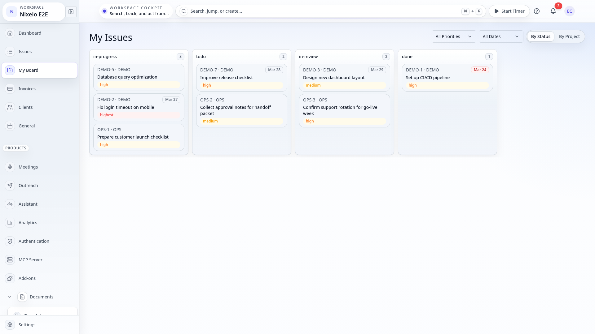 | 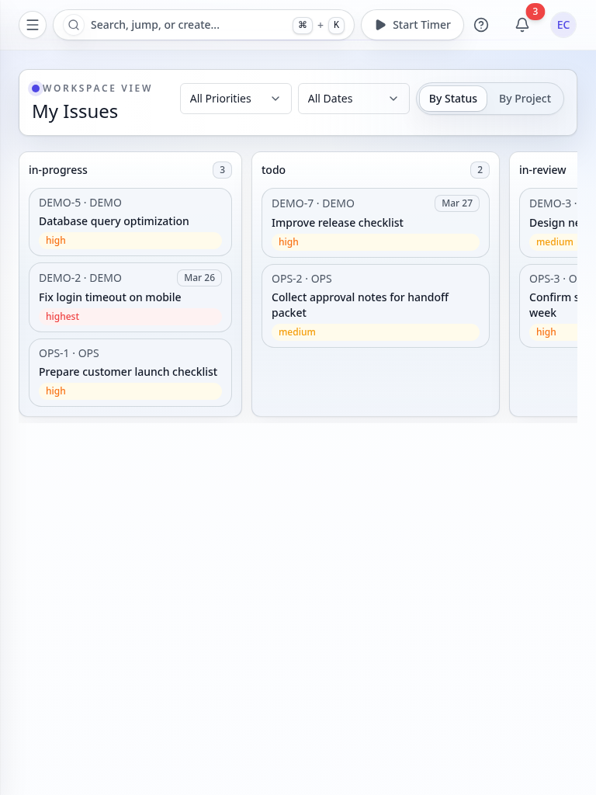 | 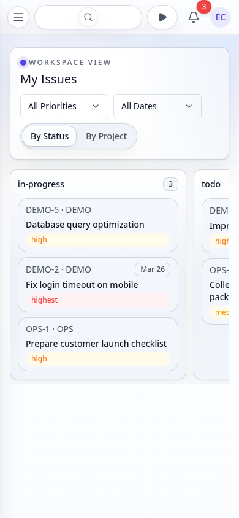 |
| Filter active with results |  | 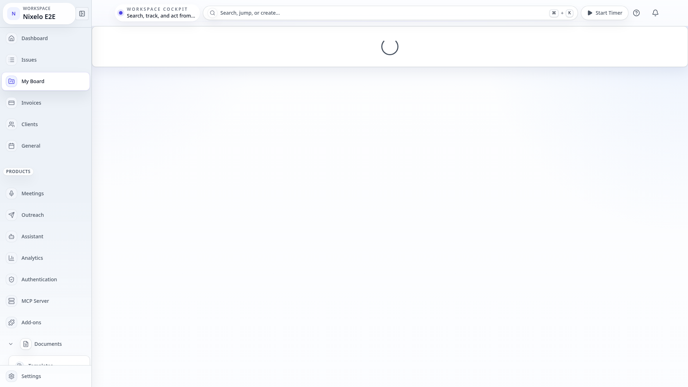 |  | 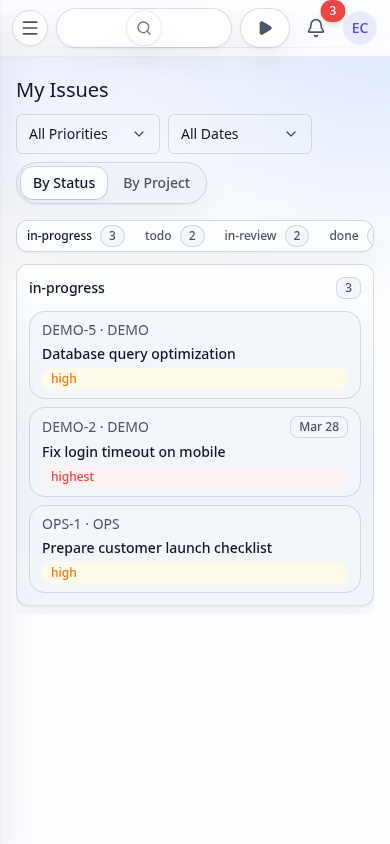 |
| Filter active with no results | 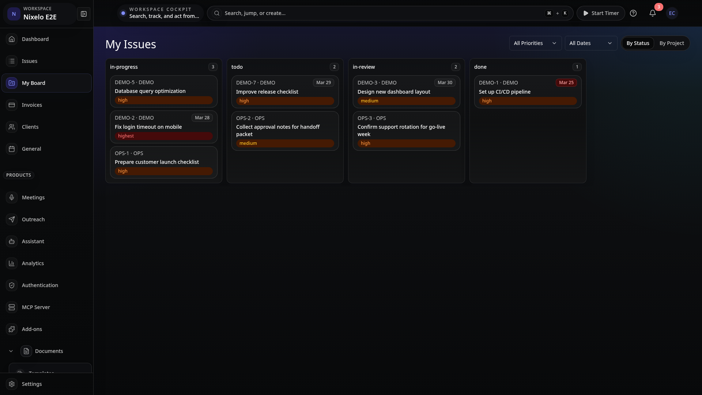 | 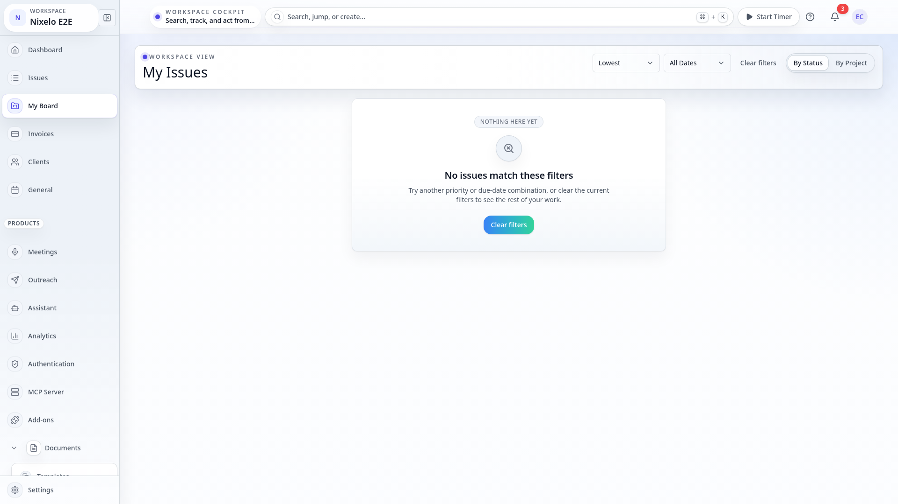 | 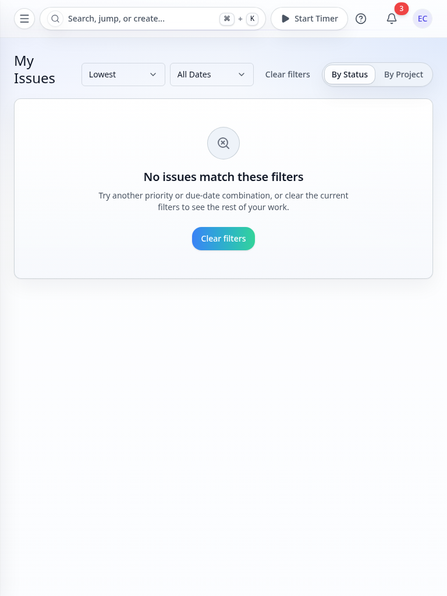 | 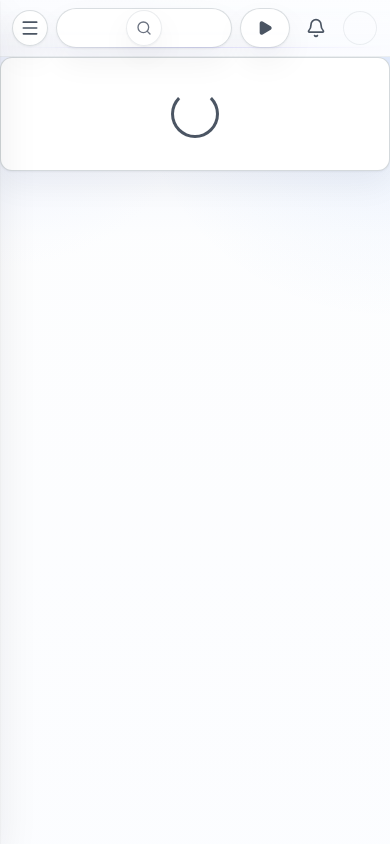 |
| Loading state | 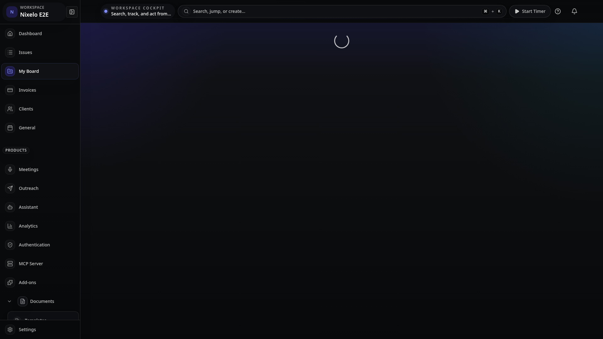 | 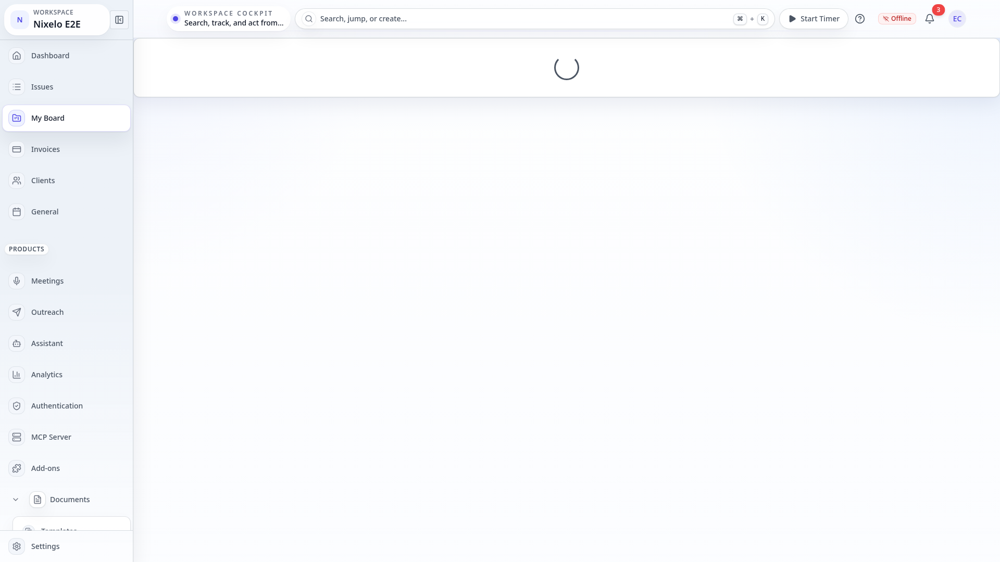 | 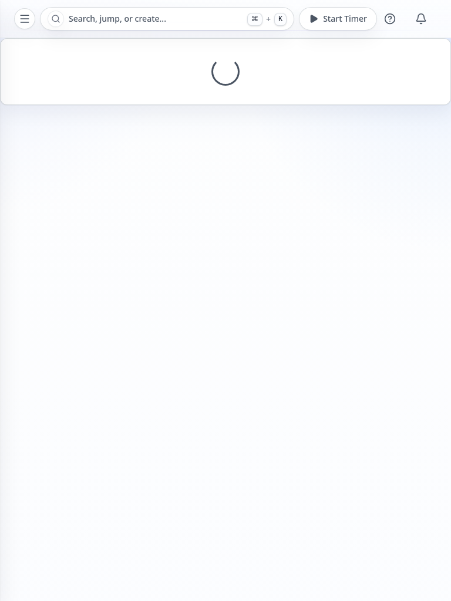 |  |

The route is no longer a canonical-only spec. Empty, filtered-empty, and loading behavior are now
reviewable states rather than hidden assumptions.

---

## Current Problems

| # | Problem | Area | Severity |
|---|---------|------|----------|
| ~~1~~ | ~~Client-side grouping only~~ **Fixed** — `getMyIssueGroupCounts` supplies server-backed group totals | ~~data fidelity~~ | ~~MEDIUM~~ |
| ~~2~~ | ~~No priority or due-date filters~~ **Fixed** — priority and due-date dropdowns now narrow the board in place | ~~controls~~ | ~~LOW~~ |
| ~~3~~ | ~~Empty or over-filtered states degraded into hollow columns~~ **Fixed** — route now renders dedicated recovery empty states | ~~empty-state quality~~ | ~~MEDIUM~~ |
| ~~4~~ | ~~Spec only covered the canonical filled route~~ **Fixed** — reviewed screenshot coverage now includes empty, filter-active, filtered-empty, and loading matrices | ~~visual review depth~~ | ~~MEDIUM~~ |
| ~~5~~ | ~~Phone-width grouped columns clipped horizontally and read like a broken board~~ **Fixed** — mobile now uses a segmented active-column selector with one full-width visible column | ~~mobile layout~~ | ~~HIGH~~ |
| 6 | Project grouping is still only as informative as the currently assigned cross-project dataset | seeded review depth | LOW |

---

## Source Files

| File | Purpose |
|------|---------|
| `src/routes/_auth/_app/$orgSlug/my-issues.tsx` | Route composition, filters, grouping, and empty-state handling |
| `src/routes/_auth/_app/$orgSlug/__tests__/my-issues.test.tsx` | Route-level coverage for empty, filtered-empty, grouping, and loading states |
| `e2e/pages/my-issues.page.ts` | My-issues page object for screenshot interactions |
| `e2e/screenshot-lib/interactive-captures.ts` | Filter-active, filtered-empty, and loading captures |
| `convex/dashboard.ts` | Paginated assigned-issues query plus server-backed group counts |

---

## Summary

My Issues is now a reviewed personal-work surface instead of a default-route-only baseline. The
remaining work is incremental data/seed polish, not missing recovery states or obvious mobile
layout failures.
