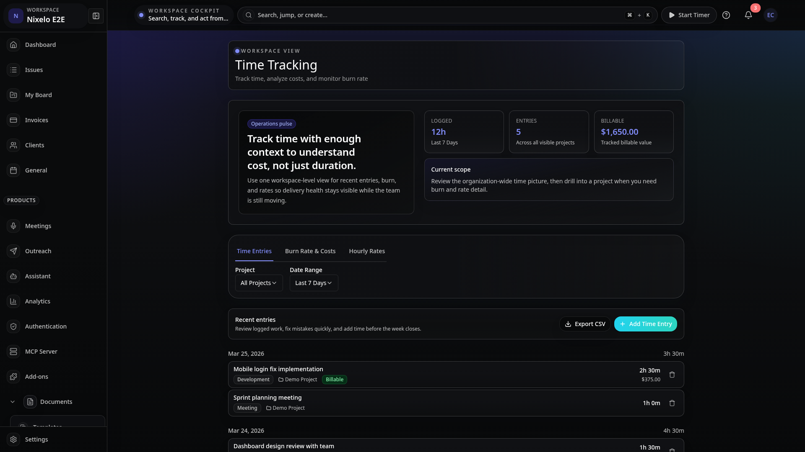
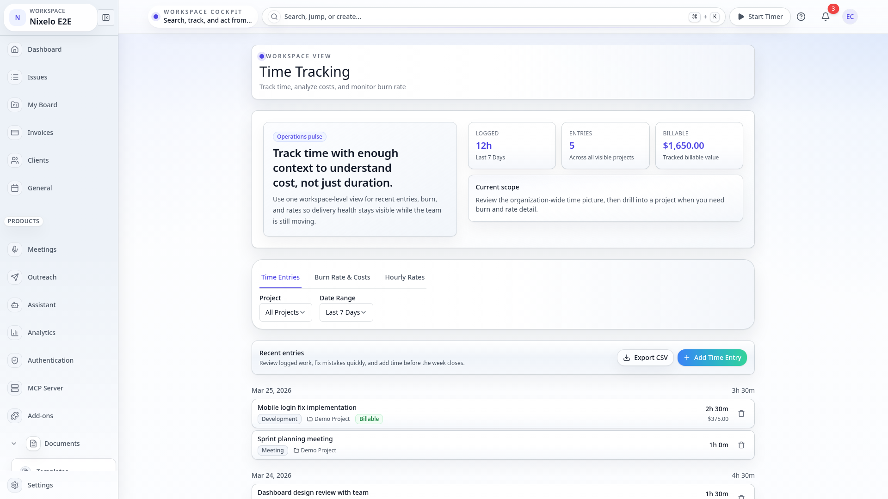
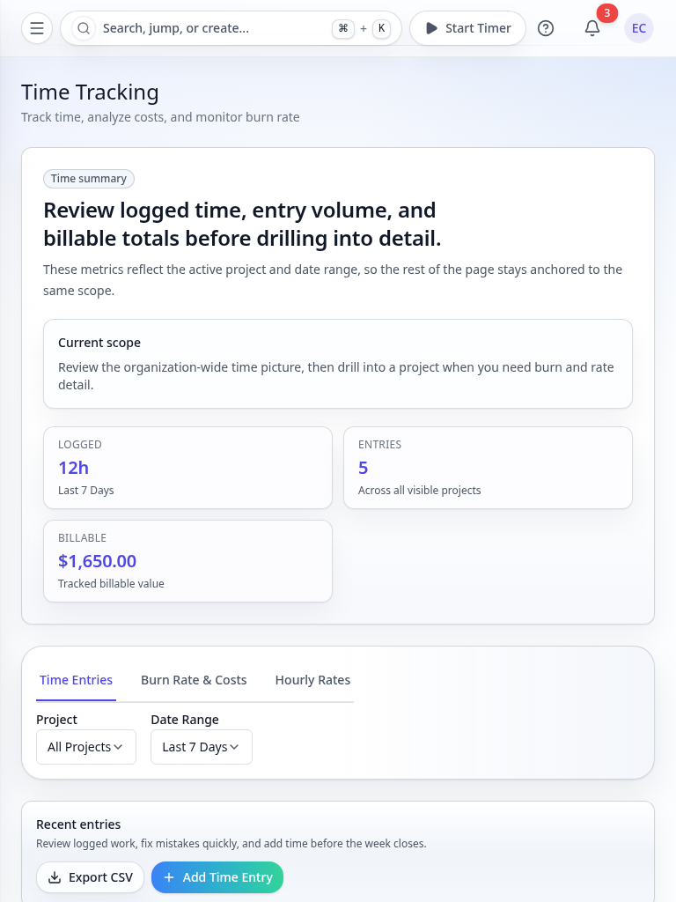
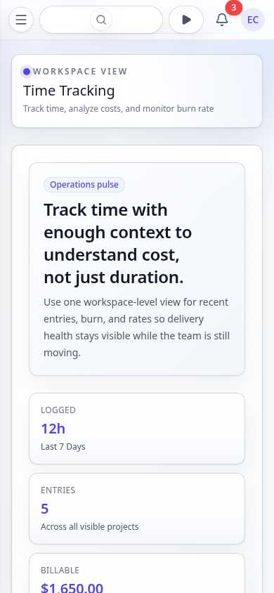

# Time Tracking Page - Current State

> **Route**: `/:slug/time-tracking`
> **Status**: REVIEWED
> **Last Updated**: 2026-03-23

> **Spec Contract**: This file is intentionally hyper-comprehensive. ASCII diagrams, explicit structure walkthroughs, and high-detail notes are deliberate and should not be reduced to a short summary.

---

## Purpose

The time tracking page is the organization-wide time and billing dashboard. It answers:

1. How much time has the team logged this week/month?
2. What's the burn rate and cost breakdown per project?
3. Are billable rates configured correctly for each user?
4. Can I quickly log time or review individual entries?

This is an admin-only surface. Non-admin users are redirected to the dashboard. The page
combines time entry management, burn rate analytics, and user rate configuration in a single
tabbed view.

---

## Screenshot Matrix

### Canonical route captures

| Viewport | Theme | Preview |
|----------|-------|---------|
| Desktop | Dark |  |
| Desktop | Light |  |
| Tablet | Light |  |
| Mobile | Light |  |

### Additional state captures

| State | Desktop Dark | Desktop Light | Tablet Light | Mobile Light |
|-------|-------------|---------------|--------------|--------------|
| Manual entry modal | `desktop-dark-manual-entry-modal.png` | `desktop-light-manual-entry-modal.png` | `tablet-light-manual-entry-modal.png` | `mobile-light-manual-entry-modal.png` |

### Missing captures (should be added)

- Burn rate tab active
- User rates tab active
- Empty state (no time entries)
- Project filter applied
- Date range selector (week/month/all)
- Time entry edit modal
- Truncation indicator ("+" suffix on metrics)

---

## Route Anatomy

```text
+------------------------------------------------------------------------------+
| Global app shell                                                             |
| sidebar + top utility bar                                                    |
+------------------------------------------------------------------------------+
| Time Tracking route (admin only)                                             |
|                                                                              |
|  PageHeader                                                                  |
|  "Time Tracking" + "Track time, analyze costs, and monitor burn rate"        |
|                                                                              |
|  OverviewBand (summary metrics)                                              |
|  +------------------------------------------------------------------------+ |
|  | Logged        | Billable       | Cost           | Entries              | |
|  | 42h 30m       | 38h 15m        | $5,737.50      | 127                  | |
|  | (Last 7 Days)                                                          | |
|  +------------------------------------------------------------------------+ |
|                                                                              |
|  Controls                                                                    |
|  +------------------------------------------------------------------------+ |
|  | Project: [All Projects v]    Date Range: [Last 7 Days v]               | |
|  +------------------------------------------------------------------------+ |
|                                                                              |
|  Tabs                                                                        |
|  +-------------------+-------------------+-------------------+              |
|  | Entries           | Burn Rate         | User Rates        |              |
|  +-------------------+-------------------+-------------------+              |
|                                                                              |
|  Tab Content                                                                 |
|  +------------------------------------------------------------------------+ |
|  | TimeEntriesList (entries tab)                                           | |
|  | BurnRateDashboard (burn-rate tab, project-scoped only)                  | |
|  | UserRatesManagement (rates tab, admin only)                             | |
|  +------------------------------------------------------------------------+ |
|                                                                              |
+------------------------------------------------------------------------------+
```

---

## Current Composition

### 1. Route wrapper (60 lines)

- Admin-only: checks `api.users.isOrganizationAdmin`, redirects non-admins.
- Lazy-loads `TimeTrackingPage` (heavy component).
- Passes `isGlobalAdmin` prop for full tab access.

### 2. Overview band

- `OverviewBand` component showing 4 summary metrics:
  - **Logged** — total duration in human-readable format (e.g., "42h 30m")
  - **Billable** — billable duration only (if billing enabled)
  - **Cost** — total cost in currency format
  - **Entries** — entry count
- Each metric shows "+" suffix when data is truncated beyond query limits.
- Metrics respect the selected date range and project filter.
- Data from `api.timeTracking.getSummary` query.

### 3. Controls

- **Project filter**: Select dropdown — "All Projects" or specific project.
  When "All Projects" is selected, burn rate and user rates tabs may be hidden
  (they require a project context).
- **Date range**: Select — "Last 7 Days", "Last 30 Days", "All Time".
  Maps to WEEK, MONTH, or no date bound for the query.

### 4. Tabs

Three tabs with role-gated visibility:

- **Entries** — always visible. `TimeEntriesList` (286 lines).
  - Table of time entries with date, duration, issue, user, notes.
  - Edit and delete actions per entry.
  - "Log Time" button opens `ManualTimeEntryModal`.

- **Burn Rate** — visible for admin+ when a specific project is selected.
  `BurnRateDashboard` (277 lines).
  - Cost chart over time.
  - Budget vs actual comparison.
  - Team member cost breakdown.

- **User Rates** — visible for admin+ when a specific project is selected.
  `UserRatesManagement` (291 lines).
  - Table of user hourly rates.
  - Add/edit rates per user.
  - Default rate and project-specific overrides.

### 5. Manual time entry modal

- `ManualTimeEntryModal` (540 lines) — full time entry form.
- Fields: project, issue, date, duration (hours:minutes), notes, billable toggle.
- Validation via `manualTimeEntryValidation.ts`.
- Also accessible from the global timer widget in the app header.

---

## State Coverage

### States the current spec explicitly covers

- Entries tab with populated list (4 viewports)
- Manual time entry modal open (4 viewports)

### States that should be captured

- Burn rate tab with charts
- User rates tab with rate table
- Empty entries state
- Project filter applied
- Date range changed
- Truncation indicators on metrics
- Time entry edit modal

---

## Current Strengths

| Area | Current Read |
|------|--------------|
| Metric overview | OverviewBand gives instant visibility into time/cost without drilling in. |
| Tab organization | Clean separation: entries for logging, burn for analysis, rates for config. |
| Truncation honesty | "+" suffix on metrics when data exceeds query limits (from isTruncated flag). |
| Admin gating | Non-admins redirected immediately. No partial-access confusion. |
| Filter reactivity | Project and date range filters update all tabs and metrics in real time. |

---

## Current Problems

| # | Problem | Area | Severity |
|---|---------|------|----------|
| 1 | Burn rate and user rates tabs disappear when "All Projects" is selected. Users may not realize they need to pick a project first. | UX | MEDIUM |
| ~~2~~ | ~~No CSV export for time entries~~ **Fixed** — Export CSV button in TimeEntriesList header, generates CSV with date, description, issue, duration, billable status, rate, cost | ~~feature gap~~ | ~~MEDIUM~~ |
| 3 | ManualTimeEntryModal is 540 lines. Could benefit from splitting form logic from modal chrome. | architecture | LOW |
| 4 | ProjectTimesheet component exists (14 lines) but appears to be a stub/redirect. | dead code | LOW |

---

## Source Files

| File | Lines | Purpose |
|------|-------|---------|
| `src/routes/.../time-tracking.tsx` | 60 | Route: admin gate, lazy load |
| `src/components/TimeTracking/TimeTrackingPage.tsx` | 422 | Main dashboard: tabs, controls, overview |
| `src/components/TimeTracking/TimeEntriesList.tsx` | 286 | Time entry table with actions |
| `src/components/TimeTracking/BurnRateDashboard.tsx` | 277 | Cost analytics charts |
| `src/components/TimeTracking/UserRatesManagement.tsx` | 291 | Hourly rate configuration |
| `src/components/TimeTracking/ManualTimeEntryModal.tsx` | 540 | Time entry creation form |
| `src/components/TimeTracking/TimeEntryModal.tsx` | 524 | Time entry edit form |
| `src/components/TimeTracking/TimerWidget.tsx` | -- | Global timer in app header |
| `src/components/TimeTracker/BillingReport.tsx` | -- | Billing report with CSV export |
| `e2e/screenshot-pages.ts` | -- | `filled-time-tracking` spec |

---

## Review Guidance

- The admin-only gate is correct. Do not expose billing data to non-admins.
- The OverviewBand pattern is the right summary format. Do not replace with cards or charts.
- If "All Projects" needs burn rate, aggregate across projects instead of hiding the tab.
- The timer widget in the app header is the primary time entry path. The manual modal is secondary.
- Do not merge this page with project-level timesheet. They serve different audiences.

---

## Summary

The time tracking page is a mature admin dashboard combining time entry management, burn rate
analytics, and user rate configuration. The OverviewBand gives instant summary metrics, tabs
separate concerns cleanly, and the admin gate prevents data leaks. Main gaps are the hidden
tabs when no project is selected and the lack of direct CSV export from the entries tab.
