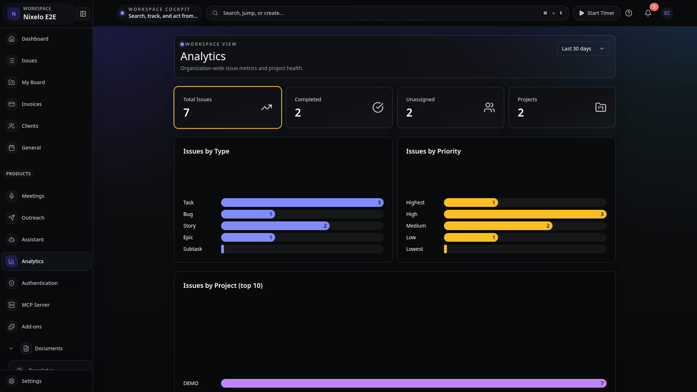
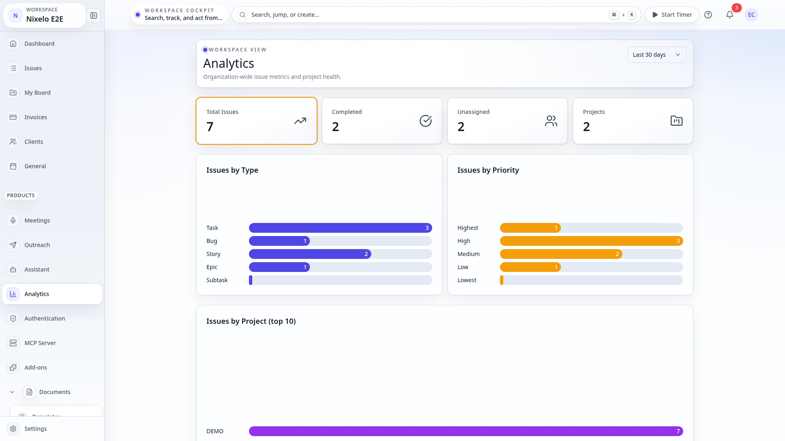
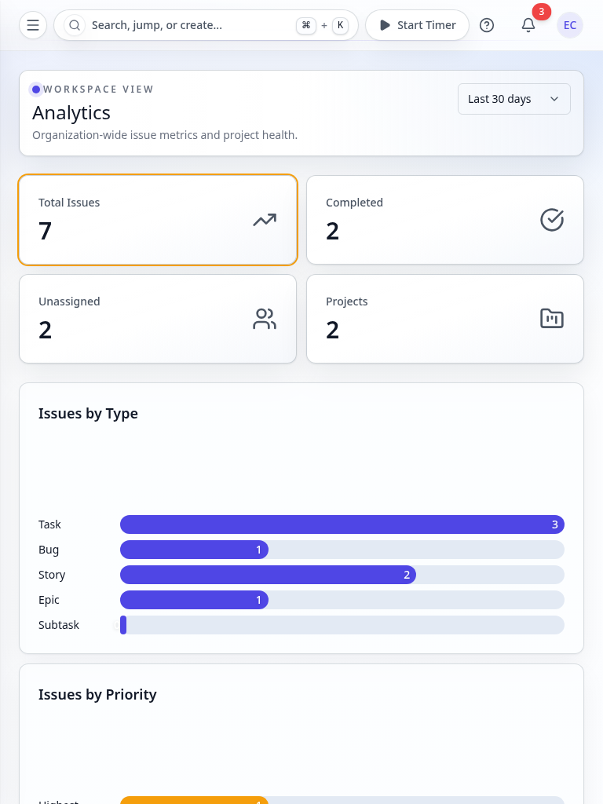
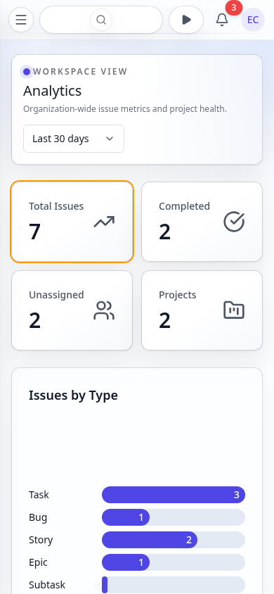

# Org Analytics Page - Current State

> **Route**: `/:orgSlug/analytics`
> **Status**: IMPLEMENTED
> **Last Updated**: 2026-03-22

---

## Purpose

The org analytics dashboard provides a high-level view of issue metrics, project health, and workload distribution across the entire organization. It answers:

- How many total issues exist across all projects, and how many are completed?
- How are issues distributed by type (task, bug, story, epic, subtask)?
- How are issues distributed by priority?
- Which projects have the most issues?
- How many issues are unassigned?

---

## Route Anatomy

```
/:orgSlug/analytics
│
├── AnalyticsPage (thin route wrapper)
│   ├── Loading gate: PageContent isLoading (while analytics === undefined)
│   └── OrganizationAnalyticsDashboard
│       ├── PageLayout (maxWidth="xl")
│       │   └── PageStack
│       │       ├── PageHeader ("Analytics" / "Organization-wide issue metrics...")
│       │       ├── [conditional] InsetPanel (truncation warning if >100 projects)
│       │       ├── Grid (2 cols, 4 cols on lg) — MetricCards
│       │       │   ├── MetricCard: Total Issues (highlight)
│       │       │   ├── MetricCard: Completed
│       │       │   ├── MetricCard: Unassigned
│       │       │   └── MetricCard: Projects
│       │       ├── Grid (1 col, 2 cols on lg) — ChartCards
│       │       │   ├── ChartCard: Issues by Type (BarChart)
│       │       │   └── ChartCard: Issues by Priority (BarChart)
│       │       ├── [conditional] ChartCard: Issues by Project top 10 (BarChart)
│       │       └── ProjectBreakdownSection (list of InsetPanel rows)
```

---

## Current Composition Walkthrough

1. **Route component**: `AnalyticsPage` is a thin 21-line wrapper. It calls `useOrganization()` for `organizationId`, fires `api.analytics.getOrgAnalytics`, and passes the result to `OrganizationAnalyticsDashboard`.
2. **Loading gate**: While `analytics === undefined`, shows `<PageContent isLoading>`.
3. **Dashboard component**: `OrganizationAnalyticsDashboard` is a pure presentational component that receives the full analytics payload as a prop. It contains no queries or mutations of its own.
4. **Metric cards**: Four top-level KPI cards (Total Issues with highlight, Completed, Unassigned, Projects) using the `MetricCard` component with icons.
5. **Bar charts**: Two side-by-side `ChartCard` + `BarChart` components show issue distribution by type and by priority. A third chart shows top-10 projects by issue count (conditional on having projects).
6. **Project breakdown**: `ProjectBreakdownSection` renders a vertical list of `InsetPanel` rows, each showing project name, key, and issue count.
7. **Truncation warning**: If `analytics.isProjectsTruncated` is true (>100 projects), an `InsetPanel` warning banner appears below the header.

---

## Screenshot Matrix

| Viewport | Theme | Preview |
|----------|-------|---------|
| Desktop | Dark |  |
| Desktop | Light |  |
| Tablet | Light |  |
| Mobile | Light |  |

---

## Current Problems

| # | Problem | Area | Severity |
|---|---------|------|----------|
| ~~1~~ | ~~No date range filtering~~ **Fixed** — time period selector (7d/30d/90d/all) filters all issue counts server-side via `sinceDate` parameter | ~~functionality~~ | ~~MEDIUM~~ |
| ~~2~~ | ~~No trend data~~ **Fixed** — `getOrgAnalyticsTrend` compares current vs previous period (created/completed counts with % change) | ~~functionality~~ | ~~MEDIUM~~ |
| 3 | Bar charts are custom `BarChart` components without tooltips or hover states | interactivity | LOW |
| 4 | Project breakdown section has no link to individual projects | navigation | LOW |
| 5 | The route is extremely thin (21 lines) with all layout in the dashboard component, creating an inconsistency with other routes that own their `PageLayout` | architecture | LOW |

---

## Source Files

| File | Purpose |
|------|---------|
| `src/routes/_auth/_app/$orgSlug/analytics.tsx` | Route component (21 lines) |
| `src/components/Analytics/OrganizationAnalyticsDashboard.tsx` | Main dashboard composition |
| `src/components/Analytics/MetricCard.tsx` | Individual KPI card |
| `src/components/Analytics/ChartCard.tsx` | Chart wrapper card |
| `src/components/Analytics/BarChart.tsx` | Horizontal bar chart |
| `src/components/Analytics/AnalyticsSection.tsx` | Section wrapper with title/description |
| `convex/analytics.ts` | `getOrgAnalytics` query |
