# Workspaces Page - Current State

> **Route**: `/:orgSlug/workspaces`
> **Status**: REVIEWED
> **Last Updated**: 2026-03-25

---

## Purpose

The workspaces list is the org-level structure view. It answers:

- What workspaces exist in this organization?
- How many teams and projects sit inside each workspace?
- How do I create a new workspace without dropping into a dead-end state?

---

## Route Anatomy

```text
/:orgSlug/workspaces
│
├── PageLayout
│   ├── PageHeader
│   │   ├── title = "Workspaces"
│   │   ├── description = "Organize your organization into departments and teams"
│   │   └── actions → Button ("+ Create Workspace")
│   │
│   ├── CreateWorkspaceModal (Dialog)
│   │
│   └── PageContent
│       ├── [loading] LoadingSpinner
│       ├── [empty] EmptyState ("No workspaces yet")
│       └── Stack
│           ├── OverviewBand (workspace/team/project totals)
│           ├── [1+ workspaces or active query] search row
│           ├── [search active] match summary
│           ├── [search miss] EmptyState ("No workspaces match …", clear action)
│           └── [default] Grid → WorkspaceCard[]
```

---

## Current Composition Walkthrough

1. `WorkspacesList` owns the route composition, metrics, and search state.
2. `api.workspaces.list` returns the enriched list with `teamCount` and `projectCount`.
3. The route computes org-level totals client-side from the loaded workspace list.
4. Search is case-insensitive across workspace name, slug, and description.
5. Search is shown whenever the route has at least one workspace, or immediately once a query is active.
6. Search misses render a full recovery state with a clear-search action instead of a dead text line.
7. `CreateWorkspaceModal` trims the name, normalizes the slug through shared helpers, resets on close, and routes through the workspace detail path so creation is not hard-coupled to a specific landing tab.
8. `WorkspaceCard` now uses shared sizing APIs cleanly instead of mixing `IconCircle` size props with raw size classes.

---

## Screenshot Matrix

| State | Desktop Dark | Desktop Light | Tablet Light | Mobile Light |
|-------|--------------|---------------|--------------|--------------|
| Default route | 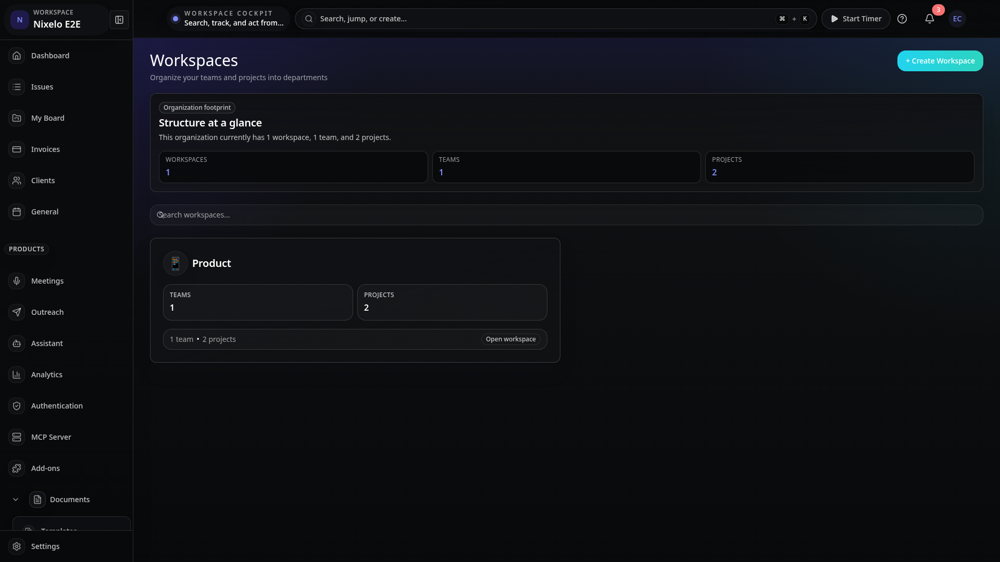 | 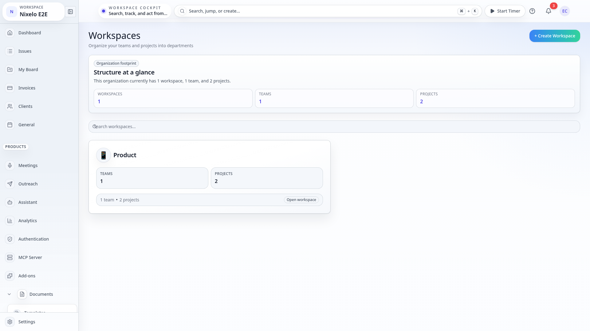 |  | 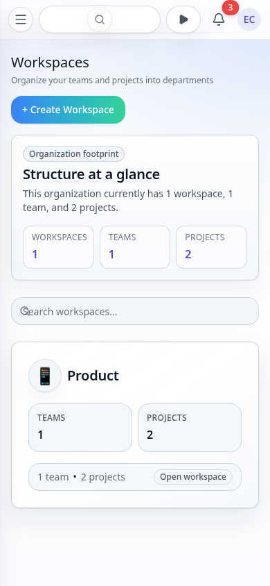 |
| True empty state | 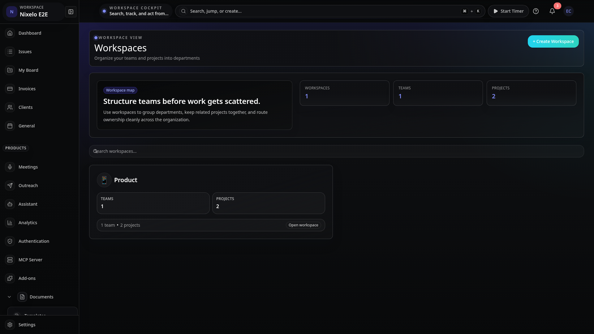 |  | 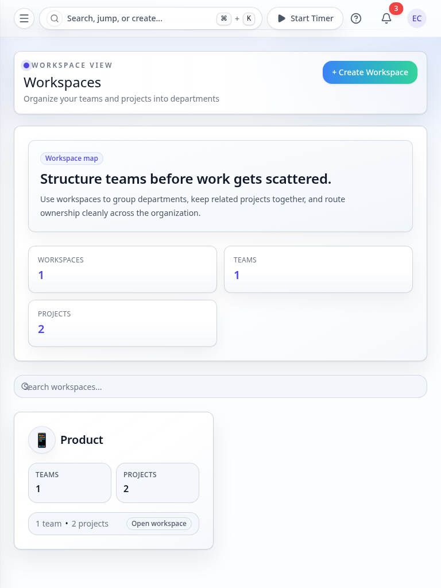 |  |
| Search-empty state | 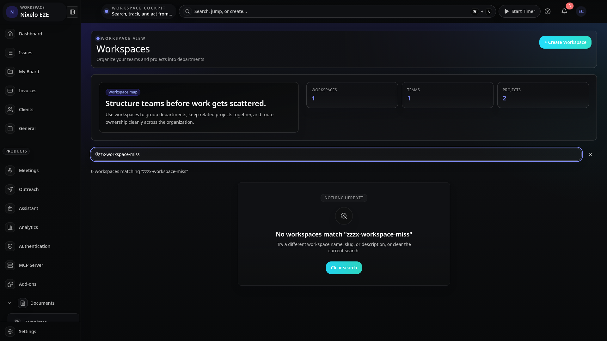 | 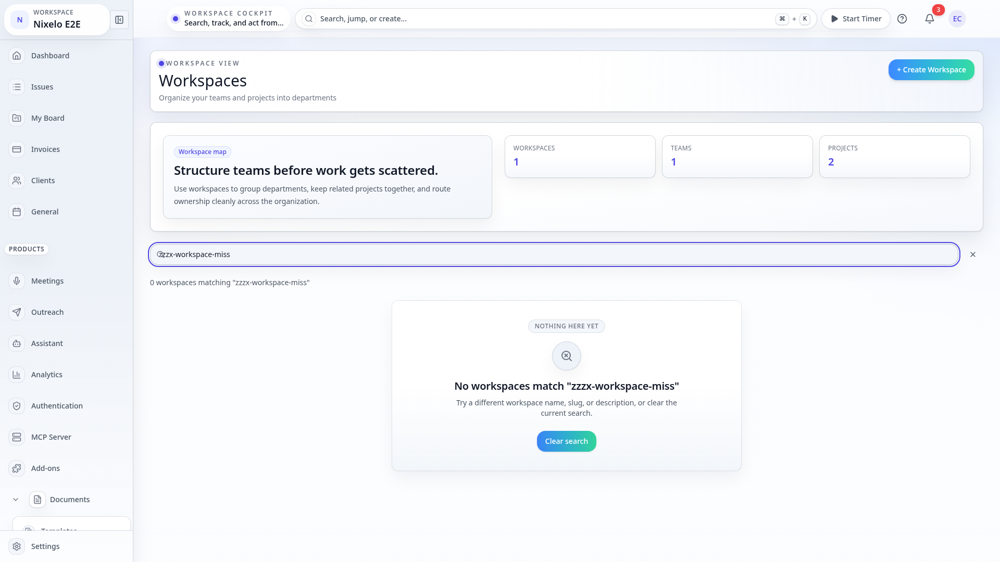 | 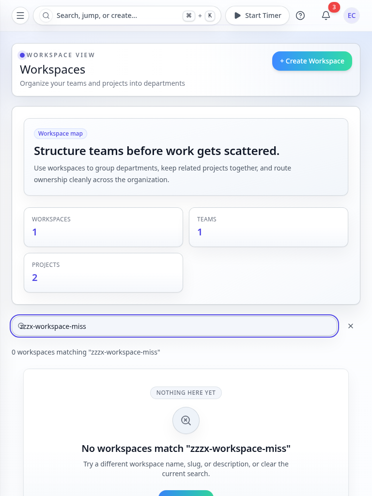 | 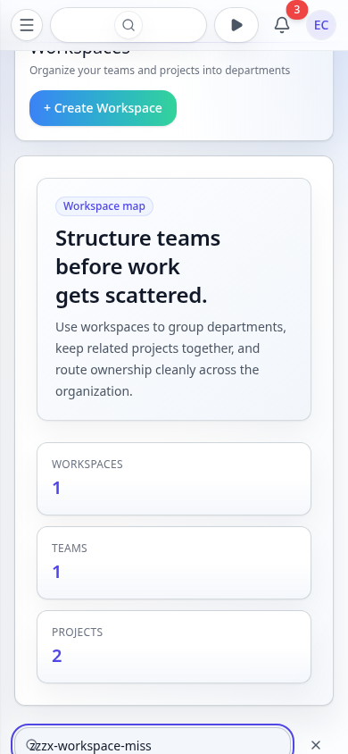 |
| Create workspace modal | 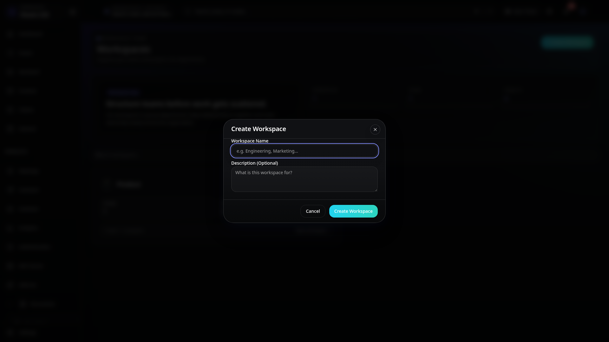 |  | 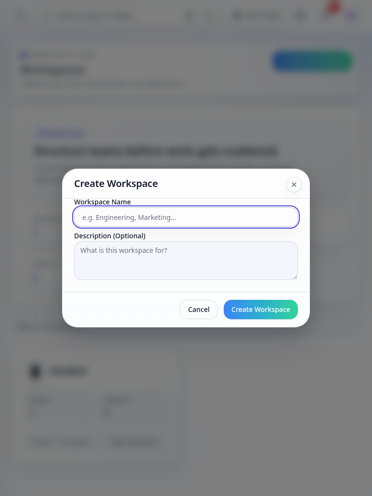 | 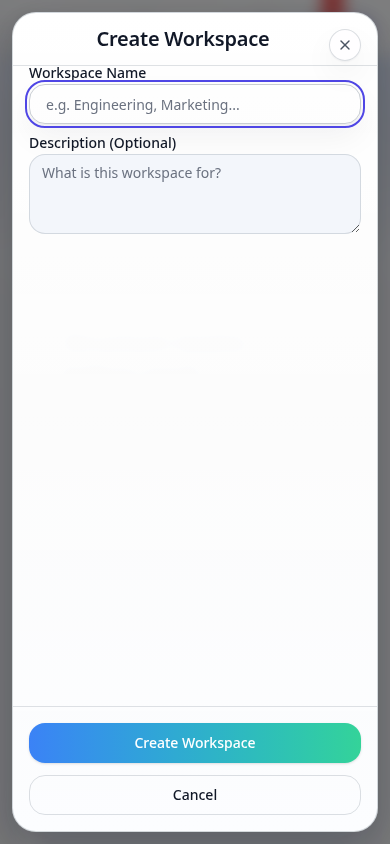 |

The route now has reviewed empty, search-empty, and modal coverage across the full viewport matrix
instead of only the default route plus a partial modal pass.

---

## Current Problems

| # | Problem | Area | Severity |
|---|---------|------|----------|
| ~~1~~ | ~~`WorkspaceCard` was inline in the route and harder to review or test~~ **Fixed** — card logic lives in `src/components/Workspaces/WorkspaceCard.tsx` | ~~architecture~~ | ~~MEDIUM~~ |
| ~~2~~ | ~~The route spec only covered default + partial modal states~~ **Fixed** — the matrix now includes true empty, search-empty, and all four create-modal captures | ~~screenshot depth~~ | ~~MEDIUM~~ |
| ~~3~~ | ~~Search miss state was just a text line without recovery action~~ **Fixed** — route now uses a real EmptyState with clear-search action | ~~empty-state quality~~ | ~~LOW~~ |
| ~~4~~ | ~~Workspace creation was coupled directly to the teams route~~ **Fixed** — post-create handoff now routes through the workspace detail path | ~~UX coupling~~ | ~~LOW~~ |
| 5 | Search still operates on the loaded client-side list rather than a server-backed query | scalability | LOW |
| 6 | Very small organizations can still feel intentionally sparse because the route is a structure map, not a dense dashboard | composition density | LOW |

---

## Source Files

| File | Purpose |
|------|---------|
| `src/routes/_auth/_app/$orgSlug/workspaces/index.tsx` | Route composition, metrics, search state, and create-modal handoff |
| `src/components/CreateWorkspaceModal.tsx` | Create workspace dialog with shared slug/reset behavior |
| `src/components/Workspaces/WorkspaceCard.tsx` | Shared workspace card |
| `src/lib/workspaces.ts` | Shared slug and search helpers |
| `e2e/pages/workspaces.page.ts` | Workspaces page-object readiness and interactions |
| `e2e/screenshot-lib/filled-states.ts` | Workspaces modal/search-empty screenshot capture |
| `convex/workspaces.ts` | Workspace CRUD and `list` query with team/project counts |

---

## Summary

Workspaces is now a reviewed core surface instead of a mostly-canonical screenshot baseline. The
remaining work is future scalability and broader composition polish, not missing route states or
spec drift.
