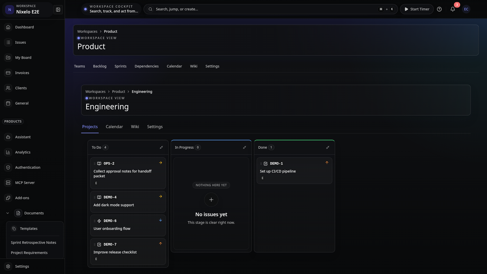
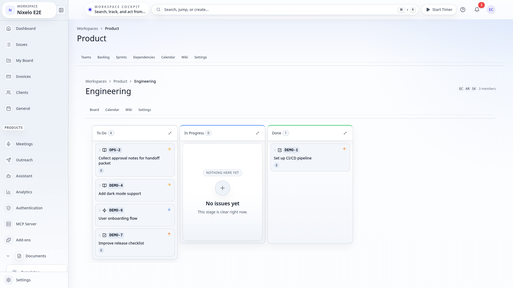
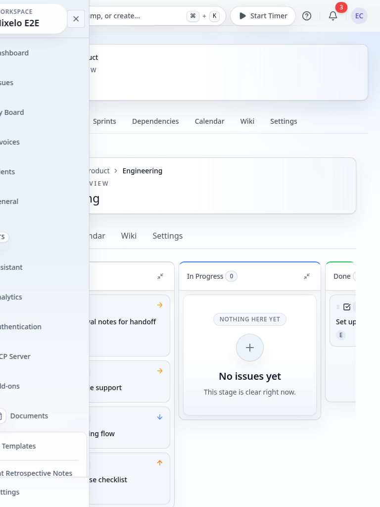
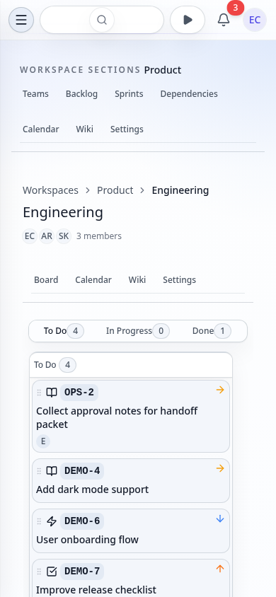

# Team Detail Page - Current State

> **Route**: `/:orgSlug/workspaces/:workspaceSlug/teams/:teamSlug` (layout shell) with child tabs
> **Status**: IMPLEMENTED (settings tab is placeholder)
> **Last Updated**: 2026-03-25

---

## Purpose

The team detail page is the working surface for a single team within a workspace. It provides board, calendar, wiki, and settings views. It answers:

- What does this team's Kanban board look like (issues by workflow state)?
- What events are on this team's calendar?
- What wiki documents are scoped to this team?
- What projects does this team own?
- How do I configure team settings?

---

## Route Anatomy

```
/:orgSlug/workspaces/:workspaceSlug/teams/:teamSlug  (layout shell)
│
├── TeamLayout (route.tsx)
│   ├── PageLayout
│   │   └── PageStack
│   │       ├── PageHeader
│   │       │   ├── title = team.name
│   │       │   ├── description = team.description
│   │       │   └── breadcrumbs = [
│   │       │       "Workspaces" → workspaces list,
│   │       │       workspace.name → workspace detail,
│   │       │       team.name
│   │       │   ]
│   │       │
│   │       ├── PageControls → RouteNav (section tabs)
│   │       │   ├── "Board" → /:orgSlug/workspaces/:ws/teams/:team/board
│   │       │   ├── "Calendar" → /.../teams/:team/calendar
│   │       │   ├── "Wiki" → /.../teams/:team/wiki
│   │       │   └── "Settings" → /.../teams/:team/settings
│   │       │
│   │       └── <Outlet /> (child route renders here)
│
├── index.tsx → Redirects to /board (via beforeLoad + redirect)
│
├── board.tsx → TeamBoardPage
│   └── KanbanBoard (teamId)
│       ├── BoardToolbar (filters, swimlanes, display options)
│       └── KanbanColumn[] (per workflow state)
│           └── IssueCard[] (draggable)
│
├── calendar.tsx → TeamCalendarPage
│   └── CalendarView (teamId)
│
├── wiki.tsx → TeamWikiPage
│   ├── EmptyState ("No team wiki docs yet")
│   └── Grid → doc card[] (identical to workspace wiki cards)
│
└── settings.tsx → TeamSettings (placeholder)
    └── Card "Coming Soon" (placeholder with icon and description)
```

---

## Current Composition Walkthrough

1. **Layout shell** (`route.tsx`): Loads workspace via `api.workspaces.getBySlug`, then team via `api.teams.getBySlug` (using workspace ID as parent). Shows loading spinner while pending, "Team not found" if either is null. Renders 3-level breadcrumbs, a lighter shared header with the member summary folded into the header actions, and a compact `PageControls` strip with 4 tabs (Board, Calendar, Wiki, Settings), then `<Outlet />`.
2. **Index redirect** (`index.tsx`): Uses TanStack Router `beforeLoad` with `redirect()` so the team root never renders a transient blank shell before landing on the board route.
3. **Board** (`board.tsx`): Resolves workspace and team, then renders `<KanbanBoard teamId={team._id} />`. The `KanbanBoard` component is a feature-rich Kanban board with drag-and-drop (Atlaskit pragmatic-drag-and-drop), swimlanes, board history (undo/redo), bulk operations, filtering, and issue detail viewer.
4. **Calendar** (`calendar.tsx`): Resolves workspace and team, renders `<CalendarView teamId={team._id} />` with full error handling for both workspace and team not-found states.
5. **Wiki** (`wiki.tsx`): Resolves workspace and team, queries `api.documents.listByTeam` scoped to the team. Renders the same card layout as workspace wiki (doc icon, title, visibility badge, creator metadata). Empty state directs users to create team-scoped docs.
6. **Settings** (`settings.tsx`): Static placeholder page with a "Coming Soon" card. No queries, mutations, or form elements. Describes future functionality (member management, roles, permissions).

---

## Screenshot Matrix

| Viewport | Theme | Tab | Preview |
|----------|-------|-----|---------|
| Desktop | Dark | Board |  |
| Desktop | Light | Board |  |
| Tablet | Light | Board |  |
| Mobile | Light | Board |  |
| Desktop | Dark | Board |  |
| Desktop | Light | Board |  |
| Tablet | Light | Board |  |
| Mobile | Light | Board |  |
| Desktop | Dark | Calendar |  |
| Desktop | Light | Calendar |  |
| Tablet | Light | Calendar |  |
| Mobile | Light | Calendar |  |
| Desktop | Dark | Wiki |  |
| Desktop | Light | Wiki |  |
| Tablet | Light | Wiki |  |
| Mobile | Light | Wiki |  |
| Desktop | Dark | Settings |  |
| Desktop | Light | Settings |  |
| Tablet | Light | Settings |  |
| Mobile | Light | Settings |  |
| Desktop | Dark | Project tree |  |
| Desktop | Light | Project tree |  |
| Tablet | Light | Project tree |  |
| Mobile | Light | Project tree |  |

---

## Current Problems

| # | Problem | Area | Severity |
|---|---------|------|----------|
| ~~1~~ | ~~Settings tab is a static "Coming Soon" placeholder~~ **Fixed** — general settings (name, description, privacy), member management (roles, removal), and danger zone (delete team) | functionality | ~~HIGH~~ |
| ~~2~~ | ~~"Projects" tab label mismatch~~ **Fixed** — renamed to "Board" to match actual content (team index redirects to board view) | ~~naming~~ | ~~MEDIUM~~ |
| ~~3~~ | ~~Duplicate workspace+team queries in child routes~~ **Fixed** — TeamLayoutContext provides teamId/workspaceId from parent; board/calendar/wiki/settings use useTeamLayout() | ~~performance~~ | ~~MEDIUM~~ |
| ~~4~~ | ~~useEffect redirect in index route~~ **Fixed** — replaced with TanStack Router `beforeLoad` + `redirect()`. No component renders, no query fires. | ~~architecture~~ | ~~LOW~~ |
| ~~5~~ | ~~Wiki page shares identical card markup with workspace wiki~~ **Fixed** — extracted `WikiDocumentGrid` to `src/components/Documents/WikiDocumentGrid.tsx`, used by both team and workspace wiki | ~~code duplication~~ | ~~MEDIUM~~ |
| 6 | Board route loads workspace + team just to pass `team._id` to KanbanBoard; team ID could come from layout context | efficiency | LOW |
| ~~7~~ | ~~No team member list visible~~ **Fixed** — team layout header now keeps the member summary inside the shared header actions (avatars, overflow badge, count) instead of spending a separate row on chrome | ~~functionality~~ | ~~MEDIUM~~ |
| 8 | Settings placeholder uses an inline SVG icon instead of an icon from `@/lib/icons` | consistency | LOW |

---

## Source Files

| File | Purpose |
|------|---------|
| `src/routes/_auth/_app/$orgSlug/workspaces/$workspaceSlug/teams/$teamSlug/route.tsx` | Layout shell with header, breadcrumbs, RouteNav tabs |
| `src/routes/_auth/_app/$orgSlug/workspaces/$workspaceSlug/teams/$teamSlug/index.tsx` | Redirect to /board |
| `src/routes/_auth/_app/$orgSlug/workspaces/$workspaceSlug/teams/$teamSlug/board.tsx` | Kanban board tab |
| `src/routes/_auth/_app/$orgSlug/workspaces/$workspaceSlug/teams/$teamSlug/calendar.tsx` | Team calendar tab |
| `src/routes/_auth/_app/$orgSlug/workspaces/$workspaceSlug/teams/$teamSlug/wiki.tsx` | Team wiki tab |
| `src/routes/_auth/_app/$orgSlug/workspaces/$workspaceSlug/teams/$teamSlug/settings.tsx` | Settings placeholder |
| `src/components/KanbanBoard.tsx` | Full Kanban board component |
| `src/components/Calendar/CalendarView.tsx` | Shared calendar component |
| `convex/workspaces.ts` | `getBySlug` for workspace resolution |
| `convex/teams.ts` | `getBySlug` for team resolution |
| `convex/documents.ts` | `listByTeam` for wiki documents |
