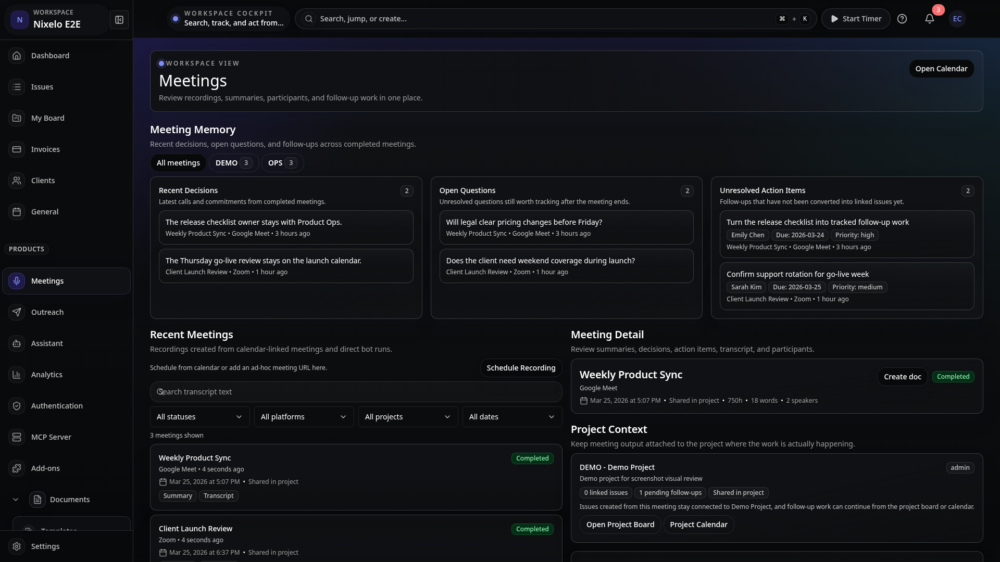
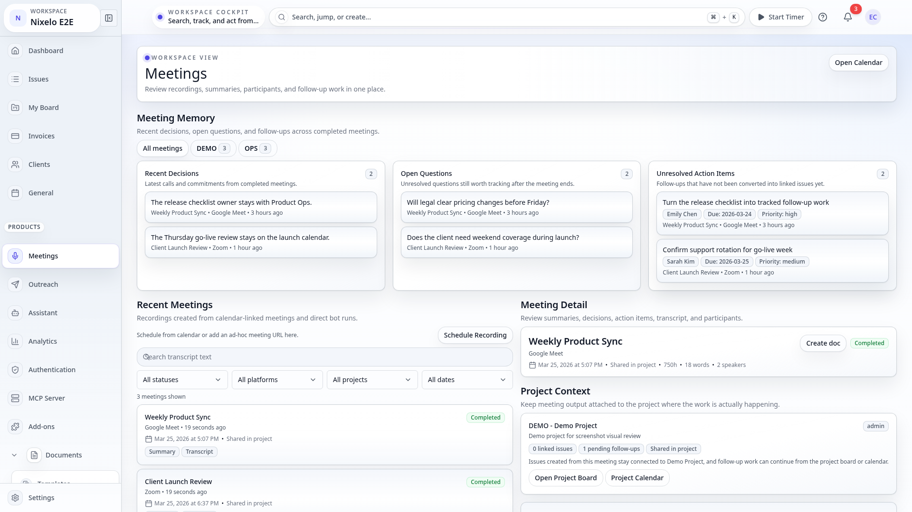
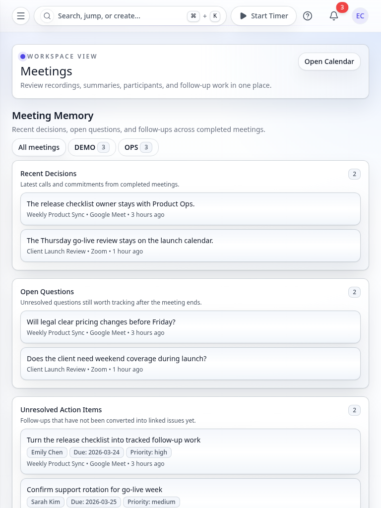
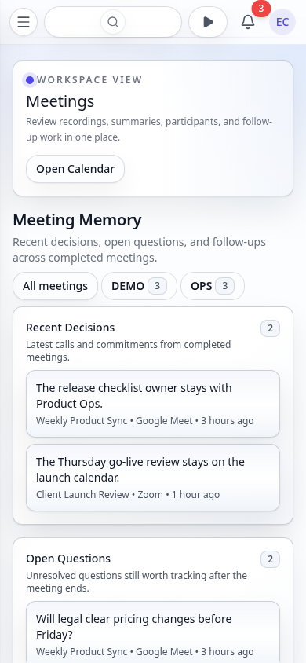

# Meetings Page - Current State

> **Route**: `/:slug/meetings`
> **Status**: REVIEWED for core route, deep-state, and operational overlay/state coverage
> **Last Updated**: 2026-03-25

> **Spec Contract**: This file is intentionally hyper-comprehensive. ASCII diagrams, explicit structure walkthroughs, and high-detail notes are deliberate and should not be reduced to a short summary.

---

## Purpose

The meetings route is the post-call operating surface:

- review recordings
- inspect summaries and transcript segments
- scan memory artifacts such as decisions and open questions
- filter by status, platform, project, and time window
- schedule or attach future recordings

It is no longer just "meeting bot output". It is supposed to behave like a searchable meeting
workspace that feeds later product/document workflows.

---

## Screenshot Matrix

### Canonical route captures

| Viewport | Theme | Preview |
|----------|-------|---------|
| Desktop | Dark |  |
| Desktop | Light |  |
| Tablet | Light |  |
| Mobile | Light |  |

### Additional state captures

| State | Desktop Dark | Desktop Light | Tablet Light | Mobile Light |
|------|---------------|---------------|--------------|--------------|
| Selected-recording detail | `desktop-dark-detail.png` | `desktop-light-detail.png` | `n/a` | `n/a` |
| Memory-lens filter state | `desktop-dark-memory-lens.png` | `desktop-light-memory-lens.png` | `tablet-light-memory-lens.png` | `mobile-light-memory-lens.png` |
| Transcript search state | `desktop-dark-transcript-search.png` | `desktop-light-transcript-search.png` | `tablet-light-transcript-search.png` | `mobile-light-transcript-search.png` |
| Processing detail state | `desktop-dark-processing.png` | `desktop-light-processing.png` | `tablet-light-processing.png` | `mobile-light-processing.png` |
| Filter-empty state | `desktop-dark-filter-empty.png` | `desktop-light-filter-empty.png` | `n/a` | `n/a` |
| Schedule dialog state | `desktop-dark-schedule-dialog.png` | `desktop-light-schedule-dialog.png` | `tablet-light-schedule-dialog.png` | `n/a` |

These screenshot states are now captured and reviewed where they are visually distinct. Small-screen
detail and filter-empty variants are intentionally not tracked because they collapse to the same
above-the-fold composition as the canonical view.

---

## Route Anatomy

```text
┌──────────────────────────────────────────────────────────────────────────────────────────────┐
│ Page header                                                                                 │
│ Meetings                                                   [Open Calendar] [Schedule]       │
├──────────────────────────────────────────────────────────────────────────────────────────────┤
│ Memory rail                                                                                 │
│ recent decisions | open questions | unresolved follow-ups                                   │
├──────────────────────────────────────────────────────────────────────────────────────────────┤
│ Main workspace                                                                              │
│                                                                                             │
│  left column                                                                                │
│  - filter controls                                                                          │
│  - recordings list                                                                          │
│  - status / platform / project / time-window lens                                           │
│                                                                                             │
│  right column                                                                               │
│  - selected recording detail                                                                │
│  - summary                                                                                  │
│  - participants                                                                             │
│  - transcript segments                                                                      │
│  - action items                                                                             │
└──────────────────────────────────────────────────────────────────────────────────────────────┘
```

---

## Current Composition

### 1. Route header

- Provides an `Open Calendar` escape hatch back to the scheduling surface.
- Supports meeting scheduling and recording setup from the route itself.

### 2. Memory rail

- Surfaces cross-recording memory:
  - recent decisions
  - open questions
  - unresolved action items
- Can be narrowed by project lens.

### 3. Left-column workspace tools

- Search and filter flow for recordings
- Status filter
- Platform filter
- Project filter
- Time-window filter

This column is the operational list-management side of the route.

### 4. Right-column detail workspace

- Selected recording summary
- Participants
- Transcript
- Action items
- Project-aware follow-up context

This column is the review and handoff side of the route.

### 5. Schedule dialog

- Supports ad hoc recording setup or calendar-linked capture.
- Belongs to the route because capture initiation is part of the meetings workflow, not a
  separate settings-only flow.

---

## State Coverage

### Reviewed route states

- Canonical filled workspace
- Alternate selected-recording detail state
- Transcript search state
- Memory-lens filtered state
- Summary-processing detail state
- Filter-empty / no-match state
- Schedule dialog state
- Empty state with no recordings yet

### Important implementation states that still matter even without dedicated screenshots

- failed/cancelled states
- action-item project assignment state
- schedule dialog validation/toast states

---

## Current Strengths

| Area | Current Read |
|------|--------------|
| Screenshot depth | Strong. This route covers canonical, deep-state, overlay, and in-progress detail states, while avoiding redundant small-screen captures that do not change the visible composition. |
| Route purpose | Clear. The page reads as a review/search workspace, not a generic transcript dump. |
| State coverage | Better than many other product routes because search, memory lens, processing, and scheduling are explicitly reviewed. |

---

## Current Problems

| # | Problem | Area | Severity |
|---|---------|------|----------|
| 1 | Dense detail states can still feel busy on smaller widths because summary, transcript, and action items all compete for the same right-column attention | detail composition | MEDIUM |
| 2 | Failed/cancelled capture quality still depends on future deterministic seed coverage if those states become a regular review target | state coverage follow-up | LOW |
| 3 | The spec will need another refresh if multi-platform capture or richer bot lifecycle UI changes the route anatomy | documentation follow-up | LOW |

---

## Source Files

| File | Purpose |
|------|---------|
| `src/routes/_auth/_app/$orgSlug/meetings.tsx` | Route wrapper and page-level actions |
| `src/components/Meetings/MeetingsWorkspace.tsx` | Main meetings workspace |
| `e2e/screenshot-pages.ts` | Canonical and deep-state meetings screenshot capture |
| `todos/meeting-intelligence.md` | Remaining backlog for provider rollout and multi-platform capture |

---

## Review Guidance

- Treat this as a dense operational workspace, not a transcript viewer.
- Do not delete the deep-state screenshots; they are the real value of this spec.
- The next meaningful spec expansion should happen when multi-platform capture or richer failed job
  handling lands, because that changes the route anatomy more than another cosmetic tweak would.

---

## Summary

The meetings spec is now current. Core route coverage, deep-state screenshots, schedule overlay,
processing detail, and filter-empty review are all real. The remaining gaps are broader platform
breadth and provider rollout, not missing route-state captures.
